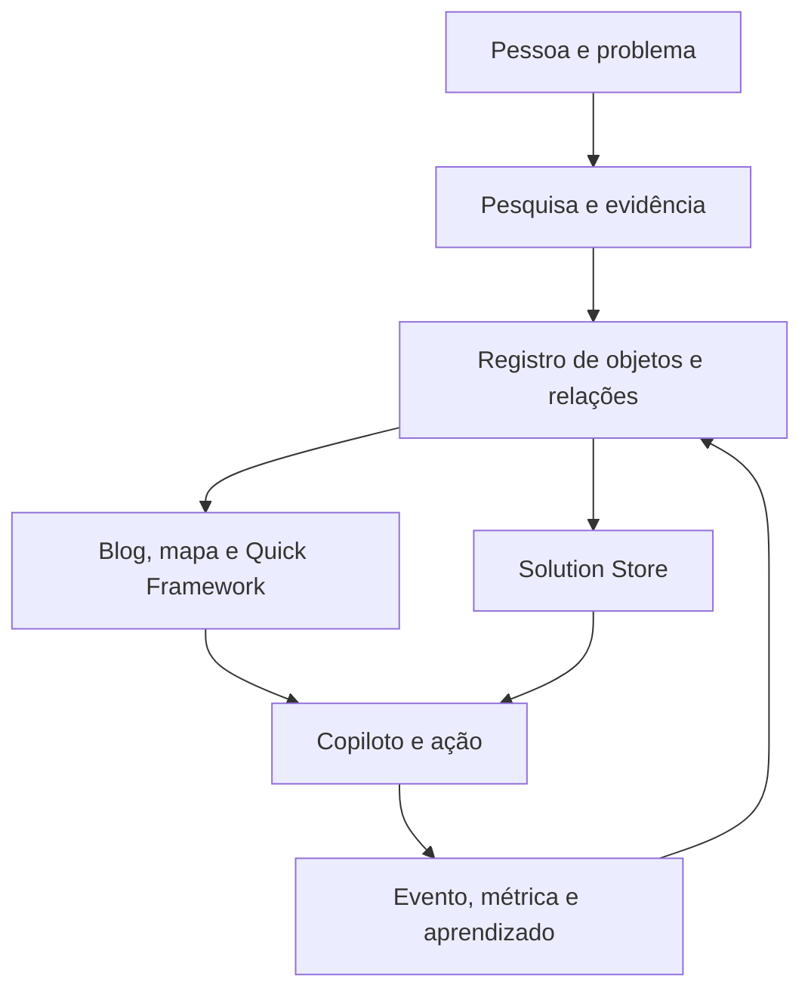

# Foundation Doc — Blog Risco Cognitivo e ecossistema EXECUTAR

**Versão:** 1.1 documental · **Data de referência:** 28/09/2026 · **Estado:** plano consolidado; execução não verificada.  
**Fonte primária:** `26-09-GTM-BLOG(2).md`, SHA-256 `37758db6e9dbd758e17aeda15b262268cc3a8de89f0022ac3d1d6875c12ca69e`. O arquivo `(2)` é idêntico, byte a byte, ao `(1)` usado para atualizar a planilha.  
**Contrato de entrada:** `EXECUTAR_projetosaasentrypoint_EXPANDIDO.schema.json`, versão lógica 2.0, com 94 IDs canônicos `1.1`–`17.3`.  
**Plano operacional associado:** `EXECUTAR_Projeto_GTM_Atualizado.xlsx`, abas `01_Formulario`, `10_Painel_Areas`, `11_Plano_Projeto`, `12_Packs`, `13_Decisoes`, `14_Rastreabilidade`, `15_Fontes_GTM` e `16_Canais`.

<a id="sumario"></a>

## Sumário do Foundation Doc

Este é o índice de navegação deste documento. Os códigos abaixo apontam às seções e anexos do relatório; os IDs de campos, tarefas, decisões e fontes permitem cruzá-lo com a planilha.

- [Protocolo de leitura para agentes](#protocolo)
- [00 — Project Character: tese e negócio](#sec-00)
- [01 — Frameworks Description: como pensar e decidir](#sec-01)
- [02 — PRD Description: produtos, experiências e aceite](#sec-02)
- [03 — Tech Description: arquitetura, dados e integrações](#sec-03)
- [04 — Editorial Description: voz, produção e canais](#sec-04)
- [05 — Pain Description: problema, causalidade e riscos](#sec-05)
- [06 — Agent Description: papéis e limites](#sec-06)
- [07 — Operation Description: execução e governança](#sec-07)
- [08 — Tasks and Issues: entregas, conflitos e controle](#sec-08)
- [09 — Sprints, Roadmaps and Chronogram: sequência e tempo](#sec-09)
- [10 — Control: resultados, evidências e auditoria](#sec-10)
- [11 — Complete System Mental Model: relações e ciclo de aprendizado](#sec-11)
- [Anexo A — Índice de áreas, objetivos e decisões](#anexo-a)
- [Anexo B — Registro integral dos 94 campos do formulário](#anexo-b)
- [Anexo C — Catálogo de evidências e endereços de linha](#anexo-c)
- [Anexo D — Contrato de produção e formatos](#anexo-d)
- [Anexo E — Matriz de canais e funil](#anexo-e)
- [Anexo F — Registro completo de tarefas e dependências](#anexo-f)
- [Anexo G — Registro integral da fonte primária](#anexo-g)

<a id="indice-mestre"></a>

## Índice mestre do Foundation Doc

### Localização por assunto

| Assunto | Seções do relatório | Detalhamento | Referência na planilha |
|---|---|---|---|
| Negócio, público e proposta de valor | [00](#sec-00) | [94 campos](#anexo-b) | 1.1–1.4; 2.1–2.3; 2.7; 8.1; AR-00 / OBJ-00 |
| Ecossistema e ofertas EXECUTAR | [00](#sec-00), [02](#sec-02), [11](#sec-11) | [Áreas e objetivos](#anexo-a) | 2.5; 9.1; GOV-01; DEC-07 |
| Finanças, orçamento e viabilidade | [00](#sec-00), [08](#sec-08) | [Campos e lacunas](#anexo-b) | 1.7–1.12; GOV-07; DEC-03; DEC-12 |
| SCQA, 5W2H, PDCA, JTBD e método | [01](#sec-01) | [Fonte integral](#anexo-g) | 8.5; 11.1; 13.1; SCH-05 |
| PRD, jornada, funcionalidades e aceite | [02](#sec-02) | [Campos de produto](#anexo-b) | 2.1–2.12; 4.8; DEC-07 |
| Blog, CMS, stack e infraestrutura | [03](#sec-03) | [Tarefas](#anexo-f) | AR-01 / OBJ-01; BLOG-01–BLOG-10; DEC-08 |
| Schema, IDs, conhecimento e proveniência | [03](#sec-03), [11](#sec-11) | [Fontes](#anexo-c) | AR-06 / OBJ-06; SCH-01–SCH-07; DEC-06 |
| Solution Store e catálogo de soluções | [02](#sec-02), [07](#sec-07) | [Tarefas](#anexo-f) | AR-04 / OBJ-04; STO-01–STO-09 |
| Mapa Cognitivo e relações | [02](#sec-02), [03](#sec-03) | [Tarefas](#anexo-f) | AR-05 / OBJ-05; MAP-01–MAP-05 |
| Quick Frameworks e Blocks | [02](#sec-02), [03](#sec-03) | [Tarefas](#anexo-f) | AR-07 / OBJ-07; QF-01–QF-06; DEC-09 |
| Linha editorial, pilares e PEM | [04](#sec-04) | [Produção](#anexo-d), [canais](#anexo-e) | AR-02 / OBJ-02; EDT-01–EDT-03; 11.1–11.4 |
| Três packs, peças e especificações | [02](#sec-02), [04](#sec-04), [09](#sec-09) | [Formatos](#anexo-d), [tarefas](#anexo-f) | 12_Packs; PACK-01, PACK-02, PACK-03; DEC-01; DEC-10 |
| Canais, funil, distribuição e comunidade | [04](#sec-04), [10](#sec-10) | [Matriz de canais](#anexo-e) | AR-08 / OBJ-08; DST-01–DST-08; 16_Canais |
| Dores, risco cognitivo e riscos do projeto | [05](#sec-05) | [Decisões](#anexo-a) | 1.1; 1.6; 6.5; 8.1; GOV-08 |
| Agentes, Copiloto, Vera e OPS-Maestro | [06](#sec-06) | [Tarefas](#anexo-f) | AR-03 / OBJ-03; AGT-01–AGT-07; DEC-11 |
| Operação, governança, deploy e rollback | [07](#sec-07) | [Campos operacionais](#anexo-b) | 5.1–6.6; 13.1–13.3; GOV-09; BLOG-07; BLOG-09 |
| Tarefas, dependências e aceite | [08](#sec-08) | [Registro das 211 tarefas](#anexo-f) | 11_Plano_Projeto |
| Pendências, conflitos e decisões | [08](#sec-08) | [Registro das 12 decisões](#anexo-a) | 13_Decisoes; DEC-01–DEC-12 |
| Roadmap, cadência e cronograma | [09](#sec-09) | [Packs](#anexo-d), [dependências](#anexo-f) | 10.1–10.4; 12_Packs; GOV-03; DEC-01 |
| Métricas, resultados e aprendizado | [10](#sec-10), [11](#sec-11) | [Evidências](#anexo-c) | 1.5; 1.6; 8.3; DST-02–DST-08; DEC-04 |
| Evidências, fontes e rastreabilidade | [10](#sec-10) | [Catálogo de fontes](#anexo-c), [GTM integral](#anexo-g) | 14_Rastreabilidade; 15_Fontes_GTM; GTM-01–GTM-18 |
| Modelo completo e conexões entre componentes | [11](#sec-11) | [Áreas e objetivos](#anexo-a) | 10_Painel_Areas; 3.8; 4.1; 9.4 |

### Chaves para cruzar documento e planilha

| Chave | Significado | Local no documento | Local na planilha |
|---|---|---|---|
| 1.1–17.3 | 94 campos distribuídos em 17 domínios; numeração não contínua | [Anexo B](#anexo-b) | 01_Formulario; 09_Indice_IDs |
| AR-00–AR-08 | Nove áreas de execução | [Anexo A](#anexo-a) | 10_Painel_Areas; 11_Plano_Projeto |
| OBJ-00–OBJ-08 | Objetivo de cada área | [Anexo A](#anexo-a) | 10_Painel_Areas; 11_Plano_Projeto |
| GOV, BLOG, EDT, AGT, STO, MAP, SCH, QF, DST, PACK | Prefixos das 211 tarefas | [Anexo F](#anexo-f) | 11_Plano_Projeto |
| DEC-01–DEC-12 | Doze decisões e lacunas abertas | [Anexo A](#anexo-a) | 13_Decisoes |
| GTM-01–GTM-18 | Dezoito intervalos de evidência da fonte primária | [Anexo C](#anexo-c) | 14_Rastreabilidade; 15_Fontes_GTM |
| PACK-01–PACK-03 | Três packs de produção editorial | [Anexos D](#anexo-d) e [F](#anexo-f) | 12_Packs; 11_Plano_Projeto |

### Ordem de leitura por finalidade

- **Compreender o negócio:** [00](#sec-00) → [02](#sec-02) → [04](#sec-04) → [05](#sec-05) → [11](#sec-11).
- **Planejar a execução:** [07](#sec-07) → [08](#sec-08) → [09](#sec-09) → [Anexo A](#anexo-a) → [Anexo F](#anexo-f).
- **Implementar produto e agentes:** [01](#sec-01) → [03](#sec-03) → [06](#sec-06) → [Anexo B](#anexo-b).
- **Auditar uma afirmação:** [10](#sec-10) → [Anexo C](#anexo-c) → [Anexo G](#anexo-g), cruzando o campo ou a tarefa correspondente.

<a id="protocolo"></a>

## Protocolo de leitura para agentes

1. Leia as seções `00`–`11` para formar o modelo executivo. Use os identificadores `AR`, `OBJ`, `GOV/BLOG/EDT/AGT/STO/MAP/SCH/QF/DST/PACK`, `DEC` e `GTM` como chaves de junção com a planilha. A tabela de correspondência está no anexo A.
2. Trate **documentado** como afirmação feita no GTM, não como comprovação independente de implementação. **Proposto** indica decisão, decomposição ou arquitetura futura. **Pendente** indica informação ausente, conflito ou validação necessária. Nenhuma tarefa nasce concluída; a planilha usa `A confirmar` até haver evidência e data.
3. Para responder a perguntas factuais, cite `GTM-xx` e o intervalo de linhas do anexo C. Para execução, cite o ID de tarefa e a célula/campo canônico do anexo B. Referências a ZIPs, documentos, links e repositórios dentro do GTM são apenas referências citadas; o conteúdo desses recursos não foi fornecido para esta consolidação.
4. O JSON é o **schema do formulário** de 94 campos, enquanto o RC-UGS / Unified Object Schema v2 discutido no GTM é o **schema de produto e conhecimento proposto**. Não confunda os dois contratos. O plano de 211 itens e suas abas novas são extensões operacionais da planilha, sem alterar os IDs canônicos do formulário.

<a id="sec-00"></a>

## 00 — Project Character: tese e negócio

O Blog Risco Cognitivo é uma iniciativa de lançamento editorial e plataforma para trabalhadores neurodivergentes, centrada na gestão do trabalho, em processos neuroadaptativos e no reconhecimento e controle de riscos cognitivos. O público primário indicado é a pessoa que trabalha de forma solo ou autônoma e encontra dificuldades de autogestão. A hipótese de oportunidade é a escassez de conteúdo técnico e didático baseado em evidências e traduzido para ações aplicáveis. O valor oferecido combina conhecimento estruturado com ferramentas, assets e recursos práticos. [GTM-01; campos `1.1`–`1.3`, `2.1`, `2.2`, `2.7`, `8.1`; `AR-00/OBJ-00`]

O blog é o canal público inicial de um ecossistema Creator-Led Business / Creator-Led Growth. Sua função econômica proposta é atrair, educar e aprender com a audiência, validar interesse, utilidade, compartilhamento, adoção e demanda, e apresentar amostras beta das frentes EXECUTAR. Os produtos correlatos citados são Executar App, Consultoria e Serviços, Marketplace, Comunidade/ONG, Schola.ai e soluções posteriores. Essa lista representa conexão estratégica, não produtos comprovadamente lançados. O terceiro pilar editorial funciona como ponte para adoção dessas ofertas. [GTM-01; `2.3`, `8.3`, `8.5`, `9.1`]

A lógica de conteúdo é **Problema → Método → Aplicação**: Riscos Cognitivos → Processos Neuroadaptativos → Ferramentas e Soluções. O primeiro pilar estabelece conceitos, tipos, causas e impactos; o segundo redesenha gestão, BPM, análise, auditoria e runbooks para o contexto neuroadaptativo; o terceiro mostra tecnologias, intervenções e soluções, incluindo EXECUTAR e MapOS. Pilar, nível de consciência e progressão curricular são dimensões distintas. A atribuição de um pack a um pilar específico continua em aberto (`DEC-10`). [GTM-01; GTM-02; `11.1`, `11.4`]

O público descobre o tema em canais de alcance, compreende o problema no blog e em peças de autoridade, executa uma ação via ferramenta ou CTA, fornece sinais de uso e eventualmente se converte em cadastro, download, uso ou compra. O modelo não contém preços, CAC, LTV, margens, breakeven, orçamento nem teto de infraestrutura aprovados; esses itens não podem ser estimados a partir do volume editorial. O plano mede resultados antes de definir uma tese financeira quantitativa. `GOV-07` e `DEC-12` controlam essa lacuna. [GTM-01; GTM-04; `1.4`–`1.12`]

O risco estratégico explicitamente mencionado é o excesso de escopo: overkill, baixa eficiência, retrabalho, componentes sem aplicabilidade e riscos de engenharia. A resposta de gestão é aprovar o corte de MVP, testar utilidade real, proteger identidade e proveniência dos objetos e não ativar todos os canais ou soluções apenas porque constam do catálogo. O corte continua pendente (`DEC-07`, `GOV-01`, `GOV-08`). [GTM-01; `2.4`, `6.5`]

<a id="sec-01"></a>

## 01 — Frameworks Description: como pensar e decidir

SCQA expressa a tese: a situação é a necessidade de compreender riscos cognitivos no trabalho; a complicação é que processos, decisões e interações podem criar ou ampliar esses riscos; a questão é como transformar conhecimento em trabalho neuroadaptativo e soluções concretas; a resposta é a sequência Problema → Método → Aplicação. Esse enquadramento serve para orientar pesquisa, artigo, solução e avaliação, não para substituir evidência empírica. [GTM-01; `8.1`, `11.1`]

O sistema editorial segue **pesquisa → peça-mãe → derivação → adaptação nativa → distribuição → medição → aprendizado**. Um artigo e um vídeo aprofundados tornam-se fontes canônicas do ciclo; nenhum derivado começa do zero. Cada canal recebe linguagem, abertura, duração, profundidade e CTA próprios, preservando claims e proveniência. A publicação seguinte deve incorporar perguntas, cliques, downloads, compartilhamentos, comentários e uso observado no ciclo anterior. [GTM-03; GTM-04; GTM-05; `8.5`, `13.1`]

Os frameworks 5W2H, SCQA, PDCA e JTBD são aplicações analíticas reutilizáveis sobre objetos, com `framework_application_id`, `framework_id`, `subject_object_id`, finalidade, entradas, saídas, `evidence_refs`, classe epistêmica e versão. 5W2H pode descrever uma solução; SCQA, um problema ou artigo; PDCA, processo ou execução; JTBD, problema, solução ou usuário. Eles organizam a evidência, mas não geram evidência por si. A terminologia irregular no GTM é normalizada como SCQA, PDCA e JTBD; essa normalização não altera a fonte. [GTM-09; GTM-10; GTM-11; `SCH-05`]

O ciclo de valor da Store é ingestão → classificação → schema → bundle → editorial → derivados → QA → Store Submission → publicação. O do Mapa é mapear → navegar → observar uso → recalibrar relações. O do Quick Framework é selecionar candidato → produzir → validar evidência → publicar/repriorizar. O Copiloto interpreta intenção, recupera contexto, recomenda ou aciona uma solução e registra resultado/aprendizado. O OPS-Maestro coordena contratos entre centros canônicos, sem assumir o conteúdo deles. [GTM-11–GTM-16; `STO-01`–`STO-09`, `MAP-01`–`MAP-05`, `QF-01`–`QF-06`, `AGT-05`–`AGT-07`]

O framework de risco cognitivo descrito no resumo do corpus relaciona condições endógenas, exposição, carga cognitiva, eventos de execução e consequências; diferencia riscos endógenos primários e secundários e menciona uma biblioteca de 16 visualizações. O próprio corpus de 16 arquivos, seu manifesto e a biblioteca não foram anexados. As definições detalhadas e a sustentação clínica precisam ser recuperadas e avaliadas antes de serem apresentadas como evidência validada (`GOV-05`, `DEC-05`). [GTM-02; `14.1`, `14.2`]

<a id="sec-02"></a>

## 02 — PRD Description: produtos, experiências e aceite

O conjunto funcional é um sistema de descoberta e execução. O blog publica conteúdo público, explicações, evidências, artigos e CTAs; o CMS mantém conteúdo estruturado; o Mapa permite filtrar um problema e navegar por conceitos, artigos, evidências e soluções; Quick Frameworks aprofundam conceitos secundários; seus Blocks renderizam o mesmo conhecimento em interfaces; a Solution Store oferece ferramentas utilizáveis; o Copiloto recebe intenção em linguagem comum e faz handoff para soluções. A jornada desejada é reconhecer um problema, compreendê-lo, encontrar uma intervenção aplicável, agir e produzir sinal de resultado. Essa jornada é hipótese a validar, não resultado observado. [GTM-01; GTM-08–GTM-16; `2.5`, `2.8`–`2.12`]

O Mapa Cognitivo é descrito como interface de auto-consultoria em linguagem simples, orientada por problema, processo e progresso. Sua arquitetura proposta é projeção de `object_registry` + `relation_edge`: `Problem` explicado por `Mechanism`, apoiado por `Evidence`, relacionado a `Concept`, atendido por `Solution` e explicado em `Quick Framework`. O GTM distingue esse conceito de MapOS e de `BLOG-09 Mapa Interativo`; uma definição de produto único ainda não está demonstrada. `MAP-01` fixa a fronteira, `MAP-02`–`MAP-05` constroem e validam a navegação. [GTM-08; GTM-09; GTM-12; `3.7`]

Um Quick Framework é unidade editorial compacta com resumo executivo, 5W2H, problema/processo/progresso, tabela, infográfico e ferramenta associada. Critérios de elegibilidade: autonomia, relevância, evidência, aplicabilidade e reutilização. A priorização sugerida é P0 essencial, P1 alta utilidade, P2 complementar e P3 especializada. O GTM informa oito candidatos, mas não traz seus títulos/IDs nem comprova publicação. O Block é representação computável do QF: `identity`, `parent`, `problem`, `process`, `progress`, 5W2H, claims, evidências, relações, ferramenta, CTA e apresentação. A separação `CON-001 → QF-001 → QFB-001` evita duplicar conhecimento em Blog, Vera, mobile e Copiloto. [GTM-09; GTM-14; GTM-15; `QF-01`–`QF-06`, `DEC-09`]

Na Solution Store, o catálogo previsto inclui ferramentas, templates, skills, workflows, ebooks, prompts e plugins. Seu profile `SOLUTION` especializa o contrato comum; `SUPER_SCHEMA_SOLUTION` agrega classificação, camada pública, 5W2H, casos de uso, riscos, assets, lifecycle e gates. O GTM cita uma matriz de 18 campos, controle interno de 24 campos, três melhores casos e três anti-use cases; a especificação externa completa não veio anexada. O aceite operacional proposto exige artefato que abre, instruções utilizáveis, ID/proveniência, claims sustentados, CTA funcional e gate editorial antes da publicação. [GTM-09; GTM-11; `STO-01`–`STO-09`]

O catálogo editorial por ciclo de 15 dias, sujeito à decisão de duração, prevê um artigo-mãe de 1.800–2.400 palavras em 9–11 blocos, um vídeo-mãe de 8–12 minutos, quatro verticais, seis carrosséis, seis imagens, três infográficos, 10–12 stories, três newsletters, três ebooks e seis CTAs. São 43 peças mínimas e 45 máximas por pack; em três packs, 129 mínimas e 135 máximas. Shorts, Reels e TikToks são adaptações dos quatro verticais, sem triplicar a contagem. `12_Packs` conserva formatos, quantidades e especificações; `11_Plano_Projeto` desdobra cada peça em ID verificável. Assets/templates adicionais dependem do Topic Pack e não receberam quantidade inventada. [GTM-03; GTM-05; GTM-06; `DEC-01`]

O PRD ainda precisa decidir escopo mínimo, autenticação, endpoints, comportamento completo dos componentes, critérios de performance/acessibilidade, papéis de usuário e aprovação de claims. O gate factual explicitado é: nenhuma afirmação factual em Block sem `Evidence_ID`/`Source_ID`; inferências devem ser marcadas. A planilha registra os itens sob `2.4`–`2.6`, `3.5`, `4.2`, `4.8` e `DEC-07/08/12`. [GTM-02; GTM-15]

<a id="sec-03"></a>

## 03 — Tech Description: arquitetura, dados e integrações

O GTM descreve blog como infraestrutura de negócio: front-end, backend, CMS, banco, SEO, analytics, CRM, newsletter, identidade, infraestrutura, APIs e integração com produtos. A pesquisa de topologia recomenda conteúdo público e aquisição próximos ao domínio principal, reservando subdomínios para fronteiras técnicas reais. React/Next.js, tokens de Design System, golden screens, component registry, rotas, contratos visuais e verificação automatizada aparecem no resumo do corpus. Tecnologias, versões, hosting, modelos de identidade, APIs e ambientes ainda não constituem ADR aprovado. `BLOG-01`–`BLOG-10` traduzem a hipótese em implantação, conteúdo, saúde e validação. [GTM-02; `3.1`–`3.10`, `DEC-08`]

O esquema integrado proposto parte do `RC-UGS-001` com `object_registry`, IDs imutáveis, entidades tipadas, relações, eventos, métricas, experimentos e aprendizado. A evolução `EXECUTAR Unified Object Schema — v2` prevê `KNOWLEDGE` (Concept, Claim, Evidence, Source), `PROBLEM/RISK` (Mechanism, Cognitive Demand, Compensation Hypothesis), `SOLUTION` (Feature, Tool, Intervention), `CONTENT` (Article, Quick Framework, Block, Asset/CTA), `EXECUTION` (Objective, Action, Task, Recommendation, Agent), `MEASUREMENT` (Event, Metric, Experiment, Learning) e `RELATION_EDGE`. Todo objeto herda `object_id`, `object_type`, `title`, `version`, `status`, `epistemic_class`, `validation_status`, `owner_id`, `canonical_uri`, `source_object_id`, `created_at`, `updated_at`, `provenance` e `metadata`. Trata-se de proposta sujeita a `DEC-06`, implementada por `SCH-01`–`SCH-07`. [GTM-09; GTM-13; `4.1`]

A matriz LEGACY_18 permanece como projeção de evidência a produto, representando função de gestão → capacidade humana → evidência/claim → mecanismo/risco → impacto operacional → hipótese de compensação → solução/feature → experimento/métrica. `rc_knw` pode implementar Knowledge Graph; `SUPER_SCHEMA_SOLUTION` é profile de `SOLUTION`; o Mapa é view das relações; Quick Framework é conhecimento editorial; Block é representação; Copiloto consome e produz ações, recomendações, eventos e evidências. A proposta separa uma identidade e proveniência de múltiplos usos. A matriz de 18 campos não é idêntica aos 94 campos do formulário de projeto. [GTM-09; `SCH-03`–`SCH-07`]

Os centros canônicos citados são Blog, Store e Copiloto, com OPS-Maestro governando contratos cross-repo. O fluxo executivo é intenção → contexto → busca de objeto/problema → relações/JTBD → candidatos de solução → recomendação → ação → evidência → métrica → aprendizado → atualização versionada. Não há contrato de API, autenticação, logs, eventos, SLAs nem teste de integração anexados; `AGT-07`, `BLOG-07`, `DST-03` e `DEC-08/11/12` definem a próxima especificação. GitHub, ActiveCampaign, Notion, Prisma e rotas manuais aparecem como entrypoints candidatos, não como conexões comprovadas. [GTM-10; GTM-16; `3.6`, `4.2`, `15.2`, `16.1`]

<a id="sec-04"></a>

## 04 — Editorial Description: voz, produção e canais

A linha editorial une os três pilares a níveis de consciência sem tratá-los como a mesma taxonomia. A peça-mãe serve de base para tutorial, guia técnico, estudo de caso, framework, checklist, diagnóstico, comparativo e asset operacional. Artigo: Markdown/HTML, 1.800–2.400 palavras, estrutura gancho → contexto → evidência → exemplo → framework → tutorial → interpretação → CTA; capa recomendada 1200×630. Vídeo: MP4 16:9 1920×1080, 8–12 minutos, hook → problema → evidência → método → demonstração → CTA. Derivados e requisitos de formatos constam integralmente na tabela do anexo D e no GTM original do anexo G. [GTM-03; GTM-05; GTM-06; `EDT-01`–`EDT-03`]

O plano não cria conteúdos independentes para cada rede. Blog, YouTube e LinkedIn sustentam profundidade e autoridade; Reels, TikTok, Shorts e Pinterest descobrem públicos; Stories, Reddit e comunidades recolhem perguntas e sinais; newsletter, WhatsApp, Telegram e comunidade preservam relacionamento; CTAs encaminham para ferramenta, cadastro, download ou produto. Facebook, Threads, X, podcast e formatos complementares aparecem como possibilidades de distribuição, sem ativação aprovada. `16_Canais` mantém os 18 canais e suas funções; o anexo E preserva a matriz de funil e formatos por canal. [GTM-04; GTM-06; `DST-01`, `DEC-07`]

O ciclo inclui pesquisa de fontes, Topic Pack, validação de claims, produção do artigo e vídeo, extração de trechos e claims, derivação em peças nativas, QA editorial, publicação, coleta de eventos e aprendizado. O GTM cita Process Doc `PD-CLB-20260906-F01-DOC-V01`, runbook `RC-CAMP-20260906-F01-RUN-V01`, painel `RC-CAMP-20260906-F01-UXP-V01`, YAML Bundle e PEM-D16. Essas referências não acompanham o arquivo como anexos completos; a presente descrição usa apenas as informações transcritas no GTM. [GTM-01; GTM-03; GTM-04; `GOV-05`, `DEC-05`]

O Plano Estratégico de Mídias Sociais (PEM, D16-DOC-PEM-001) lista 14 tópicos: Objectives, Audience, Channels, Content Pillars, Formats, Editorial Calendar, Production, Repurposing, Distribution, CTA, Community, Measurement, Governance e Brand Compliance. Para cada um, o projeto precisa transformar a intenção em dono, decisão e evidência: público e voz, função do canal, pilar/tese, formato, data/tema/canal, pesquisa/texto/visual/revisão, fonte/derivados, distribuição orgânica/comunidade/parceria, destino de CTA, resposta/moderação, alcance/engajamento/clique/conversão, aprovação e conformidade de voz/visual/claims. `EDT-02` controla a consolidação; itens de calendário e responsáveis continuam abertos. [GTM-17; `11.1`–`11.4`]

<a id="sec-05"></a>

## 05 — Pain Description: problema, causalidade e riscos

O problema de mercado declarado é a dificuldade de converter conhecimento técnico sobre riscos cognitivos em intervenções compreensíveis e úteis no trabalho. O público enfrenta sobrecarga de reconstrução de contexto e carece de orientação para identificar problema, processo e progresso. O GTM não fornece estudo de prevalência, entrevistas, tamanho de mercado, concorrência, demanda paga, dados clínicos ou medida de eficácia. Essas informações devem ser produzidas ou trazidas por evidências e classificadas quanto à força antes de validar claims. [GTM-01; GTM-08; GTM-14; `14.2`]

Há dores operacionais internas: documentos e schemas fragmentados, duplicação de ontologias, conteúdo derivado sem fonte, comunicação entre agentes sem contrato, componentes sem uso real e processo editorial possivelmente maior que a capacidade de produção. A proposta responde com IDs imutáveis, proveniência, um grafo de relações, centros canônicos, gates de evidência, reaproveitamento da peça-mãe e mensuração first-party. `GOV-08` registra mitigação dos riscos; `DEC-02/05/06/07/11` marcam conflitos e lacunas de arquitetura. [GTM-01; GTM-02; GTM-09; GTM-16]

O sucesso não é apenas publicar volume. Os resultados esperados são interesse, utilidade, compartilhamento, adoção e demanda pelas soluções. Indicadores citados: downloads de assets, taxa de compartilhamento, comentários/reviews, aquisição, engajamento e desempenho social. Falta definir denominador, janela temporal, meta, instrumentação e North Star (`DEC-04`, `DST-02`–`DST-06`). Nenhuma taxa de conversão, receita ou efeito clínico foi calculado neste material. [GTM-01; GTM-17; `1.5`, `1.6`, `8.3`]

<a id="sec-06"></a>

## 06 — Agent Description: papéis e limites

O GTM nomeia sete agentes/capacidades: AG-01 Copiloto OPS, AG2-02 Vera, AG3 especialista RC, AG4 OPS-Maestro, AG5 Video Maker, AG6 executar-block-quickframeworks e AG7 Copiloto × Solution Store. Essa lista é nominal: não prova instalação, capacidade atual, testes ou permissões. Separadamente, o resumo do corpus propõe oito capacidades funcionais — Research, Strategy, Communication, Story, Experience, Visual, Growth e Governance. As duas taxonomias não são uma correspondência um a um; `AGT-01` fará a reconciliação. [GTM-02; GTM-07; `4.3`, `14.3`, `DEC-11`]

O Copiloto operacional é descrito como plugin único de operações e usa GitHub como fonte de tarefas, campanhas, relatórios, filas, ideias, progresso, conclusão, workflows, runbooks e reconciliação. Ele ajuda o Creator a executar o processo. Vera e o especialista RC apoiam conhecimento e qualificação; Video Maker apoia a peça audiovisual; o Block transforma conteúdo em interface; o Copiloto × Store liga intenção a ferramenta; OPS-Maestro orquestra contratos entre repositórios. Esses papéis são intenção funcional e precisam de contrato de entrada/saída, fonte autorizada, limites de autonomia, handoff humano e testes (`AGT-02`–`AGT-07`). [GTM-01; GTM-07; GTM-15; GTM-16]

O operating system AI-native descrito no resumo usa workflows determinísticos para etapas previsíveis, agentes para decisões ambíguas, outputs tipados, DAGs de dependência, runs, tracing, idempotência, evaluators, aprovações e handoffs. Nenhuma configuração real desses mecanismos foi fornecida. A política operacional proposta exige separar fonte, inferência, decisão e execução: agentes podem sintetizar o GTM, mas não marcar ações como concluídas nem publicar claims sem evidência rastreável. [GTM-02; GTM-13; GTM-15; `6.2`, `6.6`, `17.3`]

<a id="sec-07"></a>

## 07 — Operation Description: execução e governança

O processo começa com `GOV-01` (escopo), `GOV-02` (sponsor, donos e aprovadores), `GOV-03` (duração), `GOV-04` (códigos F0–F8) e `GOV-05` (anexos canônicos). Em paralelo, `SCH-01`–`SCH-07` estabelecem IDs/proveniência, `BLOG-01`–`BLOG-10` entregam a base técnica e `EDT-01`–`EDT-03` fixam pilar, PEM e processo. Store, Mapa, Quick Frameworks e integração do Copiloto dependem desses contratos; distribuição depende de canais, destino de CTA e medição. `GOV-09` é gate proposto de prontidão do lançamento. Esta é uma sequência de planejamento, não cronograma aprovado. [GTM-01–GTM-17; `11_Plano_Projeto`]

GitHub foi indicado como fonte operacional. Na planilha, cada tarefa tem ID imutável, área/objetivo, ação, critério de aceite, pack/formato, escopo obrigatório ou opcional, status, responsável, início/prazo/data de conclusão, IDs predecessores, decisão, fonte, campo canônico, evidência e observação. O status inicial `A confirmar` preserva a incerteza. Uma linha `Concluída` sem URL/evidência e data de conclusão permanece `Falta evidência/data`; o painel só conta `Confirmada`. Uma sincronização futura com GitHub precisa preservar IDs e resolver conflitos; esta atualização não criou issues nem verificou estados remotos. [GTM-01; planilha `10_Painel_Areas`, `11_Plano_Projeto`]

A publicação exige revisão editorial, evidência e link de destino; a operação técnica exige checklist pré-deploy, saúde pós-deploy, gatilhos de rollback para erro/latência/fluxo crítico e procedimento exercitado. O GTM não define thresholds, SLAs, branch strategy, armazenamento/rotação de segredos ou política de dependências. Esses controles constam como campos em aberto (`5.1`–`6.6`, `DEC-12`, `BLOG-07/09`). `GOV-09` não deve ser tratado como aprovação recebida. [GTM-01; GTM-02]

<a id="sec-08"></a>

## 08 — Tasks and Issues: entregas, conflitos e controle

O plano contém **211 itens** distribuídos por **nove áreas**, incluindo **135 linhas de peças editoriais** (129 obrigatórias e seis stories opcionais). Cada item tem critério de aceite e referência de origem; o anexo F reproduz o registro compacto de IDs, dependências e critérios. A área editorial possui 141 itens obrigatórios porque agrega planejamento, três packs e gates de QA/distribuição, além das 129 peças. O painel calcula apenas conclusões com evidência e data; a contagem inicial confirmada é zero. [Planilha `10_Painel_Areas`, `11_Plano_Projeto`, `12_Packs`]

As doze decisões abertas são: `DEC-01` duração 15/17 dias; `DEC-02` colisão dos códigos F5–F7; `DEC-03` pessoas, datas e orçamento; `DEC-04` metas e North Star; `DEC-05` anexos externos; `DEC-06` aprovação do UGS v2; `DEC-07` MVP/canais; `DEC-08` stack, identidade e APIs; `DEC-09` oito candidatos a QF sem catálogo; `DEC-10` temas e consciência dos três packs; `DEC-11` limites de agentes/entrypoints; `DEC-12` custos, segurança, rollback e SLAs. Todas aparecem em `13_Decisoes` com referência de fonte e campos afetados. O GTM alterna F5 entre CMS e schema, F6 entre pipeline e Quick Frameworks e F7 entre capacidades e entrypoints; por isso o plano usa IDs AR/OBJ/Tarefa independentes desses apelidos. [GTM-01; GTM-03; GTM-09; GTM-10]

Nenhum status foi inferido a partir de menções no texto. “Candidato”, “proposto”, “previsto”, “citado” e “publicado” são estados diferentes. Cabe ao responsável conferir artefato, resultado do teste, versão, data e aprovação antes de concluir. Os anexos externos são entradas pendentes e podem exigir revisões de escopo após leitura. [GTM-02; GTM-14; `13_Decisoes`]

<a id="sec-09"></a>

## 09 — Sprints, Roadmaps and Chronogram: sequência e tempo

O GTM exige três packs em linha para formar o banco de lançamento. Uma passagem atribui **17 dias a um pack**; as tabelas de operação atribuem **15 dias a um ciclo editorial** e cerca de **45 dias a um arco de três artigos**. Se pack e ciclo fossem equivalentes e sequenciais, os cenários aritméticos seriam 51 e 45 dias, respectivamente. Essa equivalência, a convenção de dias úteis/corridos, a data de início e os paralelismos não foram definidos. `12_Packs` mostra ambos cenários sem transformá-los em cronograma comprometido. `GOV-03/DEC-01` devem ser resolvidos antes de preencher datas. [GTM-03; `10.1`, `10.2`, `10.4`]

O roadmap por precedência começa com decisões e corpus, segue por modelo canônico/PEM/blog, produção dos três packs, validação de Store, mapa, QFs e integrações, depois gate de prontidão e distribuição. `PACK-01-BRIEF` → pesquisa → artigo/vídeo → derivados → QA; `PACK-02` segue o QA de `PACK-01`, e `PACK-03` segue `PACK-02`. O pacote de saída de cada pack é distribuído em canais aprovados, com URLs e sinais; a integração Copiloto × Store depende de publicação do catálogo. São dependências propostas na planilha, sujeitas a ajuste de capacidade e prioridade. [GTM-03–GTM-05; `11_Plano_Projeto`]

A cadência executiva recomendada é revisão de decisões e riscos, gate de evidências por pack, medição de publicações e retrospectiva de aprendizado. O GTM não fornece sprints numeradas, capacidade semanal, calendário de publicação, tema de cada pack nem data go-live. Esses elementos permanecem como entradas do responsável (`10.1`–`10.4`, `11.2`, `DEC-03/10`). [GTM-01; GTM-03; GTM-04]

<a id="sec-10"></a>

## 10 — Control: resultados, evidências e auditoria

O controle de projeto distingue **produção**, **publicação** e **efeito**. Produção conta os formatos com QA e artefato; publicação registra canal, URL, data e CTA; efeito mede downloads, compartilhamentos, comentários/reviews, aquisição, engajamento, cliques, conversão, uso e feedback. Essas métricas são candidatas indicadas pelo GTM, não séries observadas. A North Star e as guardrails seguem pendentes (`DEC-04`). Uma decisão de aprendizagem deve apontar ao evento, ao asset/solution ID, à janela temporal, à fonte e à interpretação; sem denominador e instrumentação, uma taxa não é reportável. [GTM-01; GTM-04; GTM-17; `DST-02`–`DST-08`]

O CMS é fonte do conteúdo estruturado; o registro de objetos e relações é fonte de identidade/proveniência do conhecimento; GitHub é fonte operacional prevista de tarefas e workflows; analytics/CRM/newsletter são fontes de sinais se integrados. O Mapa e os painéis são projeções, não centros autônomos de verdade. `15_Fontes_GTM` preserva trechos por linha e `14_Rastreabilidade` mapeia cada campo canônico à fonte, à decisão e à tarefa. O anexo G conserva o GTM completo, inclusive URLs e remissões não resolvidas, para que nada seja perdido na síntese. [GTM-02; GTM-09; GTM-16; planilha]

No primeiro checkpoint, um agente deve conseguir responder: quais 12 decisões bloqueiam o planejamento? quais dos 94 campos são documentados, propostos ou ausentes? qual o dono e o prazo de cada tarefa? quais 43 peças mínimas de cada pack têm arquivo validado? que claim/CTA aponta a que evidência, solução e evento? A planilha fornece chaves e controles, mas as respostas de execução e resultados ainda não existem. [Planilha `01_Formulario`, `11_Plano_Projeto`, `12_Packs`, `13_Decisoes`, `14_Rastreabilidade`]

<a id="sec-11"></a>

## 11 — Complete System Mental Model: relações e ciclo de aprendizado

O ecossistema parte de um problema vivido por uma pessoa. Pesquisa produz fonte, evidência e claim; o schema canônico registra identidade e relações; o blog transforma conhecimento em artigo/vídeo e derivados; Quick Frameworks dão explicações compactas; o Mapa permite navegar de problema a evidência e solução; a Store oferece artefato utilizável; o Copiloto interpreta intenção e recomenda/aciona a solução; métricas e feedback registram resultado e alimentam nova versão do conhecimento. OPS-Maestro coordena contratos e o Creator/Governance aprovam o que exige juízo humano. Cada elo deve ter ID, versão, estado e proveniência. [GTM-02; GTM-09; GTM-16]



Este modelo resolve a relação entre editorial, produto e operação, mas não declara integração implementada. Os gates imediatos são decisão de escopo, duração dos packs, donos e metas; obtenção dos anexos; aprovação do schema e dos contratos; validação técnica/editorial; medição do lançamento. Todo avanço deve ser registrado pelo ID correspondente, acompanhado de evidência. [GTM-01–GTM-18; planilha `13_Decisoes`]

<a id="anexo-a"></a>

## Anexo A — Índice de áreas, objetivos e decisões

Os IDs a seguir coincidem com a planilha e prevalecem como chaves de junção, inclusive quando os rótulos F5–F7 do GTM divergem.

| Área | Nome | Objetivo | Resultado | Fonte |
|---|---|---|---|---|
| AR-00 | Estratégia e governança | OBJ-00 | Validar demanda e controlar escopo do lançamento | GTM-01 |
| AR-01 | Blog e infraestrutura | OBJ-01 | Disponibilizar blog full stack e CMS utilizáveis | GTM-01;GTM-02 |
| AR-02 | Editorial e packs | OBJ-02 | Preparar três packs coerentes com os pilares | GTM-03;GTM-05 |
| AR-03 | Agentes e operação | OBJ-03 | Formalizar agentes, responsabilidades e workflows | GTM-07;GTM-16 |
| AR-04 | Solution Store | OBJ-04 | Entregar soluções encontráveis, úteis e rastreáveis | GTM-11 |
| AR-05 | Mapa Cognitivo | OBJ-05 | Navegar de problemas a evidências e soluções | GTM-12 |
| AR-06 | Schema e conhecimento | OBJ-06 | Unificar IDs, relações e proveniência | GTM-09;GTM-13 |
| AR-07 | Quick Frameworks | OBJ-07 | Produzir conteúdo compacto e blocos reutilizáveis | GTM-14;GTM-15 |
| AR-08 | Distribuição e mensuração | OBJ-08 | Distribuir, medir uso e aprender por ciclo | GTM-04;GTM-17 |

| Decisão | Tipo | Questão | Resolução necessária | Fonte | Campos canônicos |
|---|---|---|---|---|---|
| DEC-01 | Conflito | 15 dias/ciclo versus 17 dias/pack | Definir duração e calendário. 45 e 51 dias são apenas cenários para três packs sequenciais. | GTM-03 | 8.4;10.1;10.4 |
| DEC-02 | Conflito | Códigos F5, F6 e F7 usados para conteúdos diferentes | Aprovar mapa de equivalência. F5: CMS/schema; F6: pipeline/Quick Frameworks; F7: capacidades/entrypoints. F8 só consta na ficha. | GTM-01;GTM-09;GTM-10 | 2.5;4.1 |
| DEC-03 | Lacuna | Pessoas, datas e orçamento ausentes | Designar sponsor, responsáveis, aprovadores, início e orçamento. | GTM-01 | 8.2;13.2;16.3;1.7;1.11 |
| DEC-04 | Lacuna | Metas de resultado e North Star não definidas | Aprovar definição, unidade, denominador, período e meta de cada KPI. | GTM-01;GTM-17 | 1.5;1.6;8.3 |
| DEC-05 | Referência ausente | Corpus, YAML Bundle, BPM e runbooks não anexados | Obter documentos e versões antes de tratar detalhes não transcritos como confirmados. | GTM-01;GTM-02;GTM-03 | 7.1;13.3;14.1 |
| DEC-06 | Proposta | Unified Object Schema v2 não está aprovado | Validar RC-UGS-001 e compatibilidade LEGACY_18; JSON anexado modela formulário, não o produto. | GTM-09;GTM-13 | 3.8;4.1 |
| DEC-07 | Lacuna | MVP e canais prioritários não fechados | Aprovar corte de escopo e canais. Matriz de canais não implica publicar em todos. | GTM-01;GTM-04 | 2.4;1.4 |
| DEC-08 | Lacuna | Stack, hosting, identidade e APIs incompletos | Definir tecnologias, contratos, permissões e rotas técnicas. | GTM-02;GTM-10 | 3.1;3.2;3.3;3.4;3.5;4.2 |
| DEC-09 | Status não comprovado | Oito Quick Frameworks candidatos, sem lista nominal | Obter catálogo e evidências; não marcar como publicados. | GTM-14;GTM-15 | 15.3;17.3 |
| DEC-10 | Lacuna | Mapeamento dos três packs para pilares e consciência | Confirmar temas e níveis. Não assumir um pack por pilar. | GTM-01;GTM-02;GTM-03 | 11.1;11.4 |
| DEC-11 | Lacuna | Limites de agentes e conexão dos entrypoints | Validar capacidades, permissões e conexão de ActiveCampaign, Notion, Prisma e distribuição. | GTM-07;GTM-10;GTM-16 | 6.6;15.2 |
| DEC-12 | Lacuna | Custos, segurança, rollback e SLAs não definidos | Detalhar antes de operar produção. Sem inferir valores ou controles implementados. | GTM-01;GTM-02 | 1.7;1.8;1.9;1.10;1.11;1.12;4.6;5.1;5.2;5.3;5.4;5.5;5.6;6.1;6.3;6.4 |

<a id="anexo-b"></a>

## Anexo B — Registro integral dos 94 campos do formulário

A coluna Valor reproduz a síntese escrita em `01_Formulario`; não converte campos ausentes em fatos. A referência de célula permanece a do schema JSON anexado.

| ID | Domínio | Campo | Célula | Valor / evidência / lacuna | Fonte_ID |
|---|---|---|---|---|---|
| 1.1 | NEGÓCIO & GTM | Problema central | 01_Formulario!E8 | Falta de conhecimento técnico e didático baseado em evidências sobre riscos cognitivos no trabalho e na autogestão. | GTM-01 |
| 1.2 | NEGÓCIO & GTM | Público-alvo / ICP | 01_Formulario!E9 | Trabalhador solo/autônomo neurodivergente com dificuldades de autogestão. | GTM-01 |
| 1.3 | NEGÓCIO & GTM | Proposta de valor | 01_Formulario!E10 | Conhecimento prático e estruturado combinado com assets, ferramentas e recursos aplicáveis ao trabalho real. | GTM-01 |
| 1.4 | NEGÓCIO & GTM | Canais de aquisição | 01_Formulario!E11 | Blog, redes sociais, newsletter, comunidades e canais diretos. Priorizar canais antes de executar a matriz completa. | GTM-04 |
| 1.5 | NEGÓCIO & GTM | Métrica North Star | 01_Formulario!E12 | A definir. Downloads de assets aparecem como métrica, mas não foram designados North Star. | GTM-01 |
| 1.6 | NEGÓCIO & GTM | Métricas guardrail | 01_Formulario!E13 | A definir. Riscos documentados: overkill, baixa eficiência, retrabalho e baixa aplicabilidade. | GTM-01 |
| 1.7 | NEGÓCIO & GTM | CAC (custo de aquisição) | 01_Formulario!E14 | Não informado no GTM. Definir antes da execução. | GTM-01;GTM-02 |
| 1.8 | NEGÓCIO & GTM | LTV (valor do tempo de vida) | 01_Formulario!E15 | Não informado no GTM. Definir antes da execução. | GTM-01;GTM-02 |
| 1.9 | NEGÓCIO & GTM | Margem por unidade/usuário | 01_Formulario!E16 | Não informado no GTM. Definir antes da execução. | GTM-01;GTM-02 |
| 1.10 | NEGÓCIO & GTM | Ponto de equilíbrio (breakeven) | 01_Formulario!E17 | Não informado no GTM. Definir antes da execução. | GTM-01;GTM-02 |
| 1.11 | NEGÓCIO & GTM | Teto de gasto de infraestrutura | 01_Formulario!E18 | Não informado no GTM. Definir antes da execução. | GTM-01;GTM-02 |
| 1.12 | NEGÓCIO & GTM | Gatilhos de upgrade de infra | 01_Formulario!E19 | Não informado no GTM. Definir antes da execução. | GTM-01;GTM-02 |
| 2.1 | PRODUTO | Nome do produto/feature | 01_Formulario!E23 | Blog Risco Cognitivo — Lançamento. | GTM-01 |
| 2.2 | PRODUTO | Contexto do PRD | 01_Formulario!E24 | Canal do Programa EXECUTAR para divulgação, aquisição, experimentação e validação de demanda. | GTM-01 |
| 2.3 | PRODUTO | Objetivos (goals) | 01_Formulario!E25 | Validar interesse, utilidade, compartilhamento, adoção e demanda; apresentar amostras beta do ecossistema. | GTM-01 |
| 2.4 | PRODUTO | Não-objetivos (non-goals) | 01_Formulario!E26 | Limite documentado: preservar centros canônicos; evitar cópias divergentes. Exclusões de escopo do MVP ainda a definir. | GTM-16 |
| 2.5 | PRODUTO | Requisitos funcionais (FRD) | 01_Formulario!E27 | Blog full stack, três packs, agentes, loja, mapa, schema, Quick Frameworks e integrações. CMS e pipeline também constam na ficha inicial. | GTM-01;GTM-09 |
| 2.6 | PRODUTO | Critérios de aceite | 01_Formulario!E28 | Gates documentados: IDs e evidências rastreáveis, QA antes de publicação e claims factuais com Evidence_ID/Source_ID. Aceite do lançamento a aprovar. | GTM-11;GTM-15 |
| 2.7 | PRODUTO | Persona principal | 01_Formulario!E29 | Trabalhador solo/autônomo neurodivergente. | GTM-01 |
| 2.8 | PRODUTO | Jornada — Descoberta | 01_Formulario!E30 | Descobrir conteúdos em Reels, TikTok, Shorts, Instagram, Threads, X e Pinterest. | GTM-04 |
| 2.9 | PRODUTO | Jornada — Ativação | 01_Formulario!E31 | Executar ação concreta por Blog, Stories, newsletter, WhatsApp ou ferramentas. | GTM-04 |
| 2.10 | PRODUTO | Jornada — Uso recorrente | 01_Formulario!E32 | Relacionamento recorrente por newsletter, comunidade, WhatsApp, Telegram e YouTube. | GTM-04 |
| 2.11 | PRODUTO | Momento 'aha' | 01_Formulario!E33 | Hipótese: reconhecer um problema e encontrar uma solução utilizável sem reconstruir contexto. Validar com usuários. | GTM-11;GTM-12 |
| 2.12 | PRODUTO | User story de referência | 01_Formulario!E34 | Proposta: como trabalhador neurodivergente, quero filtrar meu problema para encontrar artigos e soluções aplicáveis ao meu trabalho. | GTM-08 |
| 3.1 | ARQUITETURA & FULL STACK | Stack — Frontend | 01_Formulario!E38 | React/Next.js citados no resumo; versões e decisão final não informadas. Design System, tokens e golden screens previstos. | GTM-02 |
| 3.2 | ARQUITETURA & FULL STACK | Stack — Backend | 01_Formulario!E39 | Backend, CMS e APIs previstos; tecnologia a definir. | GTM-02 |
| 3.3 | ARQUITETURA & FULL STACK | Banco de dados | 01_Formulario!E40 | Banco e CMS estruturado previstos. Prisma citado como camada de mapa, sem contrato ou decisão técnica confirmada. | GTM-02;GTM-10 |
| 3.4 | ARQUITETURA & FULL STACK | Infraestrutura / hosting | 01_Formulario!E41 | Infraestrutura e hosting a definir; topologia recomendada mantém conteúdo público próximo ao domínio principal. | GTM-02 |
| 3.5 | ARQUITETURA & FULL STACK | Autenticação | 01_Formulario!E42 | Identidade citada; provedor e fluxos de autenticação a definir. | GTM-02 |
| 3.6 | ARQUITETURA & FULL STACK | Estrutura de repositório | 01_Formulario!E43 | Centros citados: LANCAMENTO (Store/schema), 01-Executar-Echo (Copiloto) e OPS-Maestro (orquestração). Não verificados externamente. | GTM-11;GTM-13;GTM-16 |
| 3.7 | ARQUITETURA & FULL STACK | Mapa de rotas principais | 01_Formulario!E44 | Rotas funcionais: Blog, Store, Mapa, Quick Frameworks e Copiloto. URLs e rotas técnicas a definir. | GTM-08;GTM-16 |
| 3.8 | ARQUITETURA & FULL STACK | Decisão de arquitetura #1 (ADR) | 01_Formulario!E45 | Proposta: schema canônico de objetos e relações, com Store, Mapa, Blog e Copiloto como profiles, views e consumidores. | GTM-09 |
| 3.9 | ARQUITETURA & FULL STACK | Decisão de arquitetura #2 (ADR) | 01_Formulario!E46 | Recomendação: aquisição e conteúdo público próximos ao domínio principal; subdomínios apenas para fronteiras técnicas reais. | GTM-02 |
| 3.10 | ARQUITETURA & FULL STACK | Trade-offs aceitos | 01_Formulario!E47 | Preservar especialização sem duplicar conhecimento; matriz LEGACY_18 como compatibilidade. Aprovação do ADR pendente. | GTM-09 |
| 4.1 | IMPLEMENTAÇÃO | Modelo de dados / schema | 01_Formulario!E51 | RC-UGS-001 com evolução proposta para Unified Object Schema v2: IDs imutáveis, proveniência, objetos tipados, relações, eventos e métricas. Distinto do JSON de 94 campos anexado. | GTM-09;GTM-13 |
| 4.2 | IMPLEMENTAÇÃO | Endpoints de API principais | 01_Formulario!E52 | A definir. Fluxos conceituais existem; endpoints, métodos e contratos de API não constam no GTM. | GTM-16 |
| 4.3 | IMPLEMENTAÇÃO | Agentes/Tools MCP integrados | 01_Formulario!E53 | Copiloto OPS, Vera, especialista RC, OPS-Maestro, Video Maker, executar-block-quickframeworks e integração Copiloto × Store. Lista não comprova instalação. | GTM-07 |
| 4.4 | IMPLEMENTAÇÃO | Dependências núcleo (obrigatórias) | 01_Formulario!E54 | Três packs antes do lançamento; base técnica full stack, CMS, schema e contratos de integração. Sequência operacional proposta em 11_Plano_Projeto. | GTM-01;GTM-03;GTM-09 |
| 4.5 | IMPLEMENTAÇÃO | Dependências condicionais | 01_Formulario!E55 | Entry points citados: ActiveCampaign, distribuição, rotas manuais, Prisma e Notion; dependências condicionais a confirmar. | GTM-10 |
| 4.6 | IMPLEMENTAÇÃO | Política de atualização de dependências | 01_Formulario!E56 | Não informado no GTM. Definir antes da execução. | GTM-01;GTM-02 |
| 4.7 | IMPLEMENTAÇÃO | Componente frontend principal | 01_Formulario!E57 | Quick Framework Block: representação renderizável do conhecimento, com identidade, relações, evidências, CTA e apresentação. Ainda especificação. | GTM-15 |
| 4.8 | IMPLEMENTAÇÃO | Testes automatizados | 01_Formulario!E58 | Verificação automatizada e contratos visuais citados; suíte e cobertura a definir. Gate factual exige Evidence_ID/Source_ID. | GTM-02;GTM-15 |
| 5.1 | OPERAÇÃO (DEPLOY & ROLLBACK) | Checklist pré-deploy | 01_Formulario!E62 | Não informado no GTM. Definir antes da execução. | GTM-01;GTM-02 |
| 5.2 | OPERAÇÃO (DEPLOY & ROLLBACK) | Checks de saúde pós-deploy | 01_Formulario!E63 | Não informado no GTM. Definir antes da execução. | GTM-01;GTM-02 |
| 5.3 | OPERAÇÃO (DEPLOY & ROLLBACK) | Gatilho de rollback — taxa de erro | 01_Formulario!E64 | Não informado no GTM. Definir antes da execução. | GTM-01;GTM-02 |
| 5.4 | OPERAÇÃO (DEPLOY & ROLLBACK) | Gatilho de rollback — latência | 01_Formulario!E65 | Não informado no GTM. Definir antes da execução. | GTM-01;GTM-02 |
| 5.5 | OPERAÇÃO (DEPLOY & ROLLBACK) | Gatilho de rollback — fluxo crítico | 01_Formulario!E66 | Não informado no GTM. Definir antes da execução. | GTM-01;GTM-02 |
| 5.6 | OPERAÇÃO (DEPLOY & ROLLBACK) | Procedimento de rollback | 01_Formulario!E67 | Não informado no GTM. Definir antes da execução. | GTM-01;GTM-02 |
| 6.1 | GOVERNANÇA & SEGURANÇA | Estratégia de branch | 01_Formulario!E71 | Não informado no GTM. Definir antes da execução. | GTM-01;GTM-02 |
| 6.2 | GOVERNANÇA & SEGURANÇA | Gate humano obrigatório | 01_Formulario!E72 | Aprovações e governança previstas. Aprovador e condições de aprovação a definir. | GTM-02;GTM-17 |
| 6.3 | GOVERNANÇA & SEGURANÇA | Armazenamento de segredos | 01_Formulario!E73 | Não informado no GTM. Definir antes da execução. | GTM-01;GTM-02 |
| 6.4 | GOVERNANÇA & SEGURANÇA | Rotação de credenciais | 01_Formulario!E74 | Não informado no GTM. Definir antes da execução. | GTM-01;GTM-02 |
| 6.5 | GOVERNANÇA & SEGURANÇA | Riscos de segurança conhecidos | 01_Formulario!E75 | Riscos citados: código, arquitetura e engenharia. Ameaças específicas de segurança não detalhadas. | GTM-01 |
| 6.6 | GOVERNANÇA & SEGURANÇA | Escopo de autonomia do agente de AI | 01_Formulario!E76 | Copiloto auxilia workflows e opera GitHub; OPS-Maestro orquestra contratos cross-repo. Limites de autonomia e permissões a definir. | GTM-01;GTM-16 |
| 7.1 | DOCUMENTAÇÃO FUNDACIONAL | README existe? | 01_Formulario!E80 | GTM menciona README_AI.md do corpus, mas o arquivo não foi anexado; existência no repositório não verificada. | GTM-02 |
| 7.2 | DOCUMENTAÇÃO FUNDACIONAL | ADRs documentados | 01_Formulario!E81 | ADRs por área citados; decisões do schema e topologia descritas. Arquivos externos pendentes de consulta. | GTM-02;GTM-09 |
| 7.3 | DOCUMENTAÇÃO FUNDACIONAL | Documentação de API | 01_Formulario!E82 | A definir. Documentação de API não fornecida. | GTM-02 |
| 7.4 | DOCUMENTAÇÃO FUNDACIONAL | Guia de onboarding | 01_Formulario!E83 | A definir. Guia de onboarding não fornecido. | GTM-18 |
| 7.5 | DOCUMENTAÇÃO FUNDACIONAL | Catálogo de skills/ferramentas | 01_Formulario!E84 | Inventário nominal de sete agentes/capacidades no GTM. Catálogo de capacidades e limites precisa ser consolidado. | GTM-07 |
| 8.1 | GESTÃO DE PROJETOS & PMBOK | Problema/oportunidade que justifica o projeto | 01_Formulario!E88 | Tema pouco explorado e demanda por métodos, conhecimento e ferramentas para trabalhadores neurodivergentes. | GTM-01 |
| 8.2 | GESTÃO DE PROJETOS & PMBOK | Sponsor / Patrocinador | 01_Formulario!E89 | Não informado no GTM. Definir antes da execução. | GTM-01;GTM-02 |
| 8.3 | GESTÃO DE PROJETOS & PMBOK | Critério de sucesso principal | 01_Formulario!E90 | Validar interesse, utilidade, compartilhamento, adoção e demanda. Metas numéricas de resultado a definir. | GTM-01 |
| 8.4 | GESTÃO DE PROJETOS & PMBOK | Decisão Go/No-Go | 01_Formulario!E91 | A definir. Nenhuma decisão Go/No-Go comprovada; gates propostos no plano. | GTM-01 |
| 8.5 | GESTÃO DE PROJETOS & PMBOK | Abordagem do projeto | 01_Formulario!E92 | Creator-Led Business + Creator-Led Growth; pesquisa, peça-mãe, derivação, distribuição, medição e aprendizado. | GTM-04 |
| 9.1 | PLANEJAMENTO ESTRATÉGICO, TÁTICO E OPERACIONAL | Objetivo estratégico (12+ meses) | 01_Formulario!E96 | Apoiar validação e adoção de Executar App, serviços, marketplace, comunidade/ONG e Schola.ai. Horizonte temporal não informado. | GTM-01 |
| 9.2 | PLANEJAMENTO ESTRATÉGICO, TÁTICO E OPERACIONAL | Objetivo tático (trimestre/ciclo) | 01_Formulario!E97 | Preparar banco de conteúdo com três packs e fundação técnica para lançamento. | GTM-01;GTM-03 |
| 9.3 | PLANEJAMENTO ESTRATÉGICO, TÁTICO E OPERACIONAL | Prioridade operacional da semana | 01_Formulario!E98 | Proposta: resolver duração dos packs, escopo de lançamento, responsáveis e contratos canônicos antes de datar o cronograma. | GTM-03;GTM-09 |
| 9.4 | PLANEJAMENTO ESTRATÉGICO, TÁTICO E OPERACIONAL | Dependência entre horizontes | 01_Formulario!E99 | Conteúdo valida demanda; três packs e fundação suportam lançamento; dados de uso alimentam aprendizado e evolução do ecossistema. | GTM-01;GTM-04 |
| 10.1 | ROADMAP, CRONOGRAMA, CICLOS E BACKLOG | Marco de médio prazo #1 | 01_Formulario!E103 | Banco de três packs pronto para lançamento; cronograma pendente de conciliar 17 dias/pack e 15 dias/ciclo. | GTM-03 |
| 10.2 | ROADMAP, CRONOGRAMA, CICLOS E BACKLOG | Ciclo semanal atual | 01_Formulario!E104 | A definir. Ciclo corrente e datas de início/fim não informados. | GTM-03 |
| 10.3 | ROADMAP, CRONOGRAMA, CICLOS E BACKLOG | Item de backlog crítico | 01_Formulario!E105 | Proposta: formalizar schema canônico e contratos entre Blog, Store e Copiloto; resolver lacunas de planejamento. | GTM-09;GTM-16 |
| 10.4 | ROADMAP, CRONOGRAMA, CICLOS E BACKLOG | Cadência de revisão | 01_Formulario!E106 | Medição e aprendizado por ciclo. Duração divergente: 15 versus 17 dias. | GTM-03;GTM-04 |
| 11.1 | EDITORIAL, CAMPANHAS E CONTEÚDO | Linha editorial | 01_Formulario!E110 | Riscos Cognitivos (problema), Processos Neuroadaptativos (método), Ferramentas e Soluções (aplicação). | GTM-01 |
| 11.2 | EDITORIAL, CAMPANHAS E CONTEÚDO | Calendário de publicação | 01_Formulario!E111 | Três packs em linha; datas, temas e canais de cada publicação a definir. Cada ciclo entrega artigo e vídeo-mãe com derivados. | GTM-03;GTM-05 |
| 11.3 | EDITORIAL, CAMPANHAS E CONTEÚDO | Campanha ativa | 01_Formulario!E112 | Lançamento Blog Risco Cognitivo. Execução e publicações ainda não comprovadas. | GTM-01 |
| 11.4 | EDITORIAL, CAMPANHAS E CONTEÚDO | Trilha de conteúdo | 01_Formulario!E113 | Problema → Método → Aplicação; pilares e níveis de consciência são dimensões independentes. | GTM-01;GTM-02 |
| 12.1 | STAKEHOLDERS | Stakeholder principal | 01_Formulario!E117 | Usuário final neurodivergente, Creator, Oficina e agentes. Pessoas responsáveis e sponsor não identificados. | GTM-01;GTM-11 |
| 12.2 | STAKEHOLDERS | Forma de comunicação | 01_Formulario!E118 | GitHub como fonte operacional; newsletter, comunidades e canais diretos para relacionamento. | GTM-01;GTM-04 |
| 12.3 | STAKEHOLDERS | Expectativa não alinhada | 01_Formulario!E119 | Pendências: duração 15/17 dias, divergência dos códigos F5–F7 e fronteira entre componentes canônicos e propostas. | GTM-01;GTM-03;GTM-09;GTM-10 |
| 13.1 | RUNBOOKS, SOPS E ROTINAS | Runbook crítico #1 | 01_Formulario!E123 | Runbook de campanha TP001 citado; produção: pesquisa → peça-mãe → derivação → adaptação → distribuição → medição → aprendizado. | GTM-01;GTM-04 |
| 13.2 | RUNBOOKS, SOPS E ROTINAS | Responsável pela rotina | 01_Formulario!E124 | Copiloto operacional apoia Creator; responsável humano por rotina a definir. | GTM-01 |
| 13.3 | RUNBOOKS, SOPS E ROTINAS | SOP documentado? | 01_Formulario!E125 | Process Doc e BPM/Qualidade citados, mas não anexados integralmente. Não comprovado como SOP vigente. | GTM-01 |
| 14.1 | PESQUISA, DADOS E CONHECIMENTO | Fonte de evidência principal | 01_Formulario!E129 | GTM fornecido; menciona corpus AIKB-0001–0016 e índice Knowledge Master. Conteúdo desses anexos não disponível nesta atualização. | GTM-02;GTM-12 |
| 14.2 | PESQUISA, DADOS E CONHECIMENTO | Pesquisa/dado pendente | 01_Formulario!E130 | Obter anexos canônicos e evidências; validar demanda e candidatos a Quick Framework; distinguir evidência de inferência. | GTM-02;GTM-14 |
| 14.3 | PESQUISA, DADOS E CONHECIMENTO | Papel de agentes de IA no projeto | 01_Formulario!E131 | Oito capacidades conceituais: Research, Strategy, Communication, Story, Experience, Visual, Growth e Governance. Não equivalem à lista de sete agentes. | GTM-02;GTM-07 |
| 15.1 | SKILLS, PLUGINS E FERRAMENTAS | Skill/plugin principal em uso | 01_Formulario!E135 | copiloto-operacional, referido como único plugin de operações; caminho citado no GTM. Estado de instalação não verificado. | GTM-01 |
| 15.2 | SKILLS, PLUGINS E FERRAMENTAS | Ferramenta de automação conectada | 01_Formulario!E136 | ActiveCampaign e distribuição citados; conexão efetiva não comprovada. | GTM-10 |
| 15.3 | SKILLS, PLUGINS E FERRAMENTAS | Lacuna de ferramenta | 01_Formulario!E137 | Formalizar executar-block-quickframeworks e integração Copiloto × Store; validar capacidades e ferramentas existentes. | GTM-15;GTM-16 |
| 16.1 | PLATAFORMAS, CONTAS E IDENTIFICADORES | Plataforma principal | 01_Formulario!E141 | GitHub para operação; CMS estruturado para conteúdo. Notion e demais entrypoints pendentes de papel definitivo. | GTM-01;GTM-02;GTM-10 |
| 16.2 | PLATAFORMAS, CONTAS E IDENTIFICADORES | Link/atalho crítico | 01_Formulario!E142 | https://github.com/Sas-Executar/OPS-Maestro/issues/1 — referência citada no GTM, não consultada nesta atualização. | GTM-16 |
| 16.3 | PLATAFORMAS, CONTAS E IDENTIFICADORES | Responsável pela conta | 01_Formulario!E143 | Não informado no GTM. Definir antes da execução. | GTM-01;GTM-02 |
| 17.1 | PROMPT ENGINEERING & COMANDOS | Prompt canônico principal | 01_Formulario!E147 | PROMPT MESTRE de pré-preenchimento é mencionado; texto canônico não fornecido. | GTM-17 |
| 17.2 | PROMPT ENGINEERING & COMANDOS | Comando/gatilho operacional | 01_Formulario!E148 | A definir. Gatilhos concretos das skills e comandos operacionais não especificados. | GTM-16 |
| 17.3 | PROMPT ENGINEERING & COMANDOS | Regra anti-alucinação específica | 01_Formulario!E149 | Não apresentar candidato como publicado; nenhum claim factual sem Evidence_ID/Source_ID; marcar inferências e preservar proveniência. | GTM-14;GTM-15 |

<a id="anexo-c"></a>

## Anexo C — Catálogo de evidências e endereços de linha

`GTM-xx` é um intervalo de linhas do arquivo recebido. A nomenclatura permite ao agente localizar afirmações sem confundir texto secundário ou referências externas com evidência verificada.

| Fonte_ID | Linhas 1-based | Seção | Estado da fonte |
|---|---|---|---|
| GTM-01 | 2–51 | Ficha da iniciativa | Texto fornecido; links e anexos internos não verificados |
| GTM-02 | 55–124 | Resumo executivo e F0 | Texto fornecido; links e anexos internos não verificados |
| GTM-03 | 125–160 | Três packs e metas do ciclo | Texto fornecido; links e anexos internos não verificados |
| GTM-04 | 161–255 | Canais e funil | Texto fornecido; links e anexos internos não verificados |
| GTM-05 | 256–296 | Entregáveis e contrato MECE | Texto fornecido; links e anexos internos não verificados |
| GTM-06 | 297–491 | Especificações por canal | Texto fornecido; links e anexos internos não verificados |
| GTM-07 | 494–503 | Agentes | Texto fornecido; links e anexos internos não verificados |
| GTM-08 | 504–511 | Loja e Mapa Cognitivo | Texto fornecido; links e anexos internos não verificados |
| GTM-09 | 512–923 | Evolução do schema proposta | Texto fornecido; links e anexos internos não verificados |
| GTM-10 | 924–945 | Quick Frameworks e entrypoints | Texto fornecido; links e anexos internos não verificados |
| GTM-11 | 946–968 | Pipeline Solution Store | Texto fornecido; links e anexos internos não verificados |
| GTM-12 | 969–984 | Mapa relacional | Texto fornecido; links e anexos internos não verificados |
| GTM-13 | 985–999 | Governança RC-UGS | Texto fornecido; links e anexos internos não verificados |
| GTM-14 | 1000–1010 | Quick Frameworks | Texto fornecido; links e anexos internos não verificados |
| GTM-15 | 1011–1019 | Block Quick Framework | Texto fornecido; links e anexos internos não verificados |
| GTM-16 | 1020–1082 | Copiloto e integração | Texto fornecido; links e anexos internos não verificados |
| GTM-17 | 1083–1168 | PEM e seus 14 tópicos | Texto fornecido; links e anexos internos não verificados |
| GTM-18 | 1169–1218 | Foundation Doc | Texto fornecido; links e anexos internos não verificados |

<a id="anexo-d"></a>

## Anexo D — Contrato de produção e formatos

| Formato_ID | Entregável | Mínimo por pack | Máximo por pack | Especificação resumida | Mínimo em 3 packs |
|---|---|---:|---:|---|---:|
| ART | Artigo-mãe | 1 | 1 | Markdown/HTML; 1.800–2.400 palavras; 9–11 blocos | 3 |
| VID | Vídeo-mãe | 1 | 1 | MP4; 16:9; 1920×1080; 8–12 min | 3 |
| VRT | Vídeo vertical | 4 | 4 | MP4; 9:16; 1080×1920; 20–60 s. Shorts/Reels/TikTok são adaptações, sem contar novos masters. | 12 |
| CRS | Carrossel | 6 | 6 | PNG/JPG ou PDF; 1080×1350; 6–10 páginas | 18 |
| IMG | Imagem estática | 6 | 6 | PNG/JPG; 1080×1350; alternativa 1080×1080 | 18 |
| INF | Infográfico | 3 | 3 | PNG/SVG; 1920×1080; processo, mapa ou framework | 9 |
| STR | Story | 10 | 12 | Imagem/vídeo; 1080×1920; sequência modular | 30 |
| NWL | Newsletter | 3 | 3 | HTML responsivo; aprendizado, aplicação e CTA | 9 |
| EBK | Ebook | 3 | 3 | PDF A4; framework, exercício/template e CTA | 9 |
| CTA | CTA de ferramenta | 6 | 6 | Uma ação principal; benefício, destino e evento mensurável | 18 |
| TOTAL | Por pack / três packs | 43 | 45 | 129 obrigatórias; seis stories opcionais | 129 |

O GTM também especifica capa de artigo 1200×630, thumbnail de YouTube 1280×720, carrossel Instagram 6–10 cards, stories 1080×1920, Pinterest 2:3 1000×1500, e-book A4, newsletter responsiva ~600–700 px, Shorts/Reels/TikTok como derivações verticais, LinkedIn nativo, assets em PDF/XLSX/DOCX/YAML e outros formatos por canal. Todas as variantes e quantidades não fechadas são preservadas no anexo G (`GTM-05`, `GTM-06`).

<a id="anexo-e"></a>

## Anexo E — Matriz de canais e funil

| Canal | Objetivo principal | Formatos documentados |
|---|---|---|
| Blog EXECUTAR | Autoridade, profundidade, SEO/GEO, construção de conhecimento e conversão para ferramentas/produtos. | Artigo-mãe, tutorial, guia técnico, estudo de caso, framework, checklist, diagnóstico, comparativo, infográfico incorporado, CTA para ferramenta. |
| Instagram Feed | Awareness, consideração, construção de identidade editorial e distribuição visual dos conceitos. | Carrossel, imagem estática, gráfico, framework visual, checklist, quote contextualizada, miniestudo de caso. |
| Instagram Reels | Descoberta e expansão de alcance. | Vídeos verticais curtos, cortes do vídeo-mãe, explicação rápida, demonstração, mito × fato, problema → solução, série temática. |
| Instagram Stories | Ativação, interação, validação de interesse e prova social. | Sequências narrativas, enquete, perguntas, quiz, bastidores, CTA, demonstração de ferramenta, prova/resultado, teaser. |
| TikTok | Descoberta, teste rápido de narrativas e captura de sinais da audiência. | Vídeo vertical, microtutorial, explicação curta, storytelling, série, resposta a comentário, demonstração, opinião técnica contextualizada. |
| YouTube | Autoridade, profundidade, educação e retenção de longo prazo. | Vídeo-mãe, tutorial completo, aula prática, estudo de caso, demonstração de ferramenta, entrevista, análise, série temática. |
| YouTube Shorts | Descoberta e direcionamento para conteúdos mais profundos. | Cortes, insights únicos, conceitos rápidos, perguntas/respostas, demonstrações breves, teaser do vídeo-mãe. |
| LinkedIn | Autoridade profissional/B2B, posicionamento técnico e desenvolvimento de relacionamento com profissionais e organizações. | Post textual, artigo, documento/carrossel, vídeo nativo, framework, estudo de caso, análise de processo, aprendizados de projeto, pesquisa e dados. |
| Facebook | Redistribuição, comunidade e alcance complementar para públicos específicos. | Posts, vídeos, carrosséis, links para artigos, lives, grupos, eventos e conteúdos educativos. |
| Threads | Conversação, construção de narrativa curta e experimentação de ideias. | Posts curtos, sequências, insights, perguntas, bastidores, comentários sobre pesquisas e conceitos em desenvolvimento. |
| X / Twitter | Distribuição rápida de ideias, networking e acompanhamento de discussões técnicas. | Posts curtos, threads, gráficos, comentários de pesquisa, links, sínteses, frameworks e atualizações. |
| Pinterest | Descoberta visual e geração de tráfego recorrente para conteúdos evergreen. | Infográficos, diagramas, checklists, mapas, frameworks, capas de artigos, fichas visuais e templates. |
| Reddit | Pesquisa qualitativa, participação em comunidades e identificação de problemas reais. | Discussões, respostas aprofundadas, perguntas, estudos de caso, explicações técnicas e coleta de feedback. |
| WhatsApp | Relacionamento direto, retenção e ativação de audiência própria. | Newsletter curta, atualização, link de conteúdo, checklist, PDF, áudio, convite, lembrete e distribuição segmentada. |
| Telegram | Comunidade, distribuição direta e biblioteca de materiais. | Posts, PDFs, links, vídeos, áudios, arquivos, atualizações e conteúdos exclusivos. |
| Newsletter / E-mail | Relacionamento próprio, aprofundamento, nutrição e conversão. | Newsletter editorial, sequência educativa, estudo de caso, resumo do artigo, ferramenta, diagnóstico, lançamento, CTA e oferta. |
| Podcast / Áudio | Profundidade, construção de autoridade e consumo em contexto de baixa atenção visual. | Episódio solo, entrevista, análise, série temática, narrativa, resumo de artigo e discussão de caso. |
| Comunidade própria | Retenção, aprendizagem, feedback e cocriação de produtos. | Discussões, desafios, office hours, pesquisas, workshops, templates, testes beta e sessões de feedback. |

A matriz inclui canais potenciais; ativação, responsável e calendário dependem de `DEC-07` e `DST-01`. Etapas do funil transcritas:
| Etapa | Objetivo | Canais prioritários |
|---|---|---|
| Descoberta | Fazer o público encontrar o tema e reconhecer o problema. | Reels, TikTok, Shorts, Instagram, Threads, X, Pinterest. |
| Awareness | Construir compreensão inicial e vocabulário. | Blog, Instagram, LinkedIn, YouTube. |
| Consideração | Demonstrar profundidade, método e autoridade. | Blog, YouTube, LinkedIn, Newsletter. |
| Ativação | Levar o usuário a executar uma ação concreta. | Stories, Blog, Newsletter, WhatsApp, ferramentas. |
| Validação | Observar dúvidas, comentários, uso e sinais de demanda. | Comunidades, Reddit, Stories, TikTok, comentários e ferramentas. |
| Conversão | Transformar interesse em cadastro, download, uso ou compra. | Blog, Newsletter, WhatsApp, landing pages e produto. |
| Retenção | Manter relacionamento e gerar recorrência. | Newsletter, comunidade, WhatsApp, Telegram, YouTube. |

O PEM possui os 14 tópicos principais descritos na seção 04. O detalhamento de entregáveis por Blog, YouTube, Instagram Feed/Reels/Stories, TikTok, Shorts, LinkedIn, X, Threads, Pinterest, Facebook, Newsletter, WhatsApp, Telegram, Podcast e Comunidade permanece integral no anexo G.

<a id="anexo-f"></a>

## Anexo F — Registro completo de tarefas e dependências

A Natureza das tarefas é decomposta do GTM para planejamento. Evidência de conclusão, responsável e prazo devem ser preenchidos no arquivo Excel. O critério abaixo é condição de aceite, não comprovação de entrega.

| Tarefa_ID | Área / objetivo | Ação | Critério de aceite | Depende de IDs | Fonte_ID | Campo_ID | Decisão_ID |
|---|---|---|---|---|---|---|---|
| GOV-01 | AR-00 / OBJ-00 | Consolidar escopo do lançamento | Escopo mínimo, exclusões e produtos beta identificados. |  | GTM-01 | 2.3;2.4;8.4 | DEC-07 |
| GOV-02 | AR-00 / OBJ-00 | Designar sponsor e responsáveis | Responsável e aprovador definidos por área. | GOV-01 | GTM-17 | 8.2;13.2;16.3 | DEC-03 |
| GOV-03 | AR-00 / OBJ-00 | Resolver cadência de 15 ou 17 dias | Duração, dias úteis/corridos e início registrados. | GOV-01 | GTM-03 | 10.1;10.4 | DEC-01 |
| GOV-04 | AR-00 / OBJ-00 | Conciliar nomenclatura F0–F8 | Equivalência ficha/ADRs aprovada sem perda de CMS, pipeline ou workbook. | GOV-01 | GTM-01;GTM-10 | 2.5 | DEC-02 |
| GOV-05 | AR-00 / OBJ-00 | Reunir anexos canônicos | Manifesto com arquivo, versão, proprietário e URI de cada anexo. |  | GTM-02;GTM-03 | 7.1;14.1 | DEC-05 |
| GOV-06 | AR-00 / OBJ-00 | Consolidar Foundation Doc | Doze seções vinculadas às decisões e entregáveis do projeto. | GOV-01;GOV-05 | GTM-18 | 7.1;7.2;7.3;7.4 |  |
| GOV-07 | AR-00 / OBJ-00 | Definir orçamento e capacidade | Custos, capacidade do Creator e teto de infraestrutura aprovados. | GOV-02 | GTM-01 | 1.7;1.8;1.9;1.10;1.11;1.12 | DEC-12 |
| GOV-08 | AR-00 / OBJ-00 | Revisar riscos de overkill e retrabalho | Mitigações e donos registrados para riscos da ficha. | GOV-01 | GTM-01 | 1.6;6.5 |  |
| GOV-09 | AR-00 / OBJ-00 | Aprovar prontidão de lançamento | Packs, blog, soluções e medição aceitos; pendências críticas resolvidas. | BLOG-10;PACK-01-QA;PACK-02-QA;PACK-03-QA;STO-09;DST-06 | GTM-01 | 8.4 |  |
| SCH-01 | AR-06 / OBJ-06 | Inventariar contratos atuais | RC-UGS, LEGACY_18, rc_knw e SUPER_SCHEMA_SOLUTION identificados. | GOV-05 | GTM-09 | 4.1 | DEC-06 |
| SCH-02 | AR-06 / OBJ-06 | Definir contrato mínimo OBJECT | Quatorze campos comuns documentados, incluindo ID, versão e proveniência. | SCH-01 | GTM-09 | 4.1;17.3 | DEC-06 |
| SCH-03 | AR-06 / OBJ-06 | Definir tipos e relações do grafo | Knowledge, Problem/Risk, Solution, Content, Execution e Measurement modelados. | SCH-02 | GTM-09 | 4.1 |  |
| SCH-04 | AR-06 / OBJ-06 | Mapear compatibilidade LEGACY_18 | Dezoito campos tratados como read model, sem duplicação do núcleo. | SCH-03 | GTM-09 | 4.1 |  |
| SCH-05 | AR-06 / OBJ-06 | Modelar framework_application | 5W2H, SCQA, PDCA e JTBD vinculados por subject_object_id e evidence_refs. | SCH-03 | GTM-09 | 4.1 |  |
| SCH-06 | AR-06 / OBJ-06 | Separar Quick Framework e Block | Conhecimento e apresentação possuem IDs próprios e relação rendered_as. | SCH-03 | GTM-09 | 4.7 |  |
| SCH-07 | AR-06 / OBJ-06 | Validar IDs e proveniência | Casos de referência íntegra e referência inválida exercitados. | SCH-04;SCH-05;SCH-06 | GTM-13;GTM-15 | 4.8;17.3 |  |
| BLOG-01 | AR-01 / OBJ-01 | Definir topologia e stack | ADR com domínio, subdomínios necessários, CMS, backend, banco e hosting. | GOV-01 | GTM-02 | 3.1;3.2;3.3;3.4;3.9 | DEC-08 |
| BLOG-02 | AR-01 / OBJ-01 | Configurar repositório e ambiente | Ambientes e dependências registrados com procedimento de execução. | BLOG-01 | GTM-02 | 3.6;4.4 |  |
| BLOG-03 | AR-01 / OBJ-01 | Modelar conteúdo no CMS | Artigos, autores, pilares, evidências e assets ligados ao modelo canônico. | BLOG-02;SCH-07 | GTM-02;GTM-09 | 3.2;4.1 |  |
| BLOG-04 | AR-01 / OBJ-01 | Implementar Design System | Tokens, componentes e golden screens definidos e verificados. | BLOG-01 | GTM-02 | 3.1;4.7 |  |
| BLOG-05 | AR-01 / OBJ-01 | Implementar páginas e navegação | Blog e páginas de conteúdo acessíveis com links a soluções. | BLOG-03;BLOG-04 | GTM-02;GTM-08 | 3.7 |  |
| BLOG-06 | AR-01 / OBJ-01 | Configurar SEO e metadados | Conteúdo público possui metadados e estrutura de descoberta revisados. | BLOG-05 | GTM-02 | 1.4 |  |
| BLOG-07 | AR-01 / OBJ-01 | Definir identidade, APIs e permissões | Contratos, credenciais e limites de acesso documentados. | BLOG-01 | GTM-02 | 3.5;4.2;6.3;6.4 | DEC-12 |
| BLOG-08 | AR-01 / OBJ-01 | Integrar newsletter e CRM | Cadastro de teste percorre integração e registra resultado verificável. | BLOG-07;DST-04 | GTM-02;GTM-10 | 15.2 |  |
| BLOG-09 | AR-01 / OBJ-01 | Definir deploy, saúde e rollback | Checklist e procedimento de reversão documentados e exercitados. | BLOG-05;BLOG-07 | GTM-02 | 5.1;5.2;5.3;5.4;5.5;5.6 | DEC-12 |
| BLOG-10 | AR-01 / OBJ-01 | Validar blog full stack | Navegação, conteúdo, links e medição verificados em ambiente de lançamento. | BLOG-06;BLOG-08;BLOG-09;DST-06 | GTM-01;GTM-02 | 2.6;4.8 |  |
| EDT-01 | AR-02 / OBJ-02 | Aprovar pilares e níveis de consciência | Matriz separa pilar, tema, nível e resultado de cada pack. | GOV-01 | GTM-01;GTM-02 | 11.1;11.4 | DEC-10 |
| EDT-02 | AR-02 / OBJ-02 | Consolidar PEM | Quatorze tópicos do PEM preenchidos e relacionados ao plano. | EDT-01;GOV-02 | GTM-17 | 11.1;11.2;11.3 |  |
| EDT-03 | AR-02 / OBJ-02 | Definir pipeline editorial | Pesquisa, produção, revisão, derivação, distribuição e aprendizado com handoffs. | GOV-05;EDT-02 | GTM-04;GTM-05 | 13.1;13.3 |  |
| AGT-01 | AR-03 / OBJ-03 | Inventariar agentes e capacidades | Sete nomes do GTM e oito capacidades conceituais mapeados sem equivalência presumida. | GOV-05 | GTM-02;GTM-07 | 4.3;14.3;7.5 | DEC-11 |
| AGT-02 | AR-03 / OBJ-03 | Formalizar Copiloto operacional | Contrato de tarefas, campanhas, filas e reconciliação com GitHub. | AGT-01;SCH-07 | GTM-01;GTM-16 | 15.1;6.6 |  |
| AGT-03 | AR-03 / OBJ-03 | Formalizar Vera e especialista RC | Papéis, fontes, limites e handoffs descritos. | AGT-01 | GTM-07 | 4.3;6.6 |  |
| AGT-04 | AR-03 / OBJ-03 | Formalizar Video Maker | Entradas, saídas e aceite vinculados ao pipeline editorial. | AGT-01;EDT-03 | GTM-07 | 4.3 |  |
| AGT-05 | AR-03 / OBJ-03 | Formalizar OPS-Maestro | Contratos cross-repo mantêm centros canônicos sem cópias divergentes. | AGT-02 | GTM-16 | 3.6;6.6 |  |
| AGT-06 | AR-03 / OBJ-03 | Definir tracing e handoffs | Runs, idempotência, outputs tipados e evaluators descritos. | AGT-05 | GTM-02 | 4.8;13.1 |  |
| AGT-07 | AR-03 / OBJ-03 | Integrar Copiloto e Solution Store | Intenção → contexto → solution ID → adequação → handoff → evidência demonstrados. | AGT-06;STO-09 | GTM-16 | 4.3;15.3 |  |
| STO-01 | AR-04 / OBJ-04 | Ingerir soluções candidatas | Inventário com origem, tipo e ID de cada ferramenta ou asset. | GOV-05 | GTM-11 | 2.5 |  |
| STO-02 | AR-04 / OBJ-04 | Classificar soluções | Problema, público, uso e categoria definidos. | STO-01 | GTM-11 | 4.1 |  |
| STO-03 | AR-04 / OBJ-04 | Aplicar profile SOLUTION | Schema comum, casos de uso, três anti-use cases e gates preenchidos. | STO-02;SCH-07 | GTM-09;GTM-11 | 4.1 |  |
| STO-04 | AR-04 / OBJ-04 | Montar bundles | Artefato utilizável e metadados associados ao ID canônico. | STO-03 | GTM-11 | 2.6 |  |
| STO-05 | AR-04 / OBJ-04 | Preparar apresentação editorial da Store | Descrição de problema, benefício e instrução de uso revisadas. | STO-04 | GTM-11 | 2.5 |  |
| STO-06 | AR-04 / OBJ-04 | Gerar derivados e CTAs da solução | Artigo, publicação ou QF aponta para a solução por ID. | STO-05 | GTM-08;GTM-11 | 2.9 |  |
| STO-07 | AR-04 / OBJ-04 | Executar QA de soluções | Assets abrem, instruções funcionam e evidências são rastreáveis. | STO-06 | GTM-11 | 2.6 |  |
| STO-08 | AR-04 / OBJ-04 | Preparar Store Submission | Pacote validado submetido ao gate editorial. | STO-07 | GTM-11 | 6.2 |  |
| STO-09 | AR-04 / OBJ-04 | Publicar catálogo aprovado | Soluções aprovadas acessíveis e links registrados. | STO-08;BLOG-05 | GTM-11 | 2.5 |  |
| MAP-01 | AR-05 / OBJ-05 | Delimitar produto Mapa Cognitivo | Escopo distingue projeção relacional, MapaOS e BLOG-09. | GOV-01 | GTM-12 | 2.5 |  |
| MAP-02 | AR-05 / OBJ-05 | Projetar object_registry e relation_edge | Nós tipados e relações ligam problema, conceito, evidência e solução. | MAP-01;SCH-07 | GTM-09;GTM-12 | 4.1 |  |
| MAP-03 | AR-05 / OBJ-05 | Criar filtro por problema | Interface apresenta artigos e soluções da área selecionada. | MAP-02;BLOG-04 | GTM-08 | 2.12 |  |
| MAP-04 | AR-05 / OBJ-05 | Integrar deep links | Navegação abre fontes e objetos canônicos sem duplicação. | MAP-03;STO-09 | GTM-12 | 3.7 |  |
| MAP-05 | AR-05 / OBJ-05 | Observar navegação e recalibrar relações | Teste de problema até solução gera registro de aprendizado. | MAP-04;DST-06 | GTM-12 | 2.6 |  |
| QF-01 | AR-07 / OBJ-07 | Obter lista dos oito candidatos | Oito candidatos identificados por ID e fonte; publicação não presumida. | GOV-05 | GTM-14 | 14.2;17.3 | DEC-09 |
| QF-02 | AR-07 / OBJ-07 | Priorizar candidatos | P0–P3 aplicados por autonomia, relevância, evidência e utilidade. | QF-01 | GTM-14 | 11.4 |  |
| QF-03 | AR-07 / OBJ-07 | Definir template canônico de QF | Resumo, 5W2H, problema/processo/progresso, tabela, infográfico e ferramenta. | QF-02;SCH-06 | GTM-14 | 4.7 |  |
| QF-04 | AR-07 / OBJ-07 | Formalizar contrato de Block | Identidade, parent, claims, evidences, tool, CTA e presentation documentados. | QF-03 | GTM-15 | 4.7 |  |
| QF-05 | AR-07 / OBJ-07 | Implementar renderização reutilizável | Mesmo QF renderizado sem duplicar conteúdo; IDs preservados. | QF-04;BLOG-04 | GTM-09;GTM-15 | 4.7;4.8 |  |
| QF-06 | AR-07 / OBJ-07 | Validar e publicar QFs aprovados | Claims factuais com fonte; inferências marcadas; links canônicos registrados. | QF-05 | GTM-14;GTM-15 | 17.3 |  |
| DST-01 | AR-08 / OBJ-08 | Priorizar canais e função no funil | Canais ativos, objetivo e formatos aprovados. | EDT-02 | GTM-04 | 1.4 | DEC-07 |
| DST-02 | AR-08 / OBJ-08 | Definir KPIs e metas | Downloads, compartilhamento, feedback, aquisição e conversão definidos. | GOV-01 | GTM-01;GTM-17 | 1.5;1.6;8.3 | DEC-04 |
| DST-03 | AR-08 / OBJ-08 | Criar plano de eventos first-party | Eventos, IDs de assets, origem, período e regras de coleta registrados. | DST-02;SCH-07 | GTM-02;GTM-09 | 4.1 |  |
| DST-04 | AR-08 / OBJ-08 | Confirmar entrypoints e contas | ActiveCampaign, distribuição, Notion e Prisma têm papel e dono definidos. | GOV-02 | GTM-10 | 15.2;16.3 | DEC-11 |
| DST-05 | AR-08 / OBJ-08 | Configurar destinos de CTAs | Cada CTA tem ação única, destino funcional e evento de medição. | DST-03;BLOG-05;STO-09 | GTM-05 | 2.9 |  |
| DST-06 | AR-08 / OBJ-08 | Validar coleta de métricas | Ações de teste geram eventos rastreáveis no relatório. | DST-03;BLOG-05 | GTM-01;GTM-02 | 1.5 |  |
| DST-07 | AR-08 / OBJ-08 | Definir resposta e moderação | Rotina de comunidade com responsável e fluxo de feedback. | DST-01;GOV-02 | GTM-17 | 12.2;13.2 |  |
| DST-08 | AR-08 / OBJ-08 | Consolidar aprendizado do lançamento | Resultados por canal/asset e decisões do próximo ciclo registrados. | GOV-09;PACK-03-DIST | GTM-04 | 10.4 |  |
| PACK-01-BRIEF | AR-02 / OBJ-02 | Definir tema e brief do PACK-01 | Tema, pilar, consciência, público, evidências e CTA definidos. | EDT-03;GOV-03 | GTM-03;GTM-05 | 11.1;11.2;11.4 | DEC-10 |
| PACK-01-PESQ | AR-02 / OBJ-02 | Pesquisar e validar evidências do PACK-01 | Fontes e claims registrados; inferências marcadas. | PACK-01-BRIEF;SCH-07 | GTM-05 | 14.1;17.3 |  |
| PACK-01-ART-01 | AR-02 / OBJ-02 | Produzir artigo-mãe 1 do PACK-01 | Markdown/HTML; 1.800–2.400 palavras; 9–11 blocos. Revisão e arquivo final registrados. | PACK-01-PESQ | GTM-03;GTM-05 | 11.2;2.6 |  |
| PACK-01-VID-01 | AR-02 / OBJ-02 | Produzir vídeo-mãe 1 do PACK-01 | MP4; 16:9; 1920×1080; 8–12 min. Revisão e arquivo final registrados. | PACK-01-ART-01;AGT-04 | GTM-03;GTM-05 | 11.2;2.6 |  |
| PACK-01-VRT-01 | AR-02 / OBJ-02 | Produzir vídeo vertical 1 do PACK-01 | MP4; 9:16; 1080×1920; 20–60 s. Shorts/Reels/TikTok são adaptações, sem contar novos masters.. Revisão e arquivo final registrados. | PACK-01-ART-01;PACK-01-VID-01 | GTM-03;GTM-05 | 11.2;2.6 |  |
| PACK-01-VRT-02 | AR-02 / OBJ-02 | Produzir vídeo vertical 2 do PACK-01 | MP4; 9:16; 1080×1920; 20–60 s. Shorts/Reels/TikTok são adaptações, sem contar novos masters.. Revisão e arquivo final registrados. | PACK-01-ART-01;PACK-01-VID-01 | GTM-03;GTM-05 | 11.2;2.6 |  |
| PACK-01-VRT-03 | AR-02 / OBJ-02 | Produzir vídeo vertical 3 do PACK-01 | MP4; 9:16; 1080×1920; 20–60 s. Shorts/Reels/TikTok são adaptações, sem contar novos masters.. Revisão e arquivo final registrados. | PACK-01-ART-01;PACK-01-VID-01 | GTM-03;GTM-05 | 11.2;2.6 |  |
| PACK-01-VRT-04 | AR-02 / OBJ-02 | Produzir vídeo vertical 4 do PACK-01 | MP4; 9:16; 1080×1920; 20–60 s. Shorts/Reels/TikTok são adaptações, sem contar novos masters.. Revisão e arquivo final registrados. | PACK-01-ART-01;PACK-01-VID-01 | GTM-03;GTM-05 | 11.2;2.6 |  |
| PACK-01-CRS-01 | AR-02 / OBJ-02 | Produzir carrossel 1 do PACK-01 | PNG/JPG ou PDF; 1080×1350; 6–10 páginas. Revisão e arquivo final registrados. | PACK-01-ART-01;PACK-01-VID-01 | GTM-03;GTM-05 | 11.2;2.6 |  |
| PACK-01-CRS-02 | AR-02 / OBJ-02 | Produzir carrossel 2 do PACK-01 | PNG/JPG ou PDF; 1080×1350; 6–10 páginas. Revisão e arquivo final registrados. | PACK-01-ART-01;PACK-01-VID-01 | GTM-03;GTM-05 | 11.2;2.6 |  |
| PACK-01-CRS-03 | AR-02 / OBJ-02 | Produzir carrossel 3 do PACK-01 | PNG/JPG ou PDF; 1080×1350; 6–10 páginas. Revisão e arquivo final registrados. | PACK-01-ART-01;PACK-01-VID-01 | GTM-03;GTM-05 | 11.2;2.6 |  |
| PACK-01-CRS-04 | AR-02 / OBJ-02 | Produzir carrossel 4 do PACK-01 | PNG/JPG ou PDF; 1080×1350; 6–10 páginas. Revisão e arquivo final registrados. | PACK-01-ART-01;PACK-01-VID-01 | GTM-03;GTM-05 | 11.2;2.6 |  |
| PACK-01-CRS-05 | AR-02 / OBJ-02 | Produzir carrossel 5 do PACK-01 | PNG/JPG ou PDF; 1080×1350; 6–10 páginas. Revisão e arquivo final registrados. | PACK-01-ART-01;PACK-01-VID-01 | GTM-03;GTM-05 | 11.2;2.6 |  |
| PACK-01-CRS-06 | AR-02 / OBJ-02 | Produzir carrossel 6 do PACK-01 | PNG/JPG ou PDF; 1080×1350; 6–10 páginas. Revisão e arquivo final registrados. | PACK-01-ART-01;PACK-01-VID-01 | GTM-03;GTM-05 | 11.2;2.6 |  |
| PACK-01-IMG-01 | AR-02 / OBJ-02 | Produzir imagem estática 1 do PACK-01 | PNG/JPG; 1080×1350; alternativa 1080×1080. Revisão e arquivo final registrados. | PACK-01-ART-01;PACK-01-VID-01 | GTM-03;GTM-05 | 11.2;2.6 |  |
| PACK-01-IMG-02 | AR-02 / OBJ-02 | Produzir imagem estática 2 do PACK-01 | PNG/JPG; 1080×1350; alternativa 1080×1080. Revisão e arquivo final registrados. | PACK-01-ART-01;PACK-01-VID-01 | GTM-03;GTM-05 | 11.2;2.6 |  |
| PACK-01-IMG-03 | AR-02 / OBJ-02 | Produzir imagem estática 3 do PACK-01 | PNG/JPG; 1080×1350; alternativa 1080×1080. Revisão e arquivo final registrados. | PACK-01-ART-01;PACK-01-VID-01 | GTM-03;GTM-05 | 11.2;2.6 |  |
| PACK-01-IMG-04 | AR-02 / OBJ-02 | Produzir imagem estática 4 do PACK-01 | PNG/JPG; 1080×1350; alternativa 1080×1080. Revisão e arquivo final registrados. | PACK-01-ART-01;PACK-01-VID-01 | GTM-03;GTM-05 | 11.2;2.6 |  |
| PACK-01-IMG-05 | AR-02 / OBJ-02 | Produzir imagem estática 5 do PACK-01 | PNG/JPG; 1080×1350; alternativa 1080×1080. Revisão e arquivo final registrados. | PACK-01-ART-01;PACK-01-VID-01 | GTM-03;GTM-05 | 11.2;2.6 |  |
| PACK-01-IMG-06 | AR-02 / OBJ-02 | Produzir imagem estática 6 do PACK-01 | PNG/JPG; 1080×1350; alternativa 1080×1080. Revisão e arquivo final registrados. | PACK-01-ART-01;PACK-01-VID-01 | GTM-03;GTM-05 | 11.2;2.6 |  |
| PACK-01-INF-01 | AR-02 / OBJ-02 | Produzir infográfico 1 do PACK-01 | PNG/SVG; 1920×1080; processo, mapa ou framework. Revisão e arquivo final registrados. | PACK-01-ART-01;PACK-01-VID-01 | GTM-03;GTM-05 | 11.2;2.6 |  |
| PACK-01-INF-02 | AR-02 / OBJ-02 | Produzir infográfico 2 do PACK-01 | PNG/SVG; 1920×1080; processo, mapa ou framework. Revisão e arquivo final registrados. | PACK-01-ART-01;PACK-01-VID-01 | GTM-03;GTM-05 | 11.2;2.6 |  |
| PACK-01-INF-03 | AR-02 / OBJ-02 | Produzir infográfico 3 do PACK-01 | PNG/SVG; 1920×1080; processo, mapa ou framework. Revisão e arquivo final registrados. | PACK-01-ART-01;PACK-01-VID-01 | GTM-03;GTM-05 | 11.2;2.6 |  |
| PACK-01-STR-01 | AR-02 / OBJ-02 | Produzir story 1 do PACK-01 | Imagem/vídeo; 1080×1920; sequência modular. Revisão e arquivo final registrados. | PACK-01-ART-01;PACK-01-VID-01 | GTM-03;GTM-05 | 11.2;2.6 |  |
| PACK-01-STR-02 | AR-02 / OBJ-02 | Produzir story 2 do PACK-01 | Imagem/vídeo; 1080×1920; sequência modular. Revisão e arquivo final registrados. | PACK-01-ART-01;PACK-01-VID-01 | GTM-03;GTM-05 | 11.2;2.6 |  |
| PACK-01-STR-03 | AR-02 / OBJ-02 | Produzir story 3 do PACK-01 | Imagem/vídeo; 1080×1920; sequência modular. Revisão e arquivo final registrados. | PACK-01-ART-01;PACK-01-VID-01 | GTM-03;GTM-05 | 11.2;2.6 |  |
| PACK-01-STR-04 | AR-02 / OBJ-02 | Produzir story 4 do PACK-01 | Imagem/vídeo; 1080×1920; sequência modular. Revisão e arquivo final registrados. | PACK-01-ART-01;PACK-01-VID-01 | GTM-03;GTM-05 | 11.2;2.6 |  |
| PACK-01-STR-05 | AR-02 / OBJ-02 | Produzir story 5 do PACK-01 | Imagem/vídeo; 1080×1920; sequência modular. Revisão e arquivo final registrados. | PACK-01-ART-01;PACK-01-VID-01 | GTM-03;GTM-05 | 11.2;2.6 |  |
| PACK-01-STR-06 | AR-02 / OBJ-02 | Produzir story 6 do PACK-01 | Imagem/vídeo; 1080×1920; sequência modular. Revisão e arquivo final registrados. | PACK-01-ART-01;PACK-01-VID-01 | GTM-03;GTM-05 | 11.2;2.6 |  |
| PACK-01-STR-07 | AR-02 / OBJ-02 | Produzir story 7 do PACK-01 | Imagem/vídeo; 1080×1920; sequência modular. Revisão e arquivo final registrados. | PACK-01-ART-01;PACK-01-VID-01 | GTM-03;GTM-05 | 11.2;2.6 |  |
| PACK-01-STR-08 | AR-02 / OBJ-02 | Produzir story 8 do PACK-01 | Imagem/vídeo; 1080×1920; sequência modular. Revisão e arquivo final registrados. | PACK-01-ART-01;PACK-01-VID-01 | GTM-03;GTM-05 | 11.2;2.6 |  |
| PACK-01-STR-09 | AR-02 / OBJ-02 | Produzir story 9 do PACK-01 | Imagem/vídeo; 1080×1920; sequência modular. Revisão e arquivo final registrados. | PACK-01-ART-01;PACK-01-VID-01 | GTM-03;GTM-05 | 11.2;2.6 |  |
| PACK-01-STR-10 | AR-02 / OBJ-02 | Produzir story 10 do PACK-01 | Imagem/vídeo; 1080×1920; sequência modular. Revisão e arquivo final registrados. | PACK-01-ART-01;PACK-01-VID-01 | GTM-03;GTM-05 | 11.2;2.6 |  |
| PACK-01-STR-11 | AR-02 / OBJ-02 | Produzir story 11 do PACK-01 (opcional) | Imagem/vídeo; 1080×1920; sequência modular. Revisão e arquivo final registrados. | PACK-01-ART-01;PACK-01-VID-01 | GTM-03;GTM-05 | 11.2;2.6 |  |
| PACK-01-STR-12 | AR-02 / OBJ-02 | Produzir story 12 do PACK-01 (opcional) | Imagem/vídeo; 1080×1920; sequência modular. Revisão e arquivo final registrados. | PACK-01-ART-01;PACK-01-VID-01 | GTM-03;GTM-05 | 11.2;2.6 |  |
| PACK-01-NWL-01 | AR-02 / OBJ-02 | Produzir newsletter 1 do PACK-01 | HTML responsivo; aprendizado, aplicação e CTA. Revisão e arquivo final registrados. | PACK-01-ART-01;PACK-01-VID-01 | GTM-03;GTM-05 | 11.2;2.6 |  |
| PACK-01-NWL-02 | AR-02 / OBJ-02 | Produzir newsletter 2 do PACK-01 | HTML responsivo; aprendizado, aplicação e CTA. Revisão e arquivo final registrados. | PACK-01-ART-01;PACK-01-VID-01 | GTM-03;GTM-05 | 11.2;2.6 |  |
| PACK-01-NWL-03 | AR-02 / OBJ-02 | Produzir newsletter 3 do PACK-01 | HTML responsivo; aprendizado, aplicação e CTA. Revisão e arquivo final registrados. | PACK-01-ART-01;PACK-01-VID-01 | GTM-03;GTM-05 | 11.2;2.6 |  |
| PACK-01-EBK-01 | AR-02 / OBJ-02 | Produzir ebook 1 do PACK-01 | PDF A4; framework, exercício/template e CTA. Revisão e arquivo final registrados. | PACK-01-ART-01;PACK-01-VID-01 | GTM-03;GTM-05 | 11.2;2.6 |  |
| PACK-01-EBK-02 | AR-02 / OBJ-02 | Produzir ebook 2 do PACK-01 | PDF A4; framework, exercício/template e CTA. Revisão e arquivo final registrados. | PACK-01-ART-01;PACK-01-VID-01 | GTM-03;GTM-05 | 11.2;2.6 |  |
| PACK-01-EBK-03 | AR-02 / OBJ-02 | Produzir ebook 3 do PACK-01 | PDF A4; framework, exercício/template e CTA. Revisão e arquivo final registrados. | PACK-01-ART-01;PACK-01-VID-01 | GTM-03;GTM-05 | 11.2;2.6 |  |
| PACK-01-CTA-01 | AR-02 / OBJ-02 | Produzir cta de ferramenta 1 do PACK-01 | Uma ação principal; benefício, destino e evento mensurável. Revisão e arquivo final registrados. | PACK-01-ART-01;PACK-01-VID-01;DST-05 | GTM-03;GTM-05 | 11.2;2.6 |  |
| PACK-01-CTA-02 | AR-02 / OBJ-02 | Produzir cta de ferramenta 2 do PACK-01 | Uma ação principal; benefício, destino e evento mensurável. Revisão e arquivo final registrados. | PACK-01-ART-01;PACK-01-VID-01;DST-05 | GTM-03;GTM-05 | 11.2;2.6 |  |
| PACK-01-CTA-03 | AR-02 / OBJ-02 | Produzir cta de ferramenta 3 do PACK-01 | Uma ação principal; benefício, destino e evento mensurável. Revisão e arquivo final registrados. | PACK-01-ART-01;PACK-01-VID-01;DST-05 | GTM-03;GTM-05 | 11.2;2.6 |  |
| PACK-01-CTA-04 | AR-02 / OBJ-02 | Produzir cta de ferramenta 4 do PACK-01 | Uma ação principal; benefício, destino e evento mensurável. Revisão e arquivo final registrados. | PACK-01-ART-01;PACK-01-VID-01;DST-05 | GTM-03;GTM-05 | 11.2;2.6 |  |
| PACK-01-CTA-05 | AR-02 / OBJ-02 | Produzir cta de ferramenta 5 do PACK-01 | Uma ação principal; benefício, destino e evento mensurável. Revisão e arquivo final registrados. | PACK-01-ART-01;PACK-01-VID-01;DST-05 | GTM-03;GTM-05 | 11.2;2.6 |  |
| PACK-01-CTA-06 | AR-02 / OBJ-02 | Produzir cta de ferramenta 6 do PACK-01 | Uma ação principal; benefício, destino e evento mensurável. Revisão e arquivo final registrados. | PACK-01-ART-01;PACK-01-VID-01;DST-05 | GTM-03;GTM-05 | 11.2;2.6 |  |
| PACK-01-QA | AR-02 / OBJ-02 | Revisar banco de conteúdo do PACK-01 | 43 peças mínimas validadas; coerência, evidências, formatos e CTA revisados. | PACK-01-ART-01;PACK-01-VID-01;PACK-01-VRT-01;PACK-01-VRT-02;PACK-01-VRT-03;PACK-01-VRT-04;PACK-01-CRS-01;PACK-01-CRS-02;PACK-01-CRS-03;PACK-01-CRS-04;PACK-01-CRS-05;PACK-01-CRS-06;PACK-01-IMG-01;PACK-01-IMG-02;PACK-01-IMG-03;PACK-01-IMG-04;PACK-01-IMG-05;PACK-01-IMG-06;PACK-01-INF-01;PACK-01-INF-02;PACK-01-INF-03;PACK-01-STR-01;PACK-01-STR-02;PACK-01-STR-03;PACK-01-STR-04;PACK-01-STR-05;PACK-01-STR-06;PACK-01-STR-07;PACK-01-STR-08;PACK-01-STR-09;PACK-01-STR-10;PACK-01-NWL-01;PACK-01-NWL-02;PACK-01-NWL-03;PACK-01-EBK-01;PACK-01-EBK-02;PACK-01-EBK-03;PACK-01-CTA-01;PACK-01-CTA-02;PACK-01-CTA-03;PACK-01-CTA-04;PACK-01-CTA-05;PACK-01-CTA-06 | GTM-05 | 2.6;11.2 |  |
| PACK-01-DIST | AR-08 / OBJ-08 | Adaptar e distribuir o PACK-01 | Canais aprovados recebem composição nativa; URLs, datas e sinais registrados. | PACK-01-QA;DST-01;DST-06;GOV-09 | GTM-04;GTM-06 | 1.4;11.2 |  |
| PACK-02-BRIEF | AR-02 / OBJ-02 | Definir tema e brief do PACK-02 | Tema, pilar, consciência, público, evidências e CTA definidos. | PACK-01-QA | GTM-03;GTM-05 | 11.1;11.2;11.4 | DEC-10 |
| PACK-02-PESQ | AR-02 / OBJ-02 | Pesquisar e validar evidências do PACK-02 | Fontes e claims registrados; inferências marcadas. | PACK-02-BRIEF;SCH-07 | GTM-05 | 14.1;17.3 |  |
| PACK-02-ART-01 | AR-02 / OBJ-02 | Produzir artigo-mãe 1 do PACK-02 | Markdown/HTML; 1.800–2.400 palavras; 9–11 blocos. Revisão e arquivo final registrados. | PACK-02-PESQ | GTM-03;GTM-05 | 11.2;2.6 |  |
| PACK-02-VID-01 | AR-02 / OBJ-02 | Produzir vídeo-mãe 1 do PACK-02 | MP4; 16:9; 1920×1080; 8–12 min. Revisão e arquivo final registrados. | PACK-02-ART-01;AGT-04 | GTM-03;GTM-05 | 11.2;2.6 |  |
| PACK-02-VRT-01 | AR-02 / OBJ-02 | Produzir vídeo vertical 1 do PACK-02 | MP4; 9:16; 1080×1920; 20–60 s. Shorts/Reels/TikTok são adaptações, sem contar novos masters.. Revisão e arquivo final registrados. | PACK-02-ART-01;PACK-02-VID-01 | GTM-03;GTM-05 | 11.2;2.6 |  |
| PACK-02-VRT-02 | AR-02 / OBJ-02 | Produzir vídeo vertical 2 do PACK-02 | MP4; 9:16; 1080×1920; 20–60 s. Shorts/Reels/TikTok são adaptações, sem contar novos masters.. Revisão e arquivo final registrados. | PACK-02-ART-01;PACK-02-VID-01 | GTM-03;GTM-05 | 11.2;2.6 |  |
| PACK-02-VRT-03 | AR-02 / OBJ-02 | Produzir vídeo vertical 3 do PACK-02 | MP4; 9:16; 1080×1920; 20–60 s. Shorts/Reels/TikTok são adaptações, sem contar novos masters.. Revisão e arquivo final registrados. | PACK-02-ART-01;PACK-02-VID-01 | GTM-03;GTM-05 | 11.2;2.6 |  |
| PACK-02-VRT-04 | AR-02 / OBJ-02 | Produzir vídeo vertical 4 do PACK-02 | MP4; 9:16; 1080×1920; 20–60 s. Shorts/Reels/TikTok são adaptações, sem contar novos masters.. Revisão e arquivo final registrados. | PACK-02-ART-01;PACK-02-VID-01 | GTM-03;GTM-05 | 11.2;2.6 |  |
| PACK-02-CRS-01 | AR-02 / OBJ-02 | Produzir carrossel 1 do PACK-02 | PNG/JPG ou PDF; 1080×1350; 6–10 páginas. Revisão e arquivo final registrados. | PACK-02-ART-01;PACK-02-VID-01 | GTM-03;GTM-05 | 11.2;2.6 |  |
| PACK-02-CRS-02 | AR-02 / OBJ-02 | Produzir carrossel 2 do PACK-02 | PNG/JPG ou PDF; 1080×1350; 6–10 páginas. Revisão e arquivo final registrados. | PACK-02-ART-01;PACK-02-VID-01 | GTM-03;GTM-05 | 11.2;2.6 |  |
| PACK-02-CRS-03 | AR-02 / OBJ-02 | Produzir carrossel 3 do PACK-02 | PNG/JPG ou PDF; 1080×1350; 6–10 páginas. Revisão e arquivo final registrados. | PACK-02-ART-01;PACK-02-VID-01 | GTM-03;GTM-05 | 11.2;2.6 |  |
| PACK-02-CRS-04 | AR-02 / OBJ-02 | Produzir carrossel 4 do PACK-02 | PNG/JPG ou PDF; 1080×1350; 6–10 páginas. Revisão e arquivo final registrados. | PACK-02-ART-01;PACK-02-VID-01 | GTM-03;GTM-05 | 11.2;2.6 |  |
| PACK-02-CRS-05 | AR-02 / OBJ-02 | Produzir carrossel 5 do PACK-02 | PNG/JPG ou PDF; 1080×1350; 6–10 páginas. Revisão e arquivo final registrados. | PACK-02-ART-01;PACK-02-VID-01 | GTM-03;GTM-05 | 11.2;2.6 |  |
| PACK-02-CRS-06 | AR-02 / OBJ-02 | Produzir carrossel 6 do PACK-02 | PNG/JPG ou PDF; 1080×1350; 6–10 páginas. Revisão e arquivo final registrados. | PACK-02-ART-01;PACK-02-VID-01 | GTM-03;GTM-05 | 11.2;2.6 |  |
| PACK-02-IMG-01 | AR-02 / OBJ-02 | Produzir imagem estática 1 do PACK-02 | PNG/JPG; 1080×1350; alternativa 1080×1080. Revisão e arquivo final registrados. | PACK-02-ART-01;PACK-02-VID-01 | GTM-03;GTM-05 | 11.2;2.6 |  |
| PACK-02-IMG-02 | AR-02 / OBJ-02 | Produzir imagem estática 2 do PACK-02 | PNG/JPG; 1080×1350; alternativa 1080×1080. Revisão e arquivo final registrados. | PACK-02-ART-01;PACK-02-VID-01 | GTM-03;GTM-05 | 11.2;2.6 |  |
| PACK-02-IMG-03 | AR-02 / OBJ-02 | Produzir imagem estática 3 do PACK-02 | PNG/JPG; 1080×1350; alternativa 1080×1080. Revisão e arquivo final registrados. | PACK-02-ART-01;PACK-02-VID-01 | GTM-03;GTM-05 | 11.2;2.6 |  |
| PACK-02-IMG-04 | AR-02 / OBJ-02 | Produzir imagem estática 4 do PACK-02 | PNG/JPG; 1080×1350; alternativa 1080×1080. Revisão e arquivo final registrados. | PACK-02-ART-01;PACK-02-VID-01 | GTM-03;GTM-05 | 11.2;2.6 |  |
| PACK-02-IMG-05 | AR-02 / OBJ-02 | Produzir imagem estática 5 do PACK-02 | PNG/JPG; 1080×1350; alternativa 1080×1080. Revisão e arquivo final registrados. | PACK-02-ART-01;PACK-02-VID-01 | GTM-03;GTM-05 | 11.2;2.6 |  |
| PACK-02-IMG-06 | AR-02 / OBJ-02 | Produzir imagem estática 6 do PACK-02 | PNG/JPG; 1080×1350; alternativa 1080×1080. Revisão e arquivo final registrados. | PACK-02-ART-01;PACK-02-VID-01 | GTM-03;GTM-05 | 11.2;2.6 |  |
| PACK-02-INF-01 | AR-02 / OBJ-02 | Produzir infográfico 1 do PACK-02 | PNG/SVG; 1920×1080; processo, mapa ou framework. Revisão e arquivo final registrados. | PACK-02-ART-01;PACK-02-VID-01 | GTM-03;GTM-05 | 11.2;2.6 |  |
| PACK-02-INF-02 | AR-02 / OBJ-02 | Produzir infográfico 2 do PACK-02 | PNG/SVG; 1920×1080; processo, mapa ou framework. Revisão e arquivo final registrados. | PACK-02-ART-01;PACK-02-VID-01 | GTM-03;GTM-05 | 11.2;2.6 |  |
| PACK-02-INF-03 | AR-02 / OBJ-02 | Produzir infográfico 3 do PACK-02 | PNG/SVG; 1920×1080; processo, mapa ou framework. Revisão e arquivo final registrados. | PACK-02-ART-01;PACK-02-VID-01 | GTM-03;GTM-05 | 11.2;2.6 |  |
| PACK-02-STR-01 | AR-02 / OBJ-02 | Produzir story 1 do PACK-02 | Imagem/vídeo; 1080×1920; sequência modular. Revisão e arquivo final registrados. | PACK-02-ART-01;PACK-02-VID-01 | GTM-03;GTM-05 | 11.2;2.6 |  |
| PACK-02-STR-02 | AR-02 / OBJ-02 | Produzir story 2 do PACK-02 | Imagem/vídeo; 1080×1920; sequência modular. Revisão e arquivo final registrados. | PACK-02-ART-01;PACK-02-VID-01 | GTM-03;GTM-05 | 11.2;2.6 |  |
| PACK-02-STR-03 | AR-02 / OBJ-02 | Produzir story 3 do PACK-02 | Imagem/vídeo; 1080×1920; sequência modular. Revisão e arquivo final registrados. | PACK-02-ART-01;PACK-02-VID-01 | GTM-03;GTM-05 | 11.2;2.6 |  |
| PACK-02-STR-04 | AR-02 / OBJ-02 | Produzir story 4 do PACK-02 | Imagem/vídeo; 1080×1920; sequência modular. Revisão e arquivo final registrados. | PACK-02-ART-01;PACK-02-VID-01 | GTM-03;GTM-05 | 11.2;2.6 |  |
| PACK-02-STR-05 | AR-02 / OBJ-02 | Produzir story 5 do PACK-02 | Imagem/vídeo; 1080×1920; sequência modular. Revisão e arquivo final registrados. | PACK-02-ART-01;PACK-02-VID-01 | GTM-03;GTM-05 | 11.2;2.6 |  |
| PACK-02-STR-06 | AR-02 / OBJ-02 | Produzir story 6 do PACK-02 | Imagem/vídeo; 1080×1920; sequência modular. Revisão e arquivo final registrados. | PACK-02-ART-01;PACK-02-VID-01 | GTM-03;GTM-05 | 11.2;2.6 |  |
| PACK-02-STR-07 | AR-02 / OBJ-02 | Produzir story 7 do PACK-02 | Imagem/vídeo; 1080×1920; sequência modular. Revisão e arquivo final registrados. | PACK-02-ART-01;PACK-02-VID-01 | GTM-03;GTM-05 | 11.2;2.6 |  |
| PACK-02-STR-08 | AR-02 / OBJ-02 | Produzir story 8 do PACK-02 | Imagem/vídeo; 1080×1920; sequência modular. Revisão e arquivo final registrados. | PACK-02-ART-01;PACK-02-VID-01 | GTM-03;GTM-05 | 11.2;2.6 |  |
| PACK-02-STR-09 | AR-02 / OBJ-02 | Produzir story 9 do PACK-02 | Imagem/vídeo; 1080×1920; sequência modular. Revisão e arquivo final registrados. | PACK-02-ART-01;PACK-02-VID-01 | GTM-03;GTM-05 | 11.2;2.6 |  |
| PACK-02-STR-10 | AR-02 / OBJ-02 | Produzir story 10 do PACK-02 | Imagem/vídeo; 1080×1920; sequência modular. Revisão e arquivo final registrados. | PACK-02-ART-01;PACK-02-VID-01 | GTM-03;GTM-05 | 11.2;2.6 |  |
| PACK-02-STR-11 | AR-02 / OBJ-02 | Produzir story 11 do PACK-02 (opcional) | Imagem/vídeo; 1080×1920; sequência modular. Revisão e arquivo final registrados. | PACK-02-ART-01;PACK-02-VID-01 | GTM-03;GTM-05 | 11.2;2.6 |  |
| PACK-02-STR-12 | AR-02 / OBJ-02 | Produzir story 12 do PACK-02 (opcional) | Imagem/vídeo; 1080×1920; sequência modular. Revisão e arquivo final registrados. | PACK-02-ART-01;PACK-02-VID-01 | GTM-03;GTM-05 | 11.2;2.6 |  |
| PACK-02-NWL-01 | AR-02 / OBJ-02 | Produzir newsletter 1 do PACK-02 | HTML responsivo; aprendizado, aplicação e CTA. Revisão e arquivo final registrados. | PACK-02-ART-01;PACK-02-VID-01 | GTM-03;GTM-05 | 11.2;2.6 |  |
| PACK-02-NWL-02 | AR-02 / OBJ-02 | Produzir newsletter 2 do PACK-02 | HTML responsivo; aprendizado, aplicação e CTA. Revisão e arquivo final registrados. | PACK-02-ART-01;PACK-02-VID-01 | GTM-03;GTM-05 | 11.2;2.6 |  |
| PACK-02-NWL-03 | AR-02 / OBJ-02 | Produzir newsletter 3 do PACK-02 | HTML responsivo; aprendizado, aplicação e CTA. Revisão e arquivo final registrados. | PACK-02-ART-01;PACK-02-VID-01 | GTM-03;GTM-05 | 11.2;2.6 |  |
| PACK-02-EBK-01 | AR-02 / OBJ-02 | Produzir ebook 1 do PACK-02 | PDF A4; framework, exercício/template e CTA. Revisão e arquivo final registrados. | PACK-02-ART-01;PACK-02-VID-01 | GTM-03;GTM-05 | 11.2;2.6 |  |
| PACK-02-EBK-02 | AR-02 / OBJ-02 | Produzir ebook 2 do PACK-02 | PDF A4; framework, exercício/template e CTA. Revisão e arquivo final registrados. | PACK-02-ART-01;PACK-02-VID-01 | GTM-03;GTM-05 | 11.2;2.6 |  |
| PACK-02-EBK-03 | AR-02 / OBJ-02 | Produzir ebook 3 do PACK-02 | PDF A4; framework, exercício/template e CTA. Revisão e arquivo final registrados. | PACK-02-ART-01;PACK-02-VID-01 | GTM-03;GTM-05 | 11.2;2.6 |  |
| PACK-02-CTA-01 | AR-02 / OBJ-02 | Produzir cta de ferramenta 1 do PACK-02 | Uma ação principal; benefício, destino e evento mensurável. Revisão e arquivo final registrados. | PACK-02-ART-01;PACK-02-VID-01;DST-05 | GTM-03;GTM-05 | 11.2;2.6 |  |
| PACK-02-CTA-02 | AR-02 / OBJ-02 | Produzir cta de ferramenta 2 do PACK-02 | Uma ação principal; benefício, destino e evento mensurável. Revisão e arquivo final registrados. | PACK-02-ART-01;PACK-02-VID-01;DST-05 | GTM-03;GTM-05 | 11.2;2.6 |  |
| PACK-02-CTA-03 | AR-02 / OBJ-02 | Produzir cta de ferramenta 3 do PACK-02 | Uma ação principal; benefício, destino e evento mensurável. Revisão e arquivo final registrados. | PACK-02-ART-01;PACK-02-VID-01;DST-05 | GTM-03;GTM-05 | 11.2;2.6 |  |
| PACK-02-CTA-04 | AR-02 / OBJ-02 | Produzir cta de ferramenta 4 do PACK-02 | Uma ação principal; benefício, destino e evento mensurável. Revisão e arquivo final registrados. | PACK-02-ART-01;PACK-02-VID-01;DST-05 | GTM-03;GTM-05 | 11.2;2.6 |  |
| PACK-02-CTA-05 | AR-02 / OBJ-02 | Produzir cta de ferramenta 5 do PACK-02 | Uma ação principal; benefício, destino e evento mensurável. Revisão e arquivo final registrados. | PACK-02-ART-01;PACK-02-VID-01;DST-05 | GTM-03;GTM-05 | 11.2;2.6 |  |
| PACK-02-CTA-06 | AR-02 / OBJ-02 | Produzir cta de ferramenta 6 do PACK-02 | Uma ação principal; benefício, destino e evento mensurável. Revisão e arquivo final registrados. | PACK-02-ART-01;PACK-02-VID-01;DST-05 | GTM-03;GTM-05 | 11.2;2.6 |  |
| PACK-02-QA | AR-02 / OBJ-02 | Revisar banco de conteúdo do PACK-02 | 43 peças mínimas validadas; coerência, evidências, formatos e CTA revisados. | PACK-02-ART-01;PACK-02-VID-01;PACK-02-VRT-01;PACK-02-VRT-02;PACK-02-VRT-03;PACK-02-VRT-04;PACK-02-CRS-01;PACK-02-CRS-02;PACK-02-CRS-03;PACK-02-CRS-04;PACK-02-CRS-05;PACK-02-CRS-06;PACK-02-IMG-01;PACK-02-IMG-02;PACK-02-IMG-03;PACK-02-IMG-04;PACK-02-IMG-05;PACK-02-IMG-06;PACK-02-INF-01;PACK-02-INF-02;PACK-02-INF-03;PACK-02-STR-01;PACK-02-STR-02;PACK-02-STR-03;PACK-02-STR-04;PACK-02-STR-05;PACK-02-STR-06;PACK-02-STR-07;PACK-02-STR-08;PACK-02-STR-09;PACK-02-STR-10;PACK-02-NWL-01;PACK-02-NWL-02;PACK-02-NWL-03;PACK-02-EBK-01;PACK-02-EBK-02;PACK-02-EBK-03;PACK-02-CTA-01;PACK-02-CTA-02;PACK-02-CTA-03;PACK-02-CTA-04;PACK-02-CTA-05;PACK-02-CTA-06 | GTM-05 | 2.6;11.2 |  |
| PACK-02-DIST | AR-08 / OBJ-08 | Adaptar e distribuir o PACK-02 | Canais aprovados recebem composição nativa; URLs, datas e sinais registrados. | PACK-02-QA;DST-01;DST-06;GOV-09 | GTM-04;GTM-06 | 1.4;11.2 |  |
| PACK-03-BRIEF | AR-02 / OBJ-02 | Definir tema e brief do PACK-03 | Tema, pilar, consciência, público, evidências e CTA definidos. | PACK-02-QA | GTM-03;GTM-05 | 11.1;11.2;11.4 | DEC-10 |
| PACK-03-PESQ | AR-02 / OBJ-02 | Pesquisar e validar evidências do PACK-03 | Fontes e claims registrados; inferências marcadas. | PACK-03-BRIEF;SCH-07 | GTM-05 | 14.1;17.3 |  |
| PACK-03-ART-01 | AR-02 / OBJ-02 | Produzir artigo-mãe 1 do PACK-03 | Markdown/HTML; 1.800–2.400 palavras; 9–11 blocos. Revisão e arquivo final registrados. | PACK-03-PESQ | GTM-03;GTM-05 | 11.2;2.6 |  |
| PACK-03-VID-01 | AR-02 / OBJ-02 | Produzir vídeo-mãe 1 do PACK-03 | MP4; 16:9; 1920×1080; 8–12 min. Revisão e arquivo final registrados. | PACK-03-ART-01;AGT-04 | GTM-03;GTM-05 | 11.2;2.6 |  |
| PACK-03-VRT-01 | AR-02 / OBJ-02 | Produzir vídeo vertical 1 do PACK-03 | MP4; 9:16; 1080×1920; 20–60 s. Shorts/Reels/TikTok são adaptações, sem contar novos masters.. Revisão e arquivo final registrados. | PACK-03-ART-01;PACK-03-VID-01 | GTM-03;GTM-05 | 11.2;2.6 |  |
| PACK-03-VRT-02 | AR-02 / OBJ-02 | Produzir vídeo vertical 2 do PACK-03 | MP4; 9:16; 1080×1920; 20–60 s. Shorts/Reels/TikTok são adaptações, sem contar novos masters.. Revisão e arquivo final registrados. | PACK-03-ART-01;PACK-03-VID-01 | GTM-03;GTM-05 | 11.2;2.6 |  |
| PACK-03-VRT-03 | AR-02 / OBJ-02 | Produzir vídeo vertical 3 do PACK-03 | MP4; 9:16; 1080×1920; 20–60 s. Shorts/Reels/TikTok são adaptações, sem contar novos masters.. Revisão e arquivo final registrados. | PACK-03-ART-01;PACK-03-VID-01 | GTM-03;GTM-05 | 11.2;2.6 |  |
| PACK-03-VRT-04 | AR-02 / OBJ-02 | Produzir vídeo vertical 4 do PACK-03 | MP4; 9:16; 1080×1920; 20–60 s. Shorts/Reels/TikTok são adaptações, sem contar novos masters.. Revisão e arquivo final registrados. | PACK-03-ART-01;PACK-03-VID-01 | GTM-03;GTM-05 | 11.2;2.6 |  |
| PACK-03-CRS-01 | AR-02 / OBJ-02 | Produzir carrossel 1 do PACK-03 | PNG/JPG ou PDF; 1080×1350; 6–10 páginas. Revisão e arquivo final registrados. | PACK-03-ART-01;PACK-03-VID-01 | GTM-03;GTM-05 | 11.2;2.6 |  |
| PACK-03-CRS-02 | AR-02 / OBJ-02 | Produzir carrossel 2 do PACK-03 | PNG/JPG ou PDF; 1080×1350; 6–10 páginas. Revisão e arquivo final registrados. | PACK-03-ART-01;PACK-03-VID-01 | GTM-03;GTM-05 | 11.2;2.6 |  |
| PACK-03-CRS-03 | AR-02 / OBJ-02 | Produzir carrossel 3 do PACK-03 | PNG/JPG ou PDF; 1080×1350; 6–10 páginas. Revisão e arquivo final registrados. | PACK-03-ART-01;PACK-03-VID-01 | GTM-03;GTM-05 | 11.2;2.6 |  |
| PACK-03-CRS-04 | AR-02 / OBJ-02 | Produzir carrossel 4 do PACK-03 | PNG/JPG ou PDF; 1080×1350; 6–10 páginas. Revisão e arquivo final registrados. | PACK-03-ART-01;PACK-03-VID-01 | GTM-03;GTM-05 | 11.2;2.6 |  |
| PACK-03-CRS-05 | AR-02 / OBJ-02 | Produzir carrossel 5 do PACK-03 | PNG/JPG ou PDF; 1080×1350; 6–10 páginas. Revisão e arquivo final registrados. | PACK-03-ART-01;PACK-03-VID-01 | GTM-03;GTM-05 | 11.2;2.6 |  |
| PACK-03-CRS-06 | AR-02 / OBJ-02 | Produzir carrossel 6 do PACK-03 | PNG/JPG ou PDF; 1080×1350; 6–10 páginas. Revisão e arquivo final registrados. | PACK-03-ART-01;PACK-03-VID-01 | GTM-03;GTM-05 | 11.2;2.6 |  |
| PACK-03-IMG-01 | AR-02 / OBJ-02 | Produzir imagem estática 1 do PACK-03 | PNG/JPG; 1080×1350; alternativa 1080×1080. Revisão e arquivo final registrados. | PACK-03-ART-01;PACK-03-VID-01 | GTM-03;GTM-05 | 11.2;2.6 |  |
| PACK-03-IMG-02 | AR-02 / OBJ-02 | Produzir imagem estática 2 do PACK-03 | PNG/JPG; 1080×1350; alternativa 1080×1080. Revisão e arquivo final registrados. | PACK-03-ART-01;PACK-03-VID-01 | GTM-03;GTM-05 | 11.2;2.6 |  |
| PACK-03-IMG-03 | AR-02 / OBJ-02 | Produzir imagem estática 3 do PACK-03 | PNG/JPG; 1080×1350; alternativa 1080×1080. Revisão e arquivo final registrados. | PACK-03-ART-01;PACK-03-VID-01 | GTM-03;GTM-05 | 11.2;2.6 |  |
| PACK-03-IMG-04 | AR-02 / OBJ-02 | Produzir imagem estática 4 do PACK-03 | PNG/JPG; 1080×1350; alternativa 1080×1080. Revisão e arquivo final registrados. | PACK-03-ART-01;PACK-03-VID-01 | GTM-03;GTM-05 | 11.2;2.6 |  |
| PACK-03-IMG-05 | AR-02 / OBJ-02 | Produzir imagem estática 5 do PACK-03 | PNG/JPG; 1080×1350; alternativa 1080×1080. Revisão e arquivo final registrados. | PACK-03-ART-01;PACK-03-VID-01 | GTM-03;GTM-05 | 11.2;2.6 |  |
| PACK-03-IMG-06 | AR-02 / OBJ-02 | Produzir imagem estática 6 do PACK-03 | PNG/JPG; 1080×1350; alternativa 1080×1080. Revisão e arquivo final registrados. | PACK-03-ART-01;PACK-03-VID-01 | GTM-03;GTM-05 | 11.2;2.6 |  |
| PACK-03-INF-01 | AR-02 / OBJ-02 | Produzir infográfico 1 do PACK-03 | PNG/SVG; 1920×1080; processo, mapa ou framework. Revisão e arquivo final registrados. | PACK-03-ART-01;PACK-03-VID-01 | GTM-03;GTM-05 | 11.2;2.6 |  |
| PACK-03-INF-02 | AR-02 / OBJ-02 | Produzir infográfico 2 do PACK-03 | PNG/SVG; 1920×1080; processo, mapa ou framework. Revisão e arquivo final registrados. | PACK-03-ART-01;PACK-03-VID-01 | GTM-03;GTM-05 | 11.2;2.6 |  |
| PACK-03-INF-03 | AR-02 / OBJ-02 | Produzir infográfico 3 do PACK-03 | PNG/SVG; 1920×1080; processo, mapa ou framework. Revisão e arquivo final registrados. | PACK-03-ART-01;PACK-03-VID-01 | GTM-03;GTM-05 | 11.2;2.6 |  |
| PACK-03-STR-01 | AR-02 / OBJ-02 | Produzir story 1 do PACK-03 | Imagem/vídeo; 1080×1920; sequência modular. Revisão e arquivo final registrados. | PACK-03-ART-01;PACK-03-VID-01 | GTM-03;GTM-05 | 11.2;2.6 |  |
| PACK-03-STR-02 | AR-02 / OBJ-02 | Produzir story 2 do PACK-03 | Imagem/vídeo; 1080×1920; sequência modular. Revisão e arquivo final registrados. | PACK-03-ART-01;PACK-03-VID-01 | GTM-03;GTM-05 | 11.2;2.6 |  |
| PACK-03-STR-03 | AR-02 / OBJ-02 | Produzir story 3 do PACK-03 | Imagem/vídeo; 1080×1920; sequência modular. Revisão e arquivo final registrados. | PACK-03-ART-01;PACK-03-VID-01 | GTM-03;GTM-05 | 11.2;2.6 |  |
| PACK-03-STR-04 | AR-02 / OBJ-02 | Produzir story 4 do PACK-03 | Imagem/vídeo; 1080×1920; sequência modular. Revisão e arquivo final registrados. | PACK-03-ART-01;PACK-03-VID-01 | GTM-03;GTM-05 | 11.2;2.6 |  |
| PACK-03-STR-05 | AR-02 / OBJ-02 | Produzir story 5 do PACK-03 | Imagem/vídeo; 1080×1920; sequência modular. Revisão e arquivo final registrados. | PACK-03-ART-01;PACK-03-VID-01 | GTM-03;GTM-05 | 11.2;2.6 |  |
| PACK-03-STR-06 | AR-02 / OBJ-02 | Produzir story 6 do PACK-03 | Imagem/vídeo; 1080×1920; sequência modular. Revisão e arquivo final registrados. | PACK-03-ART-01;PACK-03-VID-01 | GTM-03;GTM-05 | 11.2;2.6 |  |
| PACK-03-STR-07 | AR-02 / OBJ-02 | Produzir story 7 do PACK-03 | Imagem/vídeo; 1080×1920; sequência modular. Revisão e arquivo final registrados. | PACK-03-ART-01;PACK-03-VID-01 | GTM-03;GTM-05 | 11.2;2.6 |  |
| PACK-03-STR-08 | AR-02 / OBJ-02 | Produzir story 8 do PACK-03 | Imagem/vídeo; 1080×1920; sequência modular. Revisão e arquivo final registrados. | PACK-03-ART-01;PACK-03-VID-01 | GTM-03;GTM-05 | 11.2;2.6 |  |
| PACK-03-STR-09 | AR-02 / OBJ-02 | Produzir story 9 do PACK-03 | Imagem/vídeo; 1080×1920; sequência modular. Revisão e arquivo final registrados. | PACK-03-ART-01;PACK-03-VID-01 | GTM-03;GTM-05 | 11.2;2.6 |  |
| PACK-03-STR-10 | AR-02 / OBJ-02 | Produzir story 10 do PACK-03 | Imagem/vídeo; 1080×1920; sequência modular. Revisão e arquivo final registrados. | PACK-03-ART-01;PACK-03-VID-01 | GTM-03;GTM-05 | 11.2;2.6 |  |
| PACK-03-STR-11 | AR-02 / OBJ-02 | Produzir story 11 do PACK-03 (opcional) | Imagem/vídeo; 1080×1920; sequência modular. Revisão e arquivo final registrados. | PACK-03-ART-01;PACK-03-VID-01 | GTM-03;GTM-05 | 11.2;2.6 |  |
| PACK-03-STR-12 | AR-02 / OBJ-02 | Produzir story 12 do PACK-03 (opcional) | Imagem/vídeo; 1080×1920; sequência modular. Revisão e arquivo final registrados. | PACK-03-ART-01;PACK-03-VID-01 | GTM-03;GTM-05 | 11.2;2.6 |  |
| PACK-03-NWL-01 | AR-02 / OBJ-02 | Produzir newsletter 1 do PACK-03 | HTML responsivo; aprendizado, aplicação e CTA. Revisão e arquivo final registrados. | PACK-03-ART-01;PACK-03-VID-01 | GTM-03;GTM-05 | 11.2;2.6 |  |
| PACK-03-NWL-02 | AR-02 / OBJ-02 | Produzir newsletter 2 do PACK-03 | HTML responsivo; aprendizado, aplicação e CTA. Revisão e arquivo final registrados. | PACK-03-ART-01;PACK-03-VID-01 | GTM-03;GTM-05 | 11.2;2.6 |  |
| PACK-03-NWL-03 | AR-02 / OBJ-02 | Produzir newsletter 3 do PACK-03 | HTML responsivo; aprendizado, aplicação e CTA. Revisão e arquivo final registrados. | PACK-03-ART-01;PACK-03-VID-01 | GTM-03;GTM-05 | 11.2;2.6 |  |
| PACK-03-EBK-01 | AR-02 / OBJ-02 | Produzir ebook 1 do PACK-03 | PDF A4; framework, exercício/template e CTA. Revisão e arquivo final registrados. | PACK-03-ART-01;PACK-03-VID-01 | GTM-03;GTM-05 | 11.2;2.6 |  |
| PACK-03-EBK-02 | AR-02 / OBJ-02 | Produzir ebook 2 do PACK-03 | PDF A4; framework, exercício/template e CTA. Revisão e arquivo final registrados. | PACK-03-ART-01;PACK-03-VID-01 | GTM-03;GTM-05 | 11.2;2.6 |  |
| PACK-03-EBK-03 | AR-02 / OBJ-02 | Produzir ebook 3 do PACK-03 | PDF A4; framework, exercício/template e CTA. Revisão e arquivo final registrados. | PACK-03-ART-01;PACK-03-VID-01 | GTM-03;GTM-05 | 11.2;2.6 |  |
| PACK-03-CTA-01 | AR-02 / OBJ-02 | Produzir cta de ferramenta 1 do PACK-03 | Uma ação principal; benefício, destino e evento mensurável. Revisão e arquivo final registrados. | PACK-03-ART-01;PACK-03-VID-01;DST-05 | GTM-03;GTM-05 | 11.2;2.6 |  |
| PACK-03-CTA-02 | AR-02 / OBJ-02 | Produzir cta de ferramenta 2 do PACK-03 | Uma ação principal; benefício, destino e evento mensurável. Revisão e arquivo final registrados. | PACK-03-ART-01;PACK-03-VID-01;DST-05 | GTM-03;GTM-05 | 11.2;2.6 |  |
| PACK-03-CTA-03 | AR-02 / OBJ-02 | Produzir cta de ferramenta 3 do PACK-03 | Uma ação principal; benefício, destino e evento mensurável. Revisão e arquivo final registrados. | PACK-03-ART-01;PACK-03-VID-01;DST-05 | GTM-03;GTM-05 | 11.2;2.6 |  |
| PACK-03-CTA-04 | AR-02 / OBJ-02 | Produzir cta de ferramenta 4 do PACK-03 | Uma ação principal; benefício, destino e evento mensurável. Revisão e arquivo final registrados. | PACK-03-ART-01;PACK-03-VID-01;DST-05 | GTM-03;GTM-05 | 11.2;2.6 |  |
| PACK-03-CTA-05 | AR-02 / OBJ-02 | Produzir cta de ferramenta 5 do PACK-03 | Uma ação principal; benefício, destino e evento mensurável. Revisão e arquivo final registrados. | PACK-03-ART-01;PACK-03-VID-01;DST-05 | GTM-03;GTM-05 | 11.2;2.6 |  |
| PACK-03-CTA-06 | AR-02 / OBJ-02 | Produzir cta de ferramenta 6 do PACK-03 | Uma ação principal; benefício, destino e evento mensurável. Revisão e arquivo final registrados. | PACK-03-ART-01;PACK-03-VID-01;DST-05 | GTM-03;GTM-05 | 11.2;2.6 |  |
| PACK-03-QA | AR-02 / OBJ-02 | Revisar banco de conteúdo do PACK-03 | 43 peças mínimas validadas; coerência, evidências, formatos e CTA revisados. | PACK-03-ART-01;PACK-03-VID-01;PACK-03-VRT-01;PACK-03-VRT-02;PACK-03-VRT-03;PACK-03-VRT-04;PACK-03-CRS-01;PACK-03-CRS-02;PACK-03-CRS-03;PACK-03-CRS-04;PACK-03-CRS-05;PACK-03-CRS-06;PACK-03-IMG-01;PACK-03-IMG-02;PACK-03-IMG-03;PACK-03-IMG-04;PACK-03-IMG-05;PACK-03-IMG-06;PACK-03-INF-01;PACK-03-INF-02;PACK-03-INF-03;PACK-03-STR-01;PACK-03-STR-02;PACK-03-STR-03;PACK-03-STR-04;PACK-03-STR-05;PACK-03-STR-06;PACK-03-STR-07;PACK-03-STR-08;PACK-03-STR-09;PACK-03-STR-10;PACK-03-NWL-01;PACK-03-NWL-02;PACK-03-NWL-03;PACK-03-EBK-01;PACK-03-EBK-02;PACK-03-EBK-03;PACK-03-CTA-01;PACK-03-CTA-02;PACK-03-CTA-03;PACK-03-CTA-04;PACK-03-CTA-05;PACK-03-CTA-06 | GTM-05 | 2.6;11.2 |  |
| PACK-03-DIST | AR-08 / OBJ-08 | Adaptar e distribuir o PACK-03 | Canais aprovados recebem composição nativa; URLs, datas e sinais registrados. | PACK-03-QA;DST-01;DST-06;GOV-09 | GTM-04;GTM-06 | 1.4;11.2 |  |

<a id="anexo-g"></a>

## Anexo G — Registro integral da fonte primária

O bloco a seguir conserva o texto do GTM recebido, byte textual por byte textual, inclusive ortografia, referências externas, tabelas, dúvidas, redundâncias e remissões. Seu papel é arquivo de evidência; as seções 00–11 são a interpretação executiva, e os anexos A–F são índices operacionais. Nenhum link citado foi consultado para criar o plano.

````text

# Ficha de caracterizacao da Iniciativa. 


|                   |                                                                                                                                                                                                                                                                                                        |                                                                                                                                                                                                                                                                     |
| ----------------- | ------------------------------------------------------------------------------------------------------------------------------------------------------------------------------------------------------------------------------------------------------------------------------------------------------ | ------------------------------------------------------------------------------------------------------------------------------------------------------------------------------------------------------------------------------------------------------------------- |
| ID / Campo        | Dimensão                                                                                                                                                                                                                                                                                               | Conteúdo                                                                                                                                                                                                                                                            |
| Identificação     | Iniciativa                                                                                                                                                                                                                                                                                             | Blog Risco Cognitivo — Lançamento                                                                                                                                                                                                                                   |
| Referência 01     | Anexo [ PD-CLB-20260906-F01-DOC-V01__process-doc-padrao-multiplataforma]- RC-CAMP-20260906-F01-RUN-V01__runbook-campanha-lancamento-tp001.m][- RC-CAMP-20260906-F01-UXP-V01__painel-sistema-mermaid-kpis-assets.md — painel operacional/visual da campanha, dependências, estados, calendário e KPIs.] | V1_Padronizaca do processo criativo. objetivo: Copiloto operacional deve ser o agente que me auxilia nesses workflow. [entrega meu processo de trabalho organzado ]                                                                                                 |
| Referência 02     | Anexo [ PD-CLB-20260906-F01-DOC-V01__process-doc-padrao-multiplataforma] [Risco Cognitivo · ID: PEM-D16 · Versão: V1 · Administração/Desenvolvimento.]                                                                                                                                                 | Define a estrategia creator led-busniess/grow. + LINHA EDITORIAL                                                                                                                                                                                                    |
| Estratégia        | Anexo [ ]                                                                                                                                                                                                                                                                                              | Creator-Led Business Strategy Launch                                                                                                                                                                                                                                |
| 01                | Identificação [- plugins/copiloto-operacional/skills/copiloto-operacional/SKILL.md]                                                                                                                                                                                                                    | -   UNico plugin de operacoes <br>    <br>- Nome: copiloto-operacional<br>- Opera GitHub como fonte da verdade para tarefas, campanhas, relatórios, filas, ideias, progresso, conclusão, workflows, runbooks e reconciliação.                                       |
| 02                | Tipo de iniciativa                                                                                                                                                                                                                                                                                     | Projeto.                                                                                                                                                                                                                                                            |
| 03                | Definição                                                                                                                                                                                                                                                                                              | Blog editorial e plataforma para neurodivergentes, voltados à gestão de projetos, processos neuroadaptativos e estratégias de gestão e controle de riscos cognitivos.                                                                                               |
| 03A               | Problema                                                                                                                                                                                                                                                                                               | Existe falta de conhecimento técnico e didático, baseado em evidências, aplicado aos riscos cognitivos no contexto de trabalho e autogestão.                                                                                                                        |
| 03B               | Oportunidade                                                                                                                                                                                                                                                                                           | Tema ainda pouco explorado, associado a uma demanda relevante por métodos, conhecimento e ferramentas aplicáveis à realidade de trabalhadores neurodivergentes.                                                                                                     |
| 04–10             | Relação estratégica                                                                                                                                                                                                                                                                                    | O Blog está diretamente relacionado ao Programa EXECUTAR e ao Ecossistema, funcionando inicialmente como canal de divulgação, aquisição, experimentação e validação de demanda.                                                                                     |
| 04–10A            | Papel no lançamento                                                                                                                                                                                                                                                                                    | O Blog deverá apresentar amostras beta das frentes editoriais, produtos, serviços, ferramentas e demais ativos do ecossistema.                                                                                                                                      |
| 04–10B            | Produtos correlacionados                                                                                                                                                                                                                                                                               | O canal deverá apoiar a validação e os lançamentos de: 1. Executar App; 2. Executar Consultoria e Serviços; 3. Executar Marketplace; 4. Executar Comunidade/ONG; 5. Schola.ai; 6. Soluções posteriores.                                                             |
| 05                | Proposta de valor                                                                                                                                                                                                                                                                                      | Divulgar conhecimento técnico em linguagem prática e didática para um problema concreto e pouco atendido, direcionado principalmente ao trabalhador solo/autônomo neurodivergente com dificuldades de autogestão.                                                   |
| 05A               | Valor entregue                                                                                                                                                                                                                                                                                         | A entrega deverá combinar conhecimento estruturado + assets, ferramentas e recursos práticos que possam ser aplicados na execução real do trabalho.                                                                                                                 |
| 06–07             | Resultados esperados                                                                                                                                                                                                                                                                                   | Validar interesse, utilidade, compartilhamento, adoção e demanda pelas soluções e conteúdos apresentados pelo ecossistema.                                                                                                                                          |
| 06–07A            | Métricas                                                                                                                                                                                                                                                                                               | 1. Downloads de assets no Blog e ecossistema social; 2. Taxas de compartilhamento das soluções; 3. Comentários e reviews das comunidades; 4. Métricas adicionais de aquisição, engajamento e desempenho associadas ao lançamento em mídias sociais.                 |
| 08–09             | Arquitetura do lançamento                                                                                                                                                                                                                                                                              | O detalhamento granular deve ser associado aos ADRs específicos do lançamento.                                                                                                                                                                                      |
| #F0               | Fundação técnica                                                                                                                                                                                                                                                                                       | Blog ativo full stack, com dependências, integrações e plataformas necessárias configuradas.                                                                                                                                                                        |
| #F1               | Fundação editorial                                                                                                                                                                                                                                                                                     | 3 packages dos pilares editoriais, relacionados aos níveis de consciência e à fórmula/equação granular do lançamento.                                                                                                                                               |
| #F2               | Agente                                                                                                                                                                                                                                                                                                 | Vera Agente.                                                                                                                                                                                                                                                        |
| #F3               | Loja                                                                                                                                                                                                                                                                                                   | Loja Oficina.                                                                                                                                                                                                                                                       |
| #F4               | Ferramenta                                                                                                                                                                                                                                                                                             | Mapa Cognitivo.                                                                                                                                                                                                                                                     |
| #F5               | Produção                                                                                                                                                                                                                                                                                               | CMS de produção.                                                                                                                                                                                                                                                    |
| #F6               | Processo                                                                                                                                                                                                                                                                                               | Pipeline completo baseado no arquivo BPM / Qualidade.                                                                                                                                                                                                               |
| #F7               | Capacidades                                                                                                                                                                                                                                                                                            | Relatório descritivo das skills, agentes e capacidades técnicas existentes.                                                                                                                                                                                         |
| #F8               | Operação                                                                                                                                                                                                                                                                                               | Workbook final consolidado para iniciar a produção.                                                                                                                                                                                                                 |
| 11–15             | Caracterização complementar                                                                                                                                                                                                                                                                            | TBD — a definir.                                                                                                                                                                                                                                                    |
| 16–17             | Caracterização complementar                                                                                                                                                                                                                                                                            | TBD — a definir.                                                                                                                                                                                                                                                    |
| 18                | Caracterização complementar                                                                                                                                                                                                                                                                            | TBD — a definir.                                                                                                                                                                                                                                                    |
| 18–19             | Riscos principais                                                                                                                                                                                                                                                                                      | Overkill; baixa eficiência; retrabalho; componentes sem aplicabilidade prática; riscos de código, arquitetura e engenharia.                                                                                                                                         |
| 20                | Caracterização complementar                                                                                                                                                                                                                                                                            | TBD — a definir.                                                                                                                                                                                                                                                    |
| 21                | Caracterização complementar                                                                                                                                                                                                                                                                            | TBD — a definir.                                                                                                                                                                                                                                                    |
| 22                | Caracterização complementar                                                                                                                                                                                                                                                                            | TBD — a definir.                                                                                                                                                                                                                                                    |
| Objetivo          | Situação — S                                                                                                                                                                                                                                                                                           | O Blog Riscos Cognitivos parte da necessidade de compreender e tratar os riscos cognitivos associados ao trabalho. O primeiro pilar estabelece a base conceitual: definições, manifestações, implicações práticas e relevância para o desenho e gestão do trabalho. |
| Objetivo          | Complicação — C                                                                                                                                                                                                                                                                                        | Compreender os riscos cognitivos não é suficiente. Como eles podem ser criados ou ampliados pela estrutura do trabalho, processos, decisões e interações, é necessário transformar o conhecimento em uma metodologia de intervenção sobre o sistema de trabalho.    |
| Objetivo          | Questão — Q                                                                                                                                                                                                                                                                                            | Como transformar conhecimento sobre riscos cognitivos em processos de trabalho mais seguros e neuroadaptativos e, posteriormente, operacionalizar esses processos por meio de soluções concretas?                                                                   |
| Objetivo          | Resposta — A                                                                                                                                                                                                                                                                                           | Organizar a estratégia em três pilares integrados: Riscos Cognitivos → Processos Neuroadaptativos → Ferramentas e Soluções.                                                                                                                                         |
| Pilar 1           | Riscos Cognitivos — Problema                                                                                                                                                                                                                                                                           | Definições, fundamentos, tipos de riscos, causas, impactos e implicações práticas.                                                                                                                                                                                  |
| Pilar 2           | Processos Neuroadaptativos — Método                                                                                                                                                                                                                                                                    | Gestão de processos, BPM, análise e auditoria, desenho e redesenho de processos, runbooks, terminologia e princípios para transformar processos convencionais em processos neuroadaptativos.                                                                        |
| Pilar 3           | Ferramentas e Soluções — Aplicação                                                                                                                                                                                                                                                                     | Tecnologias, ferramentas, métodos e soluções para operacionalizar a metodologia, incluindo EXECUTAR, MapOS e demais recursos do ecossistema.                                                                                                                        |
| Arquitetura final | Lógica estratégica                                                                                                                                                                                                                                                                                     | Problema → Método → Aplicação                                                                                                                                                                                                                                       |
| Arquitetura final | Formulação específica                                                                                                                                                                                                                                                                                  | Riscos Cognitivos → Processos Neuroadaptativos → Ferramentas e Soluções                                                                                                                                                                                             |
| Conexão futura    | Evolução do ecossistema                                                                                                                                                                                                                                                                                | O terceiro pilar funciona como ponte para o posicionamento, lançamento e adoção das soluções e produtos do EXECUTAR.                                                                                                                                                |
| Coerência         | Relação entre pilares                                                                                                                                                                                                                                                                                  | O Pilar 2 não é um tema paralelo ao risco cognitivo: representa a resposta metodológica ao problema do Pilar 1. O Pilar 3 demonstra como essa metodologia é colocada em prática.                                                                                    |

# Docmentos do Projeto. 

# RESumo executivo

Pasta consolidada

Arquivo pronto: [Baixar AI_CORPUS_UNIFICADO.zip](sandbox:/mnt/data/AI_CORPUS_UNIFICADO.zip?_chatgptios_conversationID=6ab7ab37-7bc0-83e9-b9c7-1379cf14a2d7&_chatgptios_messageID=d3bc5539-eaf2-4507-83a7-a3f76795514d)⁠

O ZIP foi validado e contém uma única pasta, sem subpastas. Foram preservados os 16 arquivos reais do pacote original; os 16 arquivos __MACOSX/._*, que eram apenas metadados do macOS, foram descartados.

Estrutura de identificação:

- AIKB-0001 até AIKB-0016
- padrão: AIKB-0001__nome-semantico.ext
- nomes normalizados em ASCII
- formatos originais mantidos (DOCX, HTML, TXT, RTF, MD)
- MANIFEST_AI.jsonl: índice canônico para agentes, com ID, nome original, novo nome, título, tema, formato, tamanho, SHA-256 e resumo
- INDEX_AI.txt: índice simplificado
- README_AI.md: relações entre documentos e ordem recomendada de leitura

Resumo executivo do conteúdo

O conjunto descreve a construção de um ecossistema Creator-Led orientado por conteúdo, aquisição, tecnologia e inteligência artificial, tendo o tema de Riscos Cognitivos e Processos Neuroadaptativos como uma de suas principais verticais de conhecimento.

A camada estratégica começa pelo Process Doc Creator-Led Business + Creator-Led Growth, que funciona como documento mestre de produção. Ele organiza estratégia editorial, governança, produtos, cadência de publicação, distribuição multiplataforma e tarefas operacionais. O conteúdo é pensado como sistema: uma peça central gera derivados, distribuição, sinais de audiência e aprendizado para ciclos posteriores.

Outro núcleo trata do blog como infraestrutura de negócio, e não apenas como conjunto de artigos. Os documentos descrevem front-end, backend, CMS, banco de dados, SEO, analytics, CRM, newsletter, identidade, infraestrutura, APIs e integração com produtos. A pesquisa de topologia recomenda manter aquisição e conteúdo público próximos ao domínio principal, utilizando subdomínios quando existirem fronteiras técnicas reais. O CMS estruturado atua como source of truth e a mensuração é concebida como produto de dados first-party.

A terceira camada transforma a operação humana em um AI-native Creator Business Operating System. Em vez de reproduzir dezenas de especialistas como bots independentes, a proposta consolida aproximadamente oito capacidades: Research, Strategy, Communication, Story, Experience, Visual, Growth e Governance. O sistema prevê orquestração, workflows determinísticos, agentes para decisões ambíguas, ferramentas, handoffs, aprovações, outputs tipados, DAGs de dependência, runs, tracing, idempotência e evaluators.

Na vertical editorial, a tese é estruturada como Problema → Método → Aplicação: Riscos Cognitivos → Processos Neuroadaptativos → Ferramentas e Soluções. Pilares editoriais e níveis de consciência são tratados como dimensões independentes, complementadas por uma progressão curricular.

O framework de risco cognitivo modela uma cadeia causal entre condições endógenas, exposição, carga cognitiva, eventos de execução e consequências. Introduz ainda a distinção entre risco endógeno primário e secundário, permitindo representar ciclos de retroalimentação. Uma biblioteca de 16 visualizações fornece modelos para transformar esse framework em análise mensurável.

Por fim, o pacote conecta estratégia à execução digital por meio de Design System, golden screens, tokens, component registry, React/Next.js, rotas, contratos visuais e verificação automatizada.
# ADRS-POR AREA. 

## F0-Blog-full stack
![[AI_CORPUS_UNIFICADO.zip]]
- Rota > [   Topologia alvo.md    ]
Pasta consolidada

Arquivo pronto: [Baixar AI_CORPUS_UNIFICADO.zip](sandbox:/mnt/data/AI_CORPUS_UNIFICADO.zip?_chatgptios_conversationID=6ab7ab37-7bc0-83e9-b9c7-1379cf14a2d7&_chatgptios_messageID=d3bc5539-eaf2-4507-83a7-a3f76795514d)⁠

O ZIP foi validado e contém uma única pasta, sem subpastas. Foram preservados os 16 arquivos reais do pacote original; os 16 arquivos __MACOSX/._*, que eram apenas metadados do macOS, foram descartados.

Estrutura de identificação:

- AIKB-0001 até AIKB-0016
- padrão: AIKB-0001__nome-semantico.ext
- nomes normalizados em ASCII
- formatos originais mantidos (DOCX, HTML, TXT, RTF, MD)
- MANIFEST_AI.jsonl: índice canônico para agentes, com ID, nome original, novo nome, título, tema, formato, tamanho, SHA-256 e resumo
- INDEX_AI.txt: índice simplificado
- README_AI.md: relações entre documentos e ordem recomendada de leitura

Resumo executivo do conteúdo

O conjunto descreve a construção de um ecossistema Creator-Led orientado por conteúdo, aquisição, tecnologia e inteligência artificial, tendo o tema de Riscos Cognitivos e Processos Neuroadaptativos como uma de suas principais verticais de conhecimento.

A camada estratégica começa pelo Process Doc Creator-Led Business + Creator-Led Growth, que funciona como documento mestre de produção. Ele organiza estratégia editorial, governança, produtos, cadência de publicação, distribuição multiplataforma e tarefas operacionais. O conteúdo é pensado como sistema: uma peça central gera derivados, distribuição, sinais de audiência e aprendizado para ciclos posteriores.

Outro núcleo trata do blog como infraestrutura de negócio, e não apenas como conjunto de artigos. Os documentos descrevem front-end, backend, CMS, banco de dados, SEO, analytics, CRM, newsletter, identidade, infraestrutura, APIs e integração com produtos. A pesquisa de topologia recomenda manter aquisição e conteúdo público próximos ao domínio principal, utilizando subdomínios quando existirem fronteiras técnicas reais. O CMS estruturado atua como source of truth e a mensuração é concebida como produto de dados first-party.

A terceira camada transforma a operação humana em um AI-native Creator Business Operating System. Em vez de reproduzir dezenas de especialistas como bots independentes, a proposta consolida aproximadamente oito capacidades: Research, Strategy, Communication, Story, Experience, Visual, Growth e Governance. O sistema prevê orquestração, workflows determinísticos, agentes para decisões ambíguas, ferramentas, handoffs, aprovações, outputs tipados, DAGs de dependência, runs, tracing, idempotência e evaluators.

Na vertical editorial, a tese é estruturada como Problema → Método → Aplicação: Riscos Cognitivos → Processos Neuroadaptativos → Ferramentas e Soluções. Pilares editoriais e níveis de consciência são tratados como dimensões independentes, complementadas por uma progressão curricular.

O framework de risco cognitivo modela uma cadeia causal entre condições endógenas, exposição, carga cognitiva, eventos de execução e consequências. Introduz ainda a distinção entre risco endógeno primário e secundário, permitindo representar ciclos de retroalimentação. Uma biblioteca de 16 visualizações fornece modelos para transformar esse framework em análise mensurável.

Por fim, o pacote conecta estratégia à execução digital por meio de Design System, golden screens, tokens, component registry, React/Next.js, rotas, contratos visuais e verificação automatizada.

## F1-3X Packge 

oque: descritivo granular de especificificvao de um pack
pq: Dependecnia necessaria para lancar o blog
quando: 1pack e guiado pelo copiloto [ver ref_01-02]
Quanto: 1 pack = 17 dias para criar banco de conteudo para lancmaento sao necessarios 3 packs em linha. 1 pack entrega: 1 macro texto + 1 macro video - que depois sao desmebrados.  [ VER YAML BUNDLE]
quanto :  [ VER YAML BUNDLE]
Como : [Ver ref _01-02]
Linhas e Pilares editorias: [ver ref_pem]
![[PD-CLB-20260906-F01-DOC-V01_YAML_BUNDLE.zip]]

[Baixar YAML Bundle ZIP](sandbox:/mnt/data/PD-CLB-20260906-F01-DOC-V01_YAML_BUNDLE.zip?_chatgptios_conversationID=6ab79656-0f68-83e9-93e7-bfae2fdc1803&_chatgptios_messageID=5eabc14e-6c32-4e3f-bfcd-9767f05c9af3)⁠

|   |   |
|---|---|
|KPI / Meta|Valor|
|Ciclo editorial|15 dias|
|Artigo-mãe por ciclo|1|
|Extensão do artigo|1.800–2.400 palavras|
|Blocos do artigo|9–11|
|Vídeo-mãe|1|
|Duração vídeo-mãe|8–12 min|
|Infográficos|3|
|Imagens estáticas|6|
|Carrosséis|6|
|Vídeos verticais|4|
|Stories|10–12|
|CTAs de ferramenta|6|
|Newsletters|3|
|Ebooks|3|
|Artigos por arco temático|3|
|Duração aproximada do arco|45 dias|
|Papéis do Creator|7|
|Fases da cadeia de valor|5|
|Tarefas da Fase 1|22|
|Pastas padrão por ciclo|10|
ANEXO — MATRIZ DE REDES SOCIAIS, OBJETIVOS E FORMATOS DE CONTEÚDO

Documento relacionado: PD-CLB-20260906-F01-DOC-V01  
Modelo: Creator-Led Business + Creator-Led GrowthFinalidade: definir a função de cada canal dentro do ecossistema editorial e os formatos de conteúdo derivados da peça-mãe.

|   |   |   |
|---|---|---|
|Canal / Rede|Objetivo principal|Formatos de conteúdo|
|Blog EXECUTAR|Autoridade, profundidade, SEO/GEO, construção de conhecimento e conversão para ferramentas/produtos.|Artigo-mãe, tutorial, guia técnico, estudo de caso, framework, checklist, diagnóstico, comparativo, infográfico incorporado, CTA para ferramenta.|
|Instagram Feed|Awareness, consideração, construção de identidade editorial e distribuição visual dos conceitos.|Carrossel, imagem estática, gráfico, framework visual, checklist, quote contextualizada, miniestudo de caso.|
|Instagram Reels|Descoberta e expansão de alcance.|Vídeos verticais curtos, cortes do vídeo-mãe, explicação rápida, demonstração, mito × fato, problema → solução, série temática.|
|Instagram Stories|Ativação, interação, validação de interesse e prova social.|Sequências narrativas, enquete, perguntas, quiz, bastidores, CTA, demonstração de ferramenta, prova/resultado, teaser.|
|TikTok|Descoberta, teste rápido de narrativas e captura de sinais da audiência.|Vídeo vertical, microtutorial, explicação curta, storytelling, série, resposta a comentário, demonstração, opinião técnica contextualizada.|
|YouTube|Autoridade, profundidade, educação e retenção de longo prazo.|Vídeo-mãe, tutorial completo, aula prática, estudo de caso, demonstração de ferramenta, entrevista, análise, série temática.|
|YouTube Shorts|Descoberta e direcionamento para conteúdos mais profundos.|Cortes, insights únicos, conceitos rápidos, perguntas/respostas, demonstrações breves, teaser do vídeo-mãe.|
|LinkedIn|Autoridade profissional/B2B, posicionamento técnico e desenvolvimento de relacionamento com profissionais e organizações.|Post textual, artigo, documento/carrossel, vídeo nativo, framework, estudo de caso, análise de processo, aprendizados de projeto, pesquisa e dados.|
|Facebook|Redistribuição, comunidade e alcance complementar para públicos específicos.|Posts, vídeos, carrosséis, links para artigos, lives, grupos, eventos e conteúdos educativos.|
|Threads|Conversação, construção de narrativa curta e experimentação de ideias.|Posts curtos, sequências, insights, perguntas, bastidores, comentários sobre pesquisas e conceitos em desenvolvimento.|
|X / Twitter|Distribuição rápida de ideias, networking e acompanhamento de discussões técnicas.|Posts curtos, threads, gráficos, comentários de pesquisa, links, sínteses, frameworks e atualizações.|
|Pinterest|Descoberta visual e geração de tráfego recorrente para conteúdos evergreen.|Infográficos, diagramas, checklists, mapas, frameworks, capas de artigos, fichas visuais e templates.|
|Reddit|Pesquisa qualitativa, participação em comunidades e identificação de problemas reais.|Discussões, respostas aprofundadas, perguntas, estudos de caso, explicações técnicas e coleta de feedback.|
|WhatsApp|Relacionamento direto, retenção e ativação de audiência própria.|Newsletter curta, atualização, link de conteúdo, checklist, PDF, áudio, convite, lembrete e distribuição segmentada.|
|Telegram|Comunidade, distribuição direta e biblioteca de materiais.|Posts, PDFs, links, vídeos, áudios, arquivos, atualizações e conteúdos exclusivos.|
|Newsletter / E-mail|Relacionamento próprio, aprofundamento, nutrição e conversão.|Newsletter editorial, sequência educativa, estudo de caso, resumo do artigo, ferramenta, diagnóstico, lançamento, CTA e oferta.|
|Podcast / Áudio|Profundidade, construção de autoridade e consumo em contexto de baixa atenção visual.|Episódio solo, entrevista, análise, série temática, narrativa, resumo de artigo e discussão de caso.|
|Comunidade própria|Retenção, aprendizagem, feedback e cocriação de produtos.|Discussões, desafios, office hours, pesquisas, workshops, templates, testes beta e sessões de feedback.|

Papel dos canais no funil

|   |   |   |
|---|---|---|
|Etapa|Objetivo|Canais prioritários|
|Descoberta|Fazer o público encontrar o tema e reconhecer o problema.|Reels, TikTok, Shorts, Instagram, Threads, X, Pinterest.|
|Awareness|Construir compreensão inicial e vocabulário.|Blog, Instagram, LinkedIn, YouTube.|
|Consideração|Demonstrar profundidade, método e autoridade.|Blog, YouTube, LinkedIn, Newsletter.|
|Ativação|Levar o usuário a executar uma ação concreta.|Stories, Blog, Newsletter, WhatsApp, ferramentas.|
|Validação|Observar dúvidas, comentários, uso e sinais de demanda.|Comunidades, Reddit, Stories, TikTok, comentários e ferramentas.|
|Conversão|Transformar interesse em cadastro, download, uso ou compra.|Blog, Newsletter, WhatsApp, landing pages e produto.|
|Retenção|Manter relacionamento e gerar recorrência.|Newsletter, comunidade, WhatsApp, Telegram, YouTube.|

Regra de produção

PEÇA-MÃE

   ↓

Artigo + Vídeo principal

   ↓

DERIVAÇÃO

   ├── Carrosséis

   ├── Vídeos verticais

   ├── Imagens

   ├── Infográficos

   ├── Stories

   ├── Posts textuais

   ├── Newsletter

   ├── Ebooks

   └── CTAs / ferramentas

   ↓

ADAPTAÇÃO NATIVA POR CANAL

   ↓

DISTRIBUIÇÃO

   ↓

SINAIS / MÉTRICAS / FEEDBACK

   ↓

PRÓXIMO CICLO

Princípio operacional

Não produzir conteúdo independente para cada rede.

O sistema deve operar por:

Pesquisa → Peça-mãe → Derivação → Adaptação nativa → Distribuição → Medição → Aprendizado.

Cada rede exerce uma função específica dentro da jornada. O conteúdo-base permanece coerente, mas formato, abertura, duração, linguagem, CTA e profundidade são adaptados ao comportamento esperado em cada canal.
ANEXO — ESPECIFICAÇÃO MECE DE FORMATOS E ENTREGÁVEIS

Documento-base: PD-CLB-20260906-F01-DOC-V01  
Unidade operacional: ciclo editorial de 15 dias  
Princípio: uma peça-mãe gera derivados adaptados por formato e canal.

|   |   |   |   |
|---|---|---|---|
|Família / Entregável|Especificação técnica|Conteúdo / Estrutura|Quantidade / Ciclo|
|ART-01 · Artigo-mãe|Markdown/HTML · 1.800–2.400 palavras · hero/OG recomendado 1200×630|Gancho → contexto → evidências → exemplos → framework → tutorial → interpretação → CTA|1|
|VID-01 · Vídeo-mãe|MP4 · 16:9 · 1920×1080 · 8–12 min|Hook → problema → evidência → explicação → método → demonstração → CTA|1|
|VID-02 · Vídeo vertical|MP4 · 9:16 · 1080×1920 · 20–60 s|1 ideia por vídeo; hook inicial → insight/problema → exemplo → CTA|4|
|SHORT · YouTube Shorts|Vertical/quadrado · até 3 min; operacionalmente usar 30–60 s para derivados.|Recorte autônomo do vídeo-mãe com entrada e fechamento próprios|Dentro dos 4 verticais|
|REEL · Instagram/Facebook|9:16 · 1080×1920 · áudio + elementos principais em safe zone.|Hook → demonstração/explicação → conclusão → CTA|Dentro dos 4 verticais|
|TIK · TikTok|9:16 · 1080×1920 recomendado; padrão mobile-first. Para criativos de anúncios, TikTok documenta 5–60 s.|Conteúdo nativo, rápido, uma ideia, exemplo visual e CTA leve|Dentro dos 4 verticais|
|LIV · LinkedIn vídeo|MP4 · vertical, quadrado ou horizontal · operacional 30–120 s. LinkedIn aceita 3 s–10 min e ampla faixa de proporções.|Insight profissional → evidência → implicação prática|Derivado|
|IMG-01 · Imagem estática|PNG/JPG · 1080×1350 (4:5) principal; alternativa 1080×1080|Claim, dado, conceito, framework ou chamada visual|6|
|CRS-01 · Carrossel|PNG/JPG ou PDF · 1080×1350 (4:5) · 6–10 páginas operacionais|Capa → problema → decomposição → método → exemplo → síntese → CTA|6|
|INF-01 · Infográfico|PNG/SVG · 16:9 · 1920×1080|Processo, mapa, framework, comparação, fluxo ou dados|3|
|STR-01 · Stories|9:16 · 1080×1920 · sequência modular|Descoberta → prova → interação → urgência → CTA/retenção|10–12|
|PIN-01 · Pinterest|Preferência operacional 2:3 · 1000×1500; vídeo full-screen 9:16 · 1080×1920, 4 s–5 min suportados.|Checklist, framework, infográfico, passo a passo, referência evergreen|Derivado|
|NWL-01 · Newsletter|HTML responsivo · largura editorial ~600–700 px|Gancho → aprendizado → evidência/exemplo → aplicação → CTA|3|
|EBK-01 · Ebook|PDF · A4 vertical · capa + sumário + conteúdo modular|Aprofundamento de um subtema + framework + exercício/template + CTA|3|
|CTA-01 · CTA de ferramenta|Bloco web, card, botão, banner ou embed|Problema → benefício concreto → ação única → destino mensurável|6|
|AST-01 · Asset/Template|PDF, XLSX, DOCX, YAML, checklist ou ferramenta web|Objeto utilizável: scanner, checklist, workbook, template ou diagnóstico|Conforme Topic Pack|

Contrato MECE de produção

|   |   |   |
|---|---|---|
|Camada|Regra|Saída|
|1. Fonte|Pesquisa + evidências + Topic Pack|Base validada|
|2. Peça-mãe|Um artigo + um vídeo aprofundado|Fonte canônica do ciclo|
|3. Derivação|Nenhum derivado começa do zero|Banco de trechos e claims|
|4. Adaptação|Cada canal recebe composição nativa|Vídeos, carrosséis, imagens, stories|
|5. Conversão|Cada peça possui função e CTA identificáveis|Download, ferramenta, cadastro ou produto|
|6. Evidência|Cada publicação gera sinais mensuráveis|Métricas e aprendizado do próximo ciclo|

Volume mínimo do ciclo

1 artigo + 1 vídeo-mãe + 4 vídeos verticais + 6 carrosséis + 6 imagens + 3 infográficos + 10–12 stories + 3 newsletters + 3 ebooks + 6 CTAs.
ANEXO — FORMATOS POR CANAL E ENTREGÁVEL

1. Blog EXECUTAR

|   |   |   |
|---|---|---|
|Entregável|Formato|Especificação|
|Artigo-mãe|Markdown / HTML|1.800–2.400 palavras|
|Imagem de capa|PNG / JPG|1200×630 recomendado|
|Infográfico|PNG / SVG|16:9 · 1920×1080|
|Ferramenta / CTA|Card, botão, embed|1 ação principal|
|Ebook / Lead Magnet|PDF|A4 vertical|
|Asset operacional|PDF, XLSX, DOCX, YAML|Checklist, workbook, scanner, template|

2. YouTube

|   |   |   |
|---|---|---|
|Entregável|Formato|Especificação|
|Vídeo-mãe|MP4 horizontal|16:9 · 1920×1080 · 8–12 min|
|Tutorial|MP4 horizontal|16:9 · 5–15 min|
|Estudo de caso|MP4 horizontal|16:9 · 5–12 min|
|Thumbnail|JPG / PNG|1280×720|
|Short|MP4 vertical|9:16 · 1080×1920 · 20–60 s operacional|

3. Instagram Feed

|   |   |   |
|---|---|---|
|Entregável|Formato|Especificação|
|Carrossel|JPG / PNG|4:5 · 1080×1350 · 6–10 cards|
|Imagem estática|JPG / PNG|4:5 · 1080×1350|
|Framework visual|JPG / PNG|4:5|
|Gráfico / dado|JPG / PNG|4:5|
|Infográfico resumido|JPG / PNG|4:5|

4. Instagram Reels

|   |   |   |
|---|---|---|
|Entregável|Formato|Especificação|
|Vídeo vertical principal|MP4|9:16 · 1080×1920 · 20–60 s|
|Corte do vídeo-mãe|MP4|9:16 · 20–60 s|
|Microtutorial|MP4|9:16 · 30–90 s|
|Problema → solução|MP4|9:16 · 20–45 s|
|Série temática|MP4|9:16 · episódios curtos|

5. Instagram Stories

|   |   |   |
|---|---|---|
|Entregável|Formato|Especificação|
|Story imagem|JPG / PNG|9:16 · 1080×1920|
|Story vídeo|MP4|9:16|
|Sequência narrativa|Imagem + vídeo|10–12 peças por ciclo|
|Enquete / quiz|Story interativo|1 pergunta por peça|
|CTA|Story|Link, resposta ou ação única|
|Bastidores|Vídeo / imagem|Conteúdo contextual|

6. TikTok

|   |   |   |
|---|---|---|
|Entregável|Formato|Especificação|
|Vídeo curto|MP4|9:16 · 1080×1920 · 20–60 s|
|Microtutorial|MP4|9:16 · 30–90 s|
|Storytelling|MP4|9:16|
|Resposta a comentário|MP4|9:16|
|Série temática|MP4|Episódios sequenciais|
|Demonstração|MP4|Ferramenta/processo em uso|

7. YouTube Shorts

|   |   |   |
|---|---|---|
|Entregável|Formato|Especificação|
|Insight curto|MP4|9:16 · 1080×1920|
|Corte do vídeo-mãe|MP4|9:16|
|Pergunta/resposta|MP4|9:16|
|Microtutorial|MP4|9:16|
|CTA para vídeo longo|MP4|9:16|

8. LinkedIn

|   |   |   |
|---|---|---|
|Entregável|Formato|Especificação|
|Post textual|Texto|Insight, análise ou aprendizado|
|Documento/carrossel|PDF|6–12 páginas|
|Vídeo nativo|MP4|Vertical, quadrado ou horizontal|
|Framework|Imagem / PDF|Modelo visual explicativo|
|Estudo de caso|Texto / PDF|Contexto → processo → resultado|
|Artigo|Texto longo|Conteúdo técnico aprofundado|

9. X / Twitter

|   |   |   |
|---|---|---|
|Entregável|Formato|Especificação|
|Post curto|Texto|Uma ideia central|
|Thread|Texto sequencial|Decomposição de tema|
|Gráfico|PNG / JPG|Visual simples|
|Framework|Imagem|Síntese visual|
|Link comentado|Texto + URL|Insight + fonte|

10. Threads

|   |   |   |
|---|---|---|
|Entregável|Formato|Especificação|
|Insight|Texto curto|Uma ideia|
|Sequência|Posts encadeados|Desenvolvimento de argumento|
|Pergunta|Texto|Validação de audiência|
|Bastidor|Texto / imagem|Processo em andamento|
|Síntese de pesquisa|Texto|Principais achados|

11. Pinterest

|   |   |   |
|---|---|---|
|Entregável|Formato|Especificação|
|Pin estático|JPG / PNG|2:3 · 1000×1500|
|Infográfico|PNG|Vertical|
|Checklist|PNG / PDF visual|Vertical|
|Framework|PNG|Vertical|
|Pin vídeo|MP4|9:16|
|Template|Imagem + link|Asset evergreen|

12. Facebook

|   |   |   |
|---|---|---|
|Entregável|Formato|Especificação|
|Post|Texto + imagem|Distribuição geral|
|Vídeo|MP4|Horizontal ou vertical|
|Reel|MP4|9:16|
|Carrossel|Imagens|Conteúdo educativo|
|Live|Vídeo ao vivo|Aula, conversa ou lançamento|
|Link de artigo|Link + copy|Tráfego para o blog|

13. Newsletter / E-mail

|   |   |   |
|---|---|---|
|Entregável|Formato|Especificação|
|Newsletter editorial|HTML|1 tema principal|
|E-mail educativo|HTML / texto|Problema + evidência + aplicação|
|Estudo de caso|HTML|Contexto + resultado|
|E-mail de CTA|HTML|Ação única|
|Sequência do ciclo|3 e-mails|Educação → prova → ação|

14. WhatsApp

|   |   |   |
|---|---|---|
|Entregável|Formato|Especificação|
|Mensagem curta|Texto|Atualização ou CTA|
|Resumo|Texto|Síntese do conteúdo|
|Áudio|Áudio curto|Explicação ou orientação|
|PDF|Documento|Guia, checklist, workbook|
|Link|URL + contexto|Artigo, vídeo ou ferramenta|

15. Telegram

|   |   |   |
|---|---|---|
|Entregável|Formato|Especificação|
|Post|Texto|Atualização / conteúdo|
|Documento|PDF / XLSX / ZIP|Asset|
|Vídeo|MP4|Conteúdo educativo|
|Áudio|Arquivo de áudio|Conteúdo complementar|
|Link|URL|Artigo, produto ou ferramenta|

16. Podcast / Áudio

|   |   |   |
|---|---|---|
|Entregável|Formato|Especificação|
|Episódio solo|MP3|10–30 min|
|Entrevista|MP3|20–60 min|
|Resumo de artigo|MP3|5–15 min|
|Série temática|MP3|Episódios conectados|
|Corte em áudio|MP3|1–5 min|

17. Comunidade própria

|              |                      |                      |
| ------------ | -------------------- | -------------------- |
| Entregável   | Formato              | Especificação        |
| Discussão    | Texto                | Pergunta ou problema |
| Workshop     | Vídeo ao vivo        | Aplicação prática    |
| Pesquisa     | Formulário / enquete | Validação            |
| Beta         | Ferramenta / link    | Teste de solução     |
| Template     | Arquivo              | Uso operacional      |
| Office hours | Sessão ao vivo       | Suporte e feedback   |


# F2-Agentes.

AG-01-COPILOTO OPS 
AG2-02-VERA 
AG3-RC-ESPECILISTA
AG4- [OPS-MAESTRO]
AG5 - [VIDEO MAKER ]
AG6- executar-block-quickframeworks
ag7-executar-copiloto solution store

# F3- Loja 

a LOJA de ferramnetas e a central de solucoes onde todos usairos letorees das platformas vao para coletar solucoes esta concetada com os artigos,publicaoes,ctas e quickframworks.

# F4  -Mapa cognitvo

o mapa cognitvo deve ser ao estilo self-consultant interface visual linuhem simples orientada por Problema,processo,progresso. a pessoa entra filtra um problema e tem acesso ha artigos e solucoes daquela area. 

# F5 -schema

o schema e oque conceta tudo isso o nodle chema [ ver schema]

A evolução correta não é criar um “superarquivo” com todos os campos atuais. É transformar o que já existe em um único contrato lógico, no qual cada componente é uma especialização ou projeção do mesmo modelo.

Hoje você já tem quase todas as peças:

|   |   |
|---|---|
|Componente atual|Papel futuro|
|RC-UGS-001|Kernel do schema integrado|
|Matriz de 18 campos do anexo|compatibilidade / read model, não núcleo|
|rc_knw|implementação do módulo Knowledge Graph|
|SUPER_SCHEMA_SOLUTION|perfil especializado de SOLUTION|
|Mapa Cognitivo|projeção de relation_edge|
|Quick Framework|objeto editorial derivado do conhecimento|
|executar-block-quickframeworks|representação computável/renderizável do Quick Framework|
|Copiloto|consumidor e produtor de ACTION, RECOMMENDATION, EVENT, EVIDENCE|
|OPS-Maestro|governança e orquestração cross-repo|

O próprio RC-UGS-001 já aponta nessa direção: possui object_registry, IDs imutáveis, entidades tipadas, relações, eventos, métricas, experimentos e aprendizado. Ele também já declara LEGACY_18 como contrato de compatibilidade, portanto os 18 campos não precisam continuar sendo o schema principal. [RC Unified Governance Schema](https://github.com/Sas-Executar/LANCAMENTO/blob/main/D18__contratos-e-esquemas/unified-governance-schema-v1/schema/UNIFIED_SCHEMA.yaml)⁠

Evolução proposta: 

EXECUTAR Unified Object Schema — v2

O núcleo deveria ser:

OBJECT

  │

  ├── KNOWLEDGE

  │    ├── Concept

  │    ├── Claim

  │    ├── Evidence

  │    └── Source

  │

  ├── PROBLEM / RISK

  │    ├── Mechanism

  │    ├── Cognitive Demand

  │    └── Compensation Hypothesis

  │

  ├── SOLUTION

  │    ├── Feature

  │    ├── Tool

  │    └── Intervention

  │

  ├── CONTENT

  │    ├── Article

  │    ├── Quick Framework

  │    ├── Quick Framework Block

  │    └── Asset / CTA

  │

  ├── EXECUTION

  │    ├── Objective

  │    ├── Action

  │    ├── Task

  │    ├── Recommendation

  │    └── Agent

  │

  ├── MEASUREMENT

  │    ├── Event

  │    ├── Metric

  │    ├── Experiment

  │    └── Learning

  │

  └── RELATION_EDGE

       conecta qualquer objeto a qualquer outro

Todos herdam um contrato mínimo:

object_id:

object_type:

title:

version:

status:

epistemic_class:

validation_status:

owner_id:

canonical_uri:

source_object_id:

created_at:

updated_at:

provenance:

metadata:

Isso preserva exatamente o princípio já existente no UGS: um objeto especializado continua registrado como objeto canônico único.

Onde entra a matriz de 18 campos

Ela deixa de ser “o schema” e passa a ser uma view de Evidência → Produto.

O anexo modela:

função de gestão → capacidade humana → vulnerabilidade/evidência → impacto → compensação → conclusão de produto/design. 

✅ ADM-26-21-08.docx

No modelo normalizado, isso vira:

MANAGEMENT_FUNCTION

        ↓ requires

HUMAN_CAPACITY

        ↓ associated_with

EVIDENCE / CLAIM

        ↓ explains

MECHANISM / RISK

        ↓ produces

OPERATIONAL_IMPACT

        ↓ addressed_by

COMPENSATION_HYPOTHESIS

        ↓ implemented_by

SOLUTION / FEATURE

        ↓ validated_by

EXPERIMENT / METRIC

Assim você mantém os 18 campos para impressão, auditoria e compatibilidade, mas deixa de duplicar informação.

Onde entram 5W2H + SCQA + PDCA + JTBD

Aqui está uma evolução importante: esses frameworks não devem virar dezenas de colunas do schema.

Crie uma entidade genérica:

framework_application:

  framework_application_id:

  framework_id:

  subject_object_id:

  purpose:

  inputs:

  outputs:

  evidence_refs:

  epistemic_class:

  version:

E então:

FW-5W2H → aplicação sobre Solution

FW-SCQA → aplicação sobre Problem/Article

FW-PDCA → aplicação sobre Process/Execution

FW-JTBD → aplicação sobre Problem/Solution/User

Dessa forma, a combinação:

JTBD + SCQA + 5W2H + PDCA

vira uma camada analítica reutilizável, e não a arquitetura dos dados. Isso também está alinhado à própria executar-safe-frameworks, que determina que frameworks organizam evidência, não criam evidência. [Executar Safe Frameworks](https://github.com/Sas-Executar/01-Executar-Echo/blob/main/skills/executar-safe-frameworks/SKILL.md)⁠

Quick Framework e Block

Também separaria definitivamente os dois conceitos:

QUICK_FRAMEWORK

= conteúdo/conhecimento canônico

  

QUICK_FRAMEWORK_BLOCK

= representação daquele conteúdo para uma interface

Exemplo:

CON-001

  ↓ explained_by

QF-001

  ↓ rendered_as

QFB-001

QF-001 guarda problema, processo, progresso, frameworks, claims e evidências.

QFB-001 guarda layout, componentes, ordem, CTA, variant e regras de renderização.

Assim Blog, Vera, mobile ou Copiloto podem apresentar o mesmo QF de maneiras diferentes sem duplicar conhecimento.

Solution Store

O SUPER_SCHEMA_SOLUTION não precisa desaparecer. Ele deve virar um profile/schema composto de SOLUTION.

Hoje ele já possui classificação, camada pública, 5W2H, casos de uso, riscos, assets, lifecycle e gates. [SUPER_SCHEMA_SOLUTION](https://github.com/Sas-Executar/LANCAMENTO/blob/main/D19__assets-e-cta/solution-store/SUPER_SCHEMA_SOLUTION.yaml)⁠

A evolução seria:

EXECUTAR-UGS

       ↓

SOLUTION profile

       ↓

SUPER_SCHEMA_SOLUTION

       ↓

STORE SUBMISSION

Ou seja: Store não cria outra ontologia; consome o schema comum.

Mapa Cognitivo

Também não necessita de schema próprio.

Ele deve ser uma projeção de:

object_registry

+

relation_edge

Exemplo:

Problem

  ├── EXPLAINED_BY → Mechanism

  ├── SUPPORTED_BY → Evidence

  ├── RELATED_TO → Concept

  ├── ADDRESSED_BY → Solution

  └── EXPLAINED_IN → Quick Framework

O mapa passa então a ser view, não fonte de verdade.

Copiloto

O Copiloto opera a extremidade executiva:

USER INTENT

      ↓

EXECUTION_CONTEXT

      ↓

PROBLEM / OBJECT LOOKUP

      ↓

JTBD / relations

      ↓

SOLUTION candidates

      ↓

RECOMMENDATION

      ↓

ACTION

      ↓

EVIDENCE

      ↓

METRIC

      ↓

LEARNING

A Issue #1 já determina que Blog, Store e Copiloto devem manter seus centros canônicos enquanto o OPS-Maestro cria contratos explícitos entre eles, sem cópias divergentes. [OPS-Maestro Issue #1](https://github.com/Sas-Executar/OPS-Maestro/issues/1)⁠

Arquitetura final

Eu evoluiria a cadeia anterior para:

                     EXECUTAR UNIFIED OBJECT SCHEMA

                                  │

             ┌────────────────────┼────────────────────┐

             │                    │                    │

         KNOWLEDGE             PRODUCT             EXECUTION

             │                    │                    │

Concept → Claim → Evidence     Solution          Context → Action

             │                    │                    │

             └────── RELATION GRAPH / OBJECT REGISTRY ┘

                                  │

              ┌───────────────────┼───────────────────┐

              │                   │                   │

       Quick Framework      Solution Store        Copiloto

              │                   │                   │

       Framework Block       Tool / Asset         Recommendation

              │                   │                   │

              └──────────────→ RESULT ←──────────────┘

                                  │

                           Metric / Experiment

                                  │

                              Learning

                                  │

                              version/update

                                  ↓

                     EXECUTAR UNIFIED OBJECT SCHEMA

Em uma frase

A evolução é sair de “vários schemas que se integram” para “um schema canônico de objetos, relações, evidências e eventos, do qual Store, Mapa, Quick Frameworks, Blog e Copiloto são profiles, views e consumidores”.

Isso reduz a arquitetura sem perder especialização: uma identidade, uma proveniência, um grafo, vários usos.
# F6-Quickframweorks 


# F7- MEUS ENTRYPOISTS 


- Active Campaning 
- Plataforam de distruibcao 
- dependicais 
- rotas manual 
- primsa ocmo camada de mapa 
- notion

No catálogo executar-safe-frameworks, a combinação formal encontrada é 5W2H + PDCA + JTBD; trato SQCA como SCQA, PDCPA como PDCA e JBTD como JTBD. O schema anexado fornece a matriz de 18 campos que conecta função de gestão, capacidade humana, evidência, impacto operacional, compensação e conclusão de produto/design. 

✅ ADM-26-21-08.docx

1. LOJA DE FERRAMENTAS — SOLUTION STORE

- JTBD: quando usuário/agente identifica um problema operacional, encontrar uma solução utilizável sem reconstruir contexto.
- SCQA:

- S: soluções existem em múltiplos formatos.
- C: sem contrato comum, classificação, evidência e publicação divergem.
- Q: como transformar artefatos em produtos encontráveis e reutilizáveis?
- A: SUPER_SCHEMA_SOLUTION + pipeline canônico da Solution Store.

- 5W2H:

- What: catálogo de ferramentas, templates, skills, workflows, ebooks, prompts e plugins.
- Why: transformar conhecimento em solução reutilizável.
- Where: LANCAMENTO/D19__assets-e-cta/solution-store/.
- Who: Oficina, agentes, Copiloto e usuário final.
- When: após ingestão/classificação e antes da publicação.
- How: INGEST → CLASSIFY → SCHEMA → BUNDLE → EDITORIAL → DERIVE → QA → STORE SUBMISSION → PUBLISH.
- How much: schema contém matriz de 18 campos, controle interno de 24 campos, 3 melhores casos e 3 anti-use cases.

- PDCA: estruturar → produzir → validar → publicar/aprender.
- Status: CANÔNICO.

2. MAPA COGNITIVO / RELACIONAL

- JTBD: permitir que usuário ou agente navegue de um problema até conceitos, evidências, relações e soluções pertinentes.
- SCQA: conhecimento já existe → está fragmentado → como recuperar contexto sem depender de navegação manual? → construir grafo relacional baseado em IDs canônicos.
- 5W2H:

- What: projeção navegável de conceito → claim → evidência → fonte → relação → solução.
- Why: externalizar contexto e reduzir reconstrução cognitiva.
- Where: Blog/Vera/Copiloto; alimentado pelo Knowledge Master Index.
- Who: usuário, Vera e agentes.
- How: nós tipados + relações rastreáveis + deep links.
- How much: atualmente existem candidatos/rotas no corpus, não um produto único comprovadamente denominado “Mapa Cognitivo”.

- PDCA: mapear → navegar → observar uso → recalibrar relações.
- Status: ARQUITETURA/PROJEÇÃO, distinguir de MapaOS e do BLOG-09 Mapa Interativo.

3. SCHEMA PADRÃO — RC UNIFIED GOVERNANCE SCHEMA

- JTBD: manter uma linguagem única entre pesquisa, produto, solução, operação e aprendizado.
- SCQA: múltiplos documentos possuem estruturas distintas → IDs e estados podem divergir → como manter rastreabilidade ponta a ponta? → contrato canônico versionado.
- 5W2H:

- What: RC-UGS-001.
- Why: conectar evidência a decisão sem misturar fato, inferência e resultado.
- Where: LANCAMENTO/D18__contratos-e-esquemas/unified-governance-schema-v1/.
- How: EVIDENCE → CLAIM → MECHANISM → RISK → HYPOTHESIS → SOLUTION → ASSET/ACTION → METRIC → LEARNING → DECISION.

- Regra: ID canônico imutável, versão, estado, classe epistêmica, proveniência e relações tipadas.
- O anexo reforça que a próxima evolução deve transformar a matriz em requisitos funcionais verificáveis e separar evidência clínica de decisão arquitetural.
- Status: PROPOSED, com compatibilidade LEGACY_18.

4. QUICK FRAMEWORKS

- JTBD: aprofundar rapidamente um conceito secundário sem exigir um artigo-mãe completo.
- SCQA: artigos principais introduzem muitos conceitos → produzir artigo longo para cada conceito não escala → criar unidades compactas rastreáveis.
- Formato-base: Resumo Executivo + 5W2H + Problema/Processo/Progresso + tabela + infográfico + ferramenta associada.
- IDs recomendados: Concept_ID, Claim_ID, Evidence_ID, Source_ID, Tool_ID, Parent_Article_ID.
- Critério: conceito autônomo, relevante, evidenciado, aplicável e reutilizável.
- Prioridade: P0 essencial → P1 alta utilidade → P2 complementar → P3 especializada.
- PDCA: selecionar candidato → produzir → validar evidência → publicar/repriorizar.
- Status: existem 8 candidatos registrados; candidato não significa publicado.

5. EXECUTAR-BLOCK-QUICKFRAMEWORKS

- JTBD: transformar o Quick Framework em um bloco computável e reutilizável por Blog, Vera, Copiloto e interfaces.
- Contrato sugerido: identity + parent + problem + process + progress + 5W2H + claims + evidences + relations + tool + CTA + presentation.
- SCQA: Quick Framework textual é útil → mas difícil de reutilizar programaticamente → bloco estruturado resolve composição e renderização.
- PDCA: gerar do schema → renderizar → validar IDs/evidências → versionar.
- Gate: nenhuma afirmação factual sem Evidence_ID/Source_ID; inferências marcadas.
- Status: não encontrei artefato canônico com o nome exato executar-block-quickframeworks; deve ser tratado como especificação/derivação até ser formalizado.

6. AG7 — EXECUTAR COPILOTO × SOLUTION STORE

- JTBD: usuário descreve o que precisa; Copiloto identifica contexto e entrega/aciona a solução correta da Store.
- SCQA: Store conhece soluções e Copiloto conhece intenção operacional → hoje são centros canônicos separados → precisam de contrato, não duplicação.
- 5W2H:

- What: agente/orquestrador entre intenção, tarefa e solução.
- Where: Copiloto em 01-Executar-Echo; Store em LANCAMENTO/D19.
- How: intent → contexto → busca/classificação → solution ID → adequação → execução/handoff → evidência.

- PDCA: interpretar → executar/indicar → verificar resultado → registrar aprendizado.
- Governança: OPS-Maestro apenas orquestra; não copia a fonte canônica.
- Status: integração explicitamente prevista na Issue #1, incluindo contratos Blog ↔ Copiloto ↔ Store e ativação das skills/plugin pelo Maestro.

Fonte de integração: [OPS-Maestro Issue #1](https://github.com/Sas-Executar/OPS-Maestro/issues/1)⁠.

A relação entre esses tópicos forma uma cadeia única de conhecimento → estrutura → solução → execução:

  

O Schema Padrão é a base de governança. Ele define como cada objeto deve existir no sistema: ID, versão, estado, classe epistêmica, evidência, relações, métricas e histórico. É o contrato comum que impede Blog, Copiloto, Mapa e Solution Store de criarem objetos incompatíveis. No material anexado, a lógica central já conecta função de gestão → capacidade humana → evidência → impacto operacional → compensação → conclusão de produto/design. ✅ ADM-26-21-08.docx

  

O Mapa Cognitivo usa esses objetos e relações do schema para representar o conhecimento como grafo. Ele conecta problema, conceito, claim, evidência, fonte, risco, mecanismo, solução e ferramenta. Sua função é responder “como as coisas estão relacionadas?” e permitir que Blog, Vera e Copiloto naveguem pelo mesmo conhecimento.

  

Os Quick Frameworks são unidades pequenas de explicação derivadas desse mapa. Quando um conceito merece aprofundamento, ele pode virar um Quick Framework: uma explicação curta, rastreável e reutilizável, normalmente estruturada por problema, processo, progresso, 5W2H, evidências e ferramenta relacionada.

  

O executar-block-quickframeworks é a transformação desse Quick Framework em um bloco estruturado para software. Em vez de existir apenas como texto, passa a ter campos como Concept_ID, Claim_ID, Evidence_ID, Tool_ID, CTA e relações. Isso permite que diferentes interfaces renderizem o mesmo conteúdo sem reescrevê-lo.

  

A Solution Store é onde as soluções práticas relacionadas a esses problemas e conceitos são empacotadas e publicadas. O fluxo é aproximadamente: conhecimento → problema → solução → schema da solução → bundle → QA → publicação. Ela responde “qual ferramenta existe para ajudar neste problema?”.

  

O EXECUTAR Copiloto funciona como camada de interação e orquestração. O usuário não precisa conhecer IDs, schemas ou nomes das ferramentas. Ele pode dizer o que precisa; o Copiloto interpreta a intenção, consulta o contexto operacional e o mapa de conhecimento, identifica a solução adequada na Solution Store e orienta ou executa o próximo passo.

  

O OPS-Maestro fica acima disso como camada de governança/orquestração cross-repo. Ele não deve substituir as fontes canônicas; coordena os contratos entre Copiloto, Blog e Solution Store.

  

Em uma linha:

  

Schema Padrão → Mapa Cognitivo → Quick Framework → Block Quick Framework → Solution Store → Copiloto → Execução → Evidência/Resultado → aprendizado volta ao Schema/Mapa.

  

Ou, semanticamente:

  

Conhecimento → relação → explicação → componente → solução → agente → ação → resultado → aprendizado.
Encontrei no seu Google Drive a definição da Área PEM em documentos como CENTRAL DE CONTROLE e PROMPT MESTRE — PRÉ-PREENCHIMENTO DOCUMENTAL DO ECOSSISTEMA.

D16 — PEM

Documento: D16-DOC-PEM-001  
Nome: Plano Estratégico de Mídias Sociais

Os tópicos obrigatórios do entregável são:

1. Objectives

- objetivos

3. Audience

- públicos

5. Channels

- canal
- função

7. Content Pillars

- pilar
- tese

9. Formats

- artigo
- vídeo
- carrossel
- story
- newsletter

11. Editorial Calendar

- data
- tema
- canal

13. Production

- pesquisa
- texto
- visual
- revisão

15. Repurposing

- fonte
- derivados

17. Distribution

- orgânico
- comunidade
- parceria

19. CTA

- CTA
- destino

21. Community

- resposta
- moderação

23. Measurement

- alcance
- engajamento
- clique
- conversão

25. Governance

- owner
- aprovação

27. Brand Compliance

- voz
- visual
- claims

Portanto, o PEM possui 14 tópicos principais de entrega.
Estrutura do Foundation Doc

  

- 00 — Project Character

- Identidade, propósito e caráter do projeto.

- 01 — Frameworks Description

- Frameworks, métodos e modelos adotados.

- 02 — PRD Description

- Requisitos de produto, objetivos, escopo e funcionalidades.

- 03 — Tech Description

- Arquitetura técnica, stack, integrações e requisitos tecnológicos.

- 04 — Editorial Description

- Estratégia editorial, conteúdo, voz, formato e publicação.

- 05 — Pain Description

- Problemas, dores, riscos e necessidades que o projeto busca resolver.

- 06 — Agent Description

- Agentes de IA, papéis, responsabilidades, habilidades e limites.

- 07 — Operation Description

- Modelo operacional, fluxos, governança e procedimentos.

- 08 — Tasks and Issues

- Tarefas, pendências, problemas e itens de execução.

- 09 — Sprints, Roadmaps and Chronogram

- Sprints, roadmap, cronograma, marcos e sequência de execução.

- 10 — Control

- Controles, acompanhamento, status, métricas e mecanismos de governança.

- 11 — Complete System Mental Model

- Mapa mental consolidado do sistema completo, mostrando componentes, relações, dependências e funcionamento geral.
````
